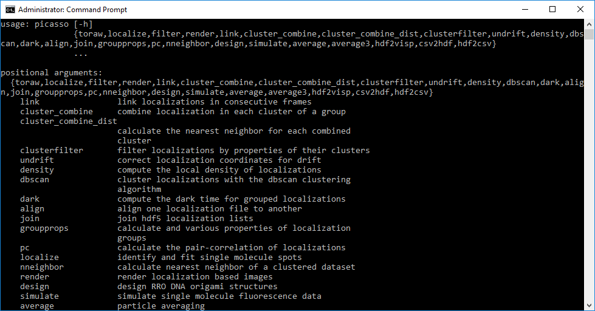

CMD
===

Here is a list of command-line commands that can be used with picasso.

localize
--------
Reconstructing images via command line is possible. Type: ``python -m picasso localize args`` within an environment or ``picasso localize args`` if Picasso is installed.

Batch process a folder
~~~~~~~~~~~~~~~~~~~~~~
To batch process a folder simply type the folder name (or drag in drop into the console), e.g. ``python -m picasso localize foldername``. Picasso will analyze the folder and process all *.ome.tif in files in the folder. If the files have consecutive names (e.g., File.ome.tif, File_1.ome.tif, File_2.ome.tif), they will be treated as one. 

If you want to analyze *.raw files, Picasso will check whether a *.raw file has a corresponding *.yaml file. If none is found, you can enter the specifications for each raw file. It is possible to use the same specifications for all *.raw files in that run. 

Adding additional arguments
^^^^^^^^^^^^^^^^^^^^^^^^^^^
The reconstruction parameters can be specified by adding respective arguments. If they are not specified the default values are chosen.

::

   ‘-b’, ‘–box-side-length’, type=int, default=7, help=‘box side length’
   ‘-a’, ‘–fit-method’, choices=["mle", "lq", "lq-gpu", "lq-3d", "lq-gpu-3d", "avg"], default=‘mle’ 
   ‘-g’, ‘–gradient’, type=int, default=5000, help=‘minimum net gradient’
   ‘-d’, ‘–drift’, type=int, default=1000, help=‘segmentation size for subsequent RCC, 0 to deactivate’
   ‘-r’, ‘-roi‘, type=int, nargs=4, default=None, help=‘ROI (y_min, x_min, y_max, x_max) in camera pixels’
   ‘-bl’, ‘–baseline’, type=int, default=0, help=‘camera baseline’
   ‘-s’, ‘–sensitivity’, type=int, default=1, help=‘camera sensitivity’
   ‘-ga’, ‘–gain’, type=int, default=1, help=‘camera gain’
   ‘-qe’, ‘–qe’, type=int, default=1, help=‘camera quantum efficiency’

Note 1: Localize will automatically try to perform an RCC drift correction on the dataset. As this will not always work with the default
settings after an unsuccessful attempt, the program will continue with the next file. If the drift correction succeeds, another hdf5 file with the
drift corrected locs will be created.

Note 2: Make sure to set the camera settings correctly; otherwise Photon counts are wrong plus the MLE might have problems.

Note 3: If you select one of the 3D algorithms (lq-3d or lq-gpu-3d) the program will ask you to enter the magnification factor and the path to the 3D calibration file. 

Example
^^^^^^^
This example shows the batch process of a folder, with movie ome.tifs that are supposed to be reconstructed and drift corrected with the ``lq``-Algorithm and a gradient of 4000.

``python -m picasso localize foldername -a lq -g 4000`` or
``picasso localize foldername -a lq -g 4000``

csv2hdf
-------
Convert csv files (thunderSTORM) to hdf. Type ``python -m picasso csv2hdf filepath pixelsize``. Note that the following columns need to be present:
``frame, x_nm, y_nm, sigma_nm, intensity_photon, offset_photon, uncertainty_xy_nm`` for 2D files
``frame, x_nm, y_nm, z_nm, sigma1_nm, sigma2_nm, intensity_photon, offset_photon, uncertainty_xy_nm`` for 3D files

join
----
Combine two hdf5 localization files. Type ``python -m picasso join file1 file2``. A new joined file will be created. Note that the frame information is preserved, i.e., frame 1 now can contain localizations from file 1 and file 2. Therefore, do not perform kinetic analysis and drift correction on joined files.

link
----
Link localizations in consecutive frames.

cluster_combine
---------------
Combines the localizations in each cluster of a group.

cluster_combine_dist
--------------------
Calculate the nearest neighbor for each combined cluster

clusterfilter
-------------
Filter localizations by properties of their clusters.

undrift
-------
Correct localization coordinates for drift with RCC.

aim
-------
Correct localization coordinates for drift with AIM.

density
-------
Compute the local density of localizations

dbscan
------
Cluster localizations with the dbscan clustering algorithm.

hdbscan
-------
Cluster localizations with the hdbscan clustering algorithm.

smlm_cluster
------------
Cluster localizations with the custom SMLM clustering algorithm.

The algorithm finds localizations with the most neighbors within a specified radius and finds clusters based on such "local maxima".

dark
----
Compute the dark time for grouped localizations.

align
-----
Align one localization file to antoher via RCC.
Type ``python -m picasso align file1 file2``

groupprops
----------
Calculate the properties of localization groups

pc
--
Calculate the pair-correlation of localizations

nneighbor
---------
Calculate the nearest neighbor within a clustered dataset

render
------
Start the render module

design
------
Start the design module.

simulate
--------
Start the simulation module.

average
-------
Start the 2D averaging module

average3
--------
Start the 3D averaging module

