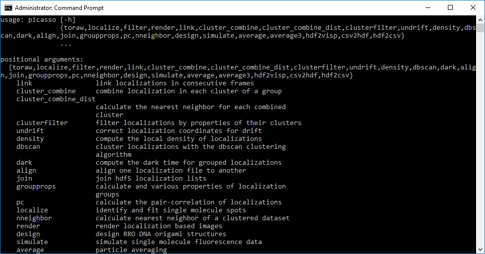

CMD
===

Here is a list of command-line commands that can be used with picasso. Each command can be run by typing ``picasso command args`` in a terminal or command prompt, where ``command`` is one of the commands listed below and ``args`` are the respective arguments for that command. For more information, type ``picasso -h`` or ``picasso command -h`` for specific commands.

If you wish to open a module (GUI), simply type ``picasso module_name``, for example, ``picasso render``.

localize
--------
Reconstructing images via command line is possible. Type: ``picasso localize args`` within an environment where Picasso is installed. Type ``picasso localize`` to open the GUI module.

Batch process a folder
~~~~~~~~~~~~~~~~~~~~~~
To batch process a folder simply type the folder name (or drag in drop into the console), e.g. ``picasso localize foldername``. Picasso will analyze the folder and process all *.ome.tif in files in the folder. If the files have consecutive names (e.g., File.ome.tif, File_1.ome.tif, File_2.ome.tif), they will be treated as one.
If you want to analyze *.raw files, Picasso will check whether a *.raw file has a corresponding *.yaml file. If none is found, you can enter the specifications for each raw file. It is possible to use the same specifications for all *.raw files in that run.

Adding additional arguments
^^^^^^^^^^^^^^^^^^^^^^^^^^^
The reconstruction parameters can be specified by adding respective arguments. If they are not specified the default values are chosen.

::

   '-b', '--box-side-length', type=int, default=7, help='box side length'
   '-a', '--fit-method', choices=["mle", "lq", "lq-gpu", "lq-3d", "lq-gpu-3d", "mle-3d", "avg"], default='mle', help='fitting method'
   '-g', '--gradient', type=int, default=5000, help='minimum net gradient'
   '-d', '--drift', type=int, default=1000, help='segmentation size for subsequent RCC, 0 to deactivate'
   '-r', '--roi', type=int, nargs=4, default=None, help='ROI (y_min, x_min, y_max, x_max) in camera pixels'
   '-fb', '--frame-bounds', type=int, nargs=2, default=None, help='frame bounds (start_frame, end_frame), 0-indexed'
   '-bl', '--baseline', type=int, default=0, help='camera baseline'
   '-s', '--sensitivity', type=float, default=1, help='camera sensitivity'
   '-ga', '--gain', type=int, default=1, help='camera gain'
   '-qe', '--qe', type=float, default=1, help='camera quantum efficiency'
   '-px', '--pixelsize', type=int, default=130, help='pixel size in nm'
   '-mf', '--mf', type=float, default=0, help='magnification factor (3D only)'
   '-zc', '--zc', type=str, default='', help='path to 3D calibration file (3D only)'
   '-sf', '--suffix', type=str, default='', help='suffix to add to output files'
   '-db', '--database', action='store_true', help='add the run to the local database'

Note 1: Localize will automatically try to perform an RCC drift correction on the dataset. As this will not always work with the default settings after an unsuccessful attempt, the program will continue with the next file. If the drift correction succeeds, another hdf5 file with the drift corrected locs will be created.

Note 2: Make sure to set the camera settings correctly; otherwise photon counts are wrong plus the MLE might have problems.

Note 3: If you select one of the 3D algorithms (``lq-3d``, ``lq-gpu-3d`` or ``mle-3d``) you must supply both the magnification factor (``-mf``) and the path to the 3D calibration file (``-zc``). If either is omitted, the program will prompt you for it interactively.

Example
^^^^^^^
This example shows the batch process of a folder, with movie ome.tifs that are supposed to be reconstructed and drift corrected with the ``lq`` algorithm and a min. net gradient of 4000.

``picasso localize foldername -a lq -g 4000``

render
------
Start the render module (GUI) or render from command line. With no arguments the GUI opens; with a ``files`` path one or more localization files are rendered to image files.

::

   '-o', '--oversampling', type=float, default=1.0, help='the number of super-resolution pixels per camera pixel'
   '-b', '--blur-method', choices=['none', 'convolve', 'gaussian'], default='convolve'
   '-w', '--min-blur-width', type=float, default=0.0, help='minimum blur width if blur is applied'
   '--vmin', type=float, default=0.0, help='minimum colormap level in range 0-100 or absolute value'
   '--vmax', type=float, default=20.0, help='maximum colormap level in range 0-100 or absolute value'
   '--scaling', choices=['yes', 'no'], default='yes', help='if scaling, the colormap value is relative in the range 0-100'
   '-c', '--cmap', choices=['viridis', 'inferno', 'plasma', 'magma', 'hot', 'gray'], help='the colormap to be applied'
   '-s', '--silent', action='store_true', help='do not open the rendered image file'

filter
------
Start the filter module (GUI).

design
------
Start the design module (GUI).

simulate
--------
Start the simulation module (GUI).

average
-------
Start the 2D averaging module (GUI).

server
------
Start the Picasso server (web browser GUI).

spinna
------
Start the SPINNA module (GUI) or run batch analysis from command line. Without ``-p`` the GUI opens; passing ``-p path/to/parameters.csv`` runs batch analysis from a parameters CSV file (see the SPINNA documentation for the expected CSV structure).

::

   '-p', '--parameters', type=str, help='.csv file containing the parameters for spinna batch analysis'
   '-a', '--asynch', action='store_false', help='do not perform fitting asynchronously (multiprocessing)'
   '-b', '--bootstrap', action='store_true', help='perform bootstrapping'
   '-v', '--verbose', action='store_true', help='display progress bar for each row'

average3
--------
Start the 3D averaging module (GUI) (to be deprecated in 1.0).

csv2hdf
-------
Convert csv files (ThunderSTORM) to ``.hdf5``. Type ``picasso csv2hdf filepath -p pixelsize`` (``-p/--pixelsize`` in nm is required). Note that the following columns need to be present:
``frame, x_nm, y_nm, sigma_nm, intensity_photon, offset_photon, uncertainty_xy_nm`` for 2D files
``frame, x_nm, y_nm, z_nm, sigma1_nm, sigma2_nm, intensity_photon, offset_photon, uncertainty_xy_nm`` for 3D files

hdf2csv
-------
Convert hdf5 files to ``.csv`` files (keeps columns names).

hdf2ts
------
Convert hdf5 files to ThunderSTORM ``.csv`` files (adapts column names).

hdf2imagej
----------
Convert hdf5 files to ImageJ ``.txt`` files.

hdf2nis
-------
Convert hdf5 files to NIS Elements ``.txt`` files.

hdf2chimera
------------
Convert hdf5 files to Chimera ``.xyz`` files.

hdf2visp
--------
Convert hdf5 files to ViSP ``.3d`` files.

join
----
Combine two hdf5 localization files. Type ``picasso join file1 file2``. A new joined file will be created. Note that the frame information of consecutive files is reindexed, i.e., frame 1 now can contain localizations from file 1 and file 2. Therefore, do not perform kinetic analysis and drift correction on joined files. Pass ``-k/--keepindex`` to keep the original frame numbers instead of reindexing.

link
----
Link localizations in consecutive frames.

::

   '-d', '--distance', type=float, default=1.0, help='maximum distance between localizations to consider them the same binding event (camera pixels)'
   '-t', '--tolerance', type=int, default=1, help='maximum dark time between localizations to still consider them the same binding event'

clusterfilter
-------------
Filter localizations by properties of their clusters.

::

   '-c', '--clusterfile', type=str, help='a hdf5 clusterfile'
   '-p', '--parameter', type=str, help='parameter to be filtered'
   '--minval', type=float, help='lower boundary'
   '--maxval', type=float, help='upper boundary'

undrift
-------
Correct localization coordinates for drift with RCC.

::

   '-s', '--segmentation', type=float, default=1000, help='the number of frames to be combined for one temporal segment'
   '-f', '--fromfile', type=str, help='apply drift from specified file instead of computing it'
   '-d', '--display', action='store_true', help='display estimated drift'

aim
---
Correct localization coordinates for drift with AIM.

::

   '-s', '--segmentation', type=float, default=100, help='the number of frames to be combined for one temporal segment'
   '-i', '--intersectdist', type=float, default=20/130, help='max. distance (camera pixels) between localizations in consecutive segments to be considered as intersecting'
   '-r', '--roiradius', type=float, default=60/130, help='max. drift (camera pixels) between two consecutive segments'

undrift_fiducials
-----------------
Correct localization coordinates for drift using fiducial markers (automatically picked). Takes one or more hdf5 localization files as positional arguments.

density
-------
Compute the local density of localizations. Takes positional ``files`` and ``radius`` (float): the maximal distance between two localizations to be considered local.

dbscan
------
Cluster localizations with the dbscan clustering algorithm. Positional arguments:

::

   files                one or more hdf5 localization files
   radius (float)       maximal distance (camera pixels) between two localizations to be considered local
   density (int)        minimum local density for localizations to be assigned to a cluster
   pixelsize (int)      camera pixel size in nm (required for 3D localizations only)

hdbscan
-------
Cluster localizations with the hdbscan clustering algorithm. Positional arguments:

::

   files                one or more hdf5 localization files
   min_cluster (int)    smallest size grouping that is considered a cluster
   min_samples (int)    the higher, the more points are considered noise
   pixelsize (int)      camera pixel size in nm (required for 3D localizations only)

smlm_cluster
------------
Cluster localizations with the custom SMLM clustering algorithm.

The algorithm finds localizations with the most neighbors within a specified radius and finds clusters based on such "local maxima".

Positional arguments:

::

   files                one or more hdf5 localization files
   radius (float)       clustering radius (in camera pixels)
   min_locs (int)       minimum number of localizations in a cluster
   pixelsize (int)      camera pixel size in nm (required for 3D localizations only)
   basic_fa (bool)      whether to perform basic frame analysis (sticking event removal)
   radius_z (float)     clustering radius in axial direction (MUST BE SET FOR 3D!)

g5m
---
Run Gaussian Mixture Modeling with Modifications (G5M) for Molecular Mapping on clustered localizations. For details see https://doi.org/10.1038/s41467-026-70198-5.

The positional ``files`` argument is a unix-style path to one or more clustered ``.hdf5`` files, or a folder in which all ``.hdf5`` files will be analyzed. If omitted, the GUI is launched.

::

   '-ml', '--min-locs', type=int, default=10, help='min. number of locs per molecule'
   '-lph', '--loc-prec-handle', type=str, default='local', help="loc. precision handle, either 'local' or 'abs'"
   '--min-sigma', type=float, default=0.8, help='minimum sigma factor/value'
   '--max-sigma', type=float, default=1.5, help='maximum sigma factor/value'
   '--max-rounds', type=int, default=3, help='max. rounds without BIC improvement to terminate'
   '--bootstrap-sem', action='store_true', help='bootstrap to estimate SEM of molecule positions'
   '-c', '--calibration', type=str, default='', help='path to calibration file (3D only)'
   '-p', '--postprocess', action='store_false', help='do not postprocess results to remove sticking events and low-quality fits'
   '--max-locs', type=int, default=100000, help='maximum number of localizations to process per cluster; useful for excluding fiducials'
   '-a', '--asynch', action='store_false', help='do not perform fitting asynchronously (multiprocessing)'

dark
----
Compute the dark time for grouped localizations.

align
-----
Align one localization file to antoher via RCC.
Type ``picasso align file1 file2 [...]`` (two or more files). Pass ``-d/--display`` to display the correlation.

groupprops
----------
Calculate the properties of localization groups

pc
--
Calculate the pair-correlation of localizations.

::

   '-b', '--binsize', type=float, default=0.1, help='the bin size (camera pixels)'
   '-r', '--rmax', type=float, default=10, help='the maximum distance to calculate the pair-correlation'

nneighbor
---------
Calculate the nearest neighbor within a clustered dataset.

cluster_combine
---------------
Combines the localizations in each cluster of a group (to be deprecated in 1.0).

cluster_combine_dist
--------------------
Calculate the nearest neighbor for each combined cluster (to be deprecated in 1.0).
