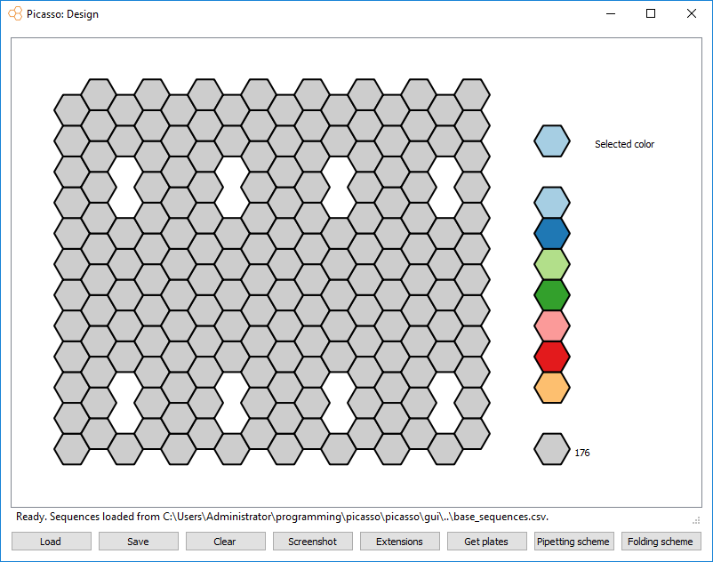

design
======

Design rectangular DNA origami
------------------------------

-  Start the design module. A canvas with hexagons, corresponding to the flat origami sheet will appear.
-  Design a pattern of DNA-PAINT binding sites by clicking on the hexagons.
-  Select a color by clicking on the color palette on the right side.
-  Each color corresponds to a different extension that can be defined later.
-  The default state of a hexagon (gray color) indicates that this staple will not be extended. Click on the ``Clear``-Button to reset all hexagons.
-  Some hexagons are marked with a ``V`` after coloring. This indicates that this staple, in contrast to all the others is pointing downwards at its 3'-end
-  Click on “Extensions” to define the sequence for each extension.
-  Use ``Get plates`` to get an excel sheet with all needed sequences in a plate format.
-  Use ``Pipetting scheme`` and select the folder with your plate list to generate a pipetting scheme.
-  Use ``Folding scheme`` to get a table for pipetting folding mixes
-  A design can be saved and loaded using the ``Save`` and ``Load``-Buttons.
-  A saved design can also be loaded into the ``Picasso: Simulate`` module.
