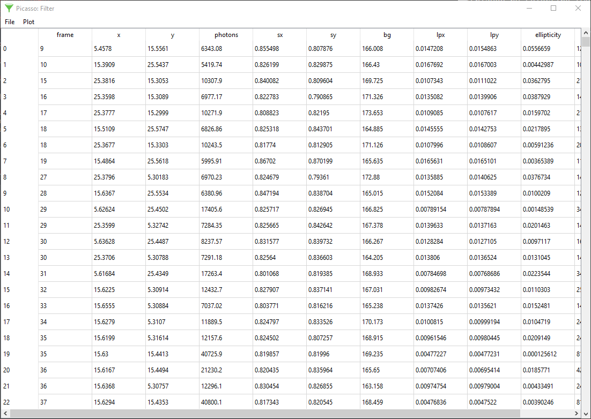

filter
=======

Filtering of localizations
--------------------------
Open a localization HDF5 file in ``Picasso: Filter`` by dragging it into the main window or by selecting ``File`` > ``Open``. The displayed table shows the properties of each localization in rows. Each column represents one property (e.g., coordinates, number of photons); see the filetypes section for details.

To display a histogram from values of one property, select the respective column in the header and select ``Plot`` > 'Histogram' (Ctrl + h). 2D histograms can be displayed by selecting two columns (press Ctrl to select multiple columns) and then selecting ``Plot`` > ``2D Histogram`` (Ctrl + d).

Left-click and hold the mouse button down to drag a selection area in a 1D or 2D histogram. The selected area will be shaded in green. Each localization event with histogram properties outside the selected area is immediately removed from the localization list.

In Picasso 0.5.0, an alternative approach was introduced: In the menu bar, click ``Filter`` > ``Filter``. A dialog is displayed where the user can numerically filter values for any of the columns. Click the ``Filter`` button in the dialog to remove localizations which do not fit in the input parameters.

Save the filtered localization table by selecting ``File`` > ``Save``.