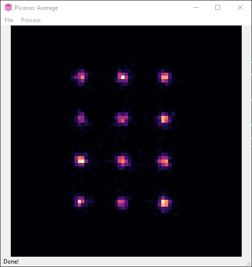

average
=======

Particle Averaging
------------------
The averaging module uses 2D cross-correlation to determine the rotational and translational offset.

1. In ``Picasso: Render``, pick structures to be averaged.
2. Save the picked localizations by selecting ``File`` > ``Save picked localizations``.
3. Load the resulting file with picked localizations into ``Picasso: Average`` by selecting ``File`` > ``Open`` or dragging and dropping it into the window. It will start a parallel pool to increase computational speed.
4. ``Picasso: Average`` will immediately perform a center-of-mass alignment of the picked structures and display an average image. Rotational and translational alignment will follow in the next steps.
5. Select ``Process`` > ``Parameters`` and adjust the ``Oversampling`` parameter. We recommend choosing the highest number at which the average image still appears smooth. High oversampling values result in substantial computational time and can cause artifacts. Hence, it might be useful to first use low oversampling to generate a less-refined average image and then perform subsequent averaging steps with higher oversampling for optimized resolution.
6. Adjust the number of average iterations in the ``Iterations`` field. In most cases, a value of 10 is more than sufficient. If you are unsure about the computational time of the process, choose one iteration as a starting point. More iterations can be added later by repeating the processing steps. After a certain number of iterations, the average image will converge, meaning that it will not change with more iterations. If you experience that one localization spot is overemphasized, try again with less oversampling and few iterations. The 2D cross-correlation is prone to lock in bright spots.
7. Select ``Process`` > ``Average`` to perform particle averaging with the current oversampling for the set number of iterations. This step can be repeated with different settings. The program will use the current average image as a starting point.
8. Once the average image has converged, save the transformed localizations by selecting ``File`` > ``Save``. The resulting HDF5 localization file contains the aligned localizations in the center of the movie dimensions. It can be loaded like any other HDF5 localization file into ``Picasso: Render``.

