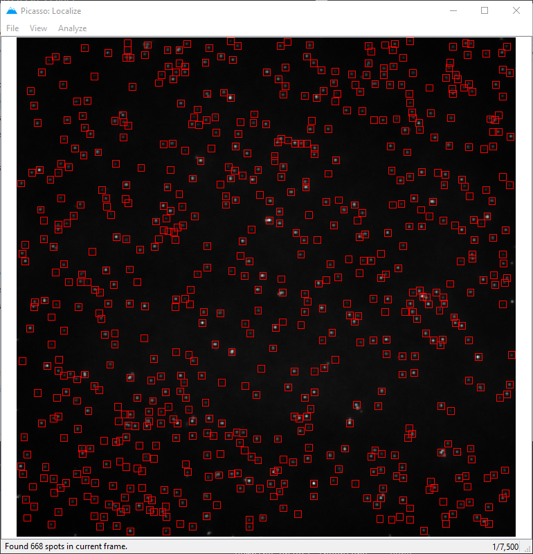

localize
========

Localize allows performing super-resolution reconstruction of image stacks. For spot detection, a gradient-based approach is used. For Fitting, the following algorithms are implemented:

- MLE, integrated Gaussian (based on `Smith et al., 2010 <https://www.ncbi.nlm.nih.gov/pmc/articles/PMC2862147/>`_.)
- LQ, Gaussian (least squares)
- Average of ROI (finds summed intensity of spots)

**Please note:** Picasso Localize supports five file formats: ``.ome.tif``, ``NDTiffStack`` with extension ``.tif``, ``.raw``, ``.ims`` and ``.nd2``. If your file has the extension ``.tiff`` or ``.ome.tiff``, it cannot be read. Usually it is enough to change the extension to ``.ome.tif``, i.e., remove the last letter.

Identification and fitting of single-molecule spots
---------------------------------------------------

1. In ``Picasso: Localize``, open a movie file by dragging the file into the window or by selecting ``File`` > ``Open movie``. If the movie is split into multiple μManager .tif files, open only the first file. Picasso will automatically detect the remaining files according to their file names. When opening a .raw file, a dialog will appear for file specifications. When opening an IMS file it should be displayed immediately in the localize window. When opening an IMS file with multiple channels, a dialog window will appear allowing you to select the channel that should be loaded. You can navigate through the file using the arrow keys on your keyboard. The current frame is displayed in the lower right corner.
2. Adjust the image contrast (select ``View`` > ``Contrast``) so that the single-molecule spots are clearly visible.
3. To adjust spot identification and fit parameters, open the ``Parameters`` dialog (select ``Analyze`` > ``Parameters``).
4. In the ``Identification`` group, set the ``Box side length`` to the rounded integer value of 6 × σ + 1, where σ is the standard deviation of the PSF. In an optimized microscope setup, σ is one pixel, and the respective ``Box side length`` should be set to 7. The value of ``Min. net gradient`` specifies a minimum threshold above which spots should be considered for fitting. The net gradient value of a spot is roughly proportional to its intensity, independent of its local background. By checking ``Preview``, the spots identified with the current settings will be marked in the displayed frame. Adjust ``Min. net gradient`` to a value at which only spots are detected (no background).
5. (Optional) The ``Identification`` group contains an extra box to input the region of interest (ROI) that is to be considered during identification (units in camera pixels). Alternatively, the ROI can be selected with clicking on the display with the left mouse button and dragging the displayed rectangle.
6. In the ``Photon conversion`` group, adjust ``EM Gain``, ``Baseline``, ``Sensitivity`` and ``Quantum Efficiency`` according to your camera specifications and the experimental conditions. Set ``EM Gain`` to 1 for conventional output amplification. ``Baseline`` is the average dark camera count. ``Sensitivity`` is the conversion factor (electrons per analog-to-digital (A/D) count). ``Quantum Efficiency`` is not used since version 0.6.0 and is kept for backward compatibility only. These parameters are critical to converting camera counts to photons correctly. The quality of the upcoming maximum likelihood fit strongly depends on a Poisson photon noise model, and thus on the absolute photon count. For simulated data, generated with ``Picasso: Simulate``, set the parameters as follows: ``EM Gain`` = 1, ``Baseline`` = 0, ``Sensitivity`` = 1.
7. From the menu bar, select ``Analyze`` > ``Localize (Identify & Fit)`` to start spot identification and fitting in all movie frames. The status of this computation is displayed in the window's status bar. After completion, the fit results will be saved in a new file in the same folder as the movie, in which the filename is the base name of the movie file with the extension ``_locs.hdf5``. Furthermore, information about the movie and analysis procedure will be saved in an accompanying file with the extension ``_locs.yaml``; this file can be inspected using a text editor.

Camera Config
-------------

Picasso can remember default cameras and will use saved camera parameters. In order to use camera configs, create a file named ``config.yaml`` in the picasso folder. To start with a template, modify ``config_template.yaml`` that can be found in the folder per default. Picasso will compare the entries with Micro-Manager-Metadata and match the sensitivity values. If no matching entries can be found (e.g., if the file was not created with Micro-Manager) the config file will still be used to create a dropdown menu to select the different categories. The camera config can also be used to define a default camera that will always be used. Indentions are used for definitions.

Example: Default Camera
~~~~~~~~~~~~~~~~~~~~~~~

::

   Cameras:
     Camera1:
       Baseline: 100
       Sensitivity: 0.5
       Quantum Efficiency: 1.0

If there is only one camera entry, picasso will create a dropdown menu that has always selected this camera. 

Gain
^^^^
If the string ``Gain Property Name`` can be found in the config, picasso will search for a value for this key in the Micro-Manager metadata and match if found.

Sensitivity
^^^^^^^^^^^

If the string ``Sensitivity Categories`` can be found in the config, picasso will create a dropdown menu for each entry, and if the property can be located in the Micro-Manager Metadata, it will be automatically set.

::

   Cameras:
     Camera1:
       Baseline: 100
       Quantum Efficiency:
         525: 0.5
       Sensitivity Categories:
         - PixelReadoutRate
         - Sensitivity/DynamicRange
       Sensitivity:
         540 MHz - fastest readout:
           12-bit (high well capacity): 7.18
           12-bit (low noise): 0.29
           16-bit (low noise & high well capacity): 0.46
         200 MHz - lowest noise:
           12-bit (high well capacity): 7.0
           12-bit (low noise): 0.26
           16-bit (low noise & high well capacity): 0.45

Here, two Sensitivity Categories are given ``PixelReadoutRate`` and ``Sensitivity/DynamicRange``. In the upper dropdown menu, one now will be able to choose from ``540 MHz - fastest readout`` and
``200 MHz - lowest noise``. Within 540 MHz it will be ``12-bit (high well capacity): 7.18``, ``12-bit (low noise): 0.29`` and ``16-bit (low noise & high well capacity): 0.46``. Accordingly for the 200 MHz entry. The dropdown menus can be further nested, e.g., when considering Gain modes:

::

       Sensitivity:
         Electron Multiplying:
           17.000 MHz:
             Gain 1: 15.9
             Gain 2: 9.34
             Gain 3: 5.32

Quantum Efficiency
^^^^^^^^^^^^^^^^^^

This feature is not used since Picasso 0.6.0. It is kept for backward compatibility only.

Several Cameras
^^^^^^^^^^^^^^^

::

   Cameras:
     Camera1:
     Camera2:
     Camera3:

Once there are several cameras present, Picasso will select the camera who's name matches the Micro-Manager Metadata. If no camera is found, the first one is automatically selected.

3D-Calibration
--------------

Theory
~~~~~~

3D Calibration is performed by an adapted version of `Huang et al., 2008 <https://www.ncbi.nlm.nih.gov/pubmed/18174397/>`_.

Calibrating z
~~~~~~~~~~~~~

After entering the step size, picasso will calculate the mean and the variance for sigma_x and sigma_y for each z position. Localizations that are not within one standard deviation are discarded. A six-degree polynomial is fitted to the mean values of x and y.

-  mean_sx = cx[6]z0 + cx[5]z1 .. + cx[0]z6
-  mean_sy = cy[6]z0 + cy[5]z1 .. + cy[0]z6

The calibration coefficients are stored in the YAML file and contain the parameters of cx and cy. The first entry being c[0], the last being c[6].

Fitting z
~~~~~~~~~

For each localization, sigma_x and sigma_y is determined. Similar to the Science paper, the following equation is used to minimize the Distance D:  ``D = (sx0.5 - wx0.5)^2 + (sy0.5 - wy0.5)^2`` with w being ``c[6]z0 +
c[5]z1 .. + c[0]z6``.