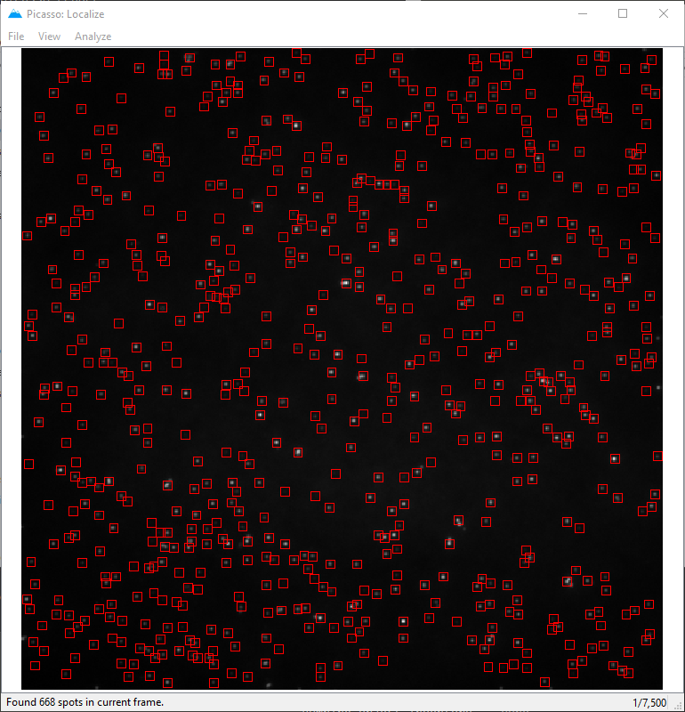

localize
========

Localize allows performing super-resolution reconstruction of image stacks. For spot detection, a gradient-based approach is used. For Fitting, the following algorithms are implemented:

- MLE, integrated Gaussian (based on `Smith et al., 2010 <https://www.ncbi.nlm.nih.gov/pmc/articles/PMC2862147/>`_.)
- LQ, Gaussian (least squares). On Windows with a CUDA-capable GPU, an accelerated variant is available via `Gpufit <https://github.com/gpufit/Gpufit>`_, which is vendored into Picasso (``picasso/ext/pygpufit/``) and works automatically — no extra install step.
- Average of ROI (finds summed intensity of spots)

**Please note:** Picasso Localize supports file formats:

- ``.ome.tif`` and plain ``.tif`` / ``.tiff`` image stacks,
- ``NDTiffStack`` with extension ``.tif``,
- BigTIFF, with extensions ``.tif``, ``.btf``, ``.tf8`` or ``.tf2``,
- Zeiss ``.lsm``,
- Zeiss ``.czi`` (requires ``pip install picassosr[czi]``, Python ≥ 3.12),
- Leica ``.lif`` (requires ``pip install picassosr[lif]``, Python ≥ 3.12),
- ``.raw``,
- ``.ims`` (supported only on Windows),
- ``.nd2``,
- ``.stk``.

TIFF-family files (``.tif``, ``.tiff``, ``.ome.tif``, ``.btf``, ``.tf8``, ``.tf2``, ``.lsm``) are read via the `tifffile <https://github.com/cgohlke/tifffile>`_ library. **Picasso expects grayscale image stacks with one frame per TIFF page; multi-channel, RGB or tiled whole-slide TIFF variants are not supported.**

Zeiss ``.czi`` and Leica ``.lif`` movies are read via the optional `czifile <https://github.com/cgohlke/czifile>`_ and `liffile <https://github.com/cgohlke/liffile>`_ libraries, installed with the ``czi`` / ``lif`` extras (e.g. ``pip install picassosr[czi,lif]``; both require Python ≥ 3.12). These files are reduced to a single-channel ``(frames, height, width)`` movie: when a file contains more than one channel a dialog asks which channel to load (a ``.lif`` file may also contain several acquisitions, in which case the one with the most frames is used). We are open to feature requests regarding support for other file formats, please visit our `GitHub page <https://github.com/jungmannlab/picasso>`_.

Identification and fitting of single-molecule spots
---------------------------------------------------

1. In ``Picasso: Localize``, open a movie file by dragging the file into the window or by selecting ``File`` > ``Open movie``. If the movie is split into multiple μManager .tif files, open only the first file. Picasso will automatically detect the remaining files according to their file names. Similarly, for consecutive .stk files (e.g. ``name_001.stk``, ``name_002.stk``, …), open the first file of the desired range and Picasso will automatically include all subsequent files with a higher numeric suffix. When opening a .raw file, a dialog will appear for file specifications. When opening an IMS file it should be displayed immediately in the localize window. When opening an IMS file with multiple channels, a dialog window will appear allowing you to select the channel that should be loaded. You can navigate through the file using the arrow keys on your keyboard. The current frame is displayed in the lower right corner.
2. Adjust the image contrast (select ``View`` > ``Contrast``) so that the single-molecule spots are clearly visible.
3. To adjust spot identification and fit parameters, open the ``Parameters`` dialog (select ``Analyze`` > ``Parameters``).
4. In the ``Identification`` group, set the ``Box side length`` to the rounded integer value of 6 × σ + 1, where σ is the standard deviation of the PSF. In an optimized microscope setup, σ is one pixel, and the respective ``Box side length`` should be set to 7. The value of ``Min. net gradient`` specifies a minimum threshold above which spots should be considered for fitting. The net gradient value of a spot is roughly proportional to its intensity, independent of its local background. By checking ``Preview``, the spots identified with the current settings will be marked in the displayed frame. Adjust ``Min. net gradient`` to a value at which only spots are detected (no background).
5. (Optional) Restrict the analysis to one or more regions of interest (ROIs) instead of the whole frame; see *Regions of interest (ROIs)* below.
6. In the ``Photon conversion`` group, adjust ``EM Gain``, ``Baseline``, ``Sensitivity`` and ``Quantum Efficiency`` according to your camera specifications and the experimental conditions. Set ``EM Gain`` to 1 for conventional output amplification. ``Baseline`` is the average dark camera count. ``Sensitivity`` is the conversion factor (electrons per analog-to-digital (A/D) count). ``Quantum Efficiency`` is not used since version 0.6.0 and is kept for backward compatibility only. These parameters are critical to converting camera counts to photons correctly. The quality of the upcoming maximum likelihood fit strongly depends on a Poisson photon noise model, and thus on the absolute photon count. For simulated data, generated with ``Picasso: Simulate``, set the parameters as follows: ``EM Gain`` = 1, ``Baseline`` = 0, ``Sensitivity`` = 1.
7. From the menu bar, select ``Analyze`` > ``Localize (Identify & Fit)`` to start spot identification and fitting in all movie frames. The status of this computation is displayed in the window's status bar. After completion, the fit results will be saved in a new file in the same folder as the movie, in which the filename is the base name of the movie file with the extension ``_locs.hdf5``. Furthermore, information about the movie and analysis procedure will be saved in an accompanying file with the extension ``_locs.yaml``; this file can be inspected using a text editor.

Regions of interest (ROIs)
--------------------------

By default, Picasso analyzes the whole frame. If you are only interested in certain parts of the movie, you can restrict the analysis to one or more rectangular regions of interest (ROIs). Spots outside the ROIs are ignored, which also speeds up the analysis. There are two ways to work with ROIs:

- **With the mouse, directly on the image.** Drag a rectangle with the left mouse button to add a ROI; repeat to add as many as you like. To remove a ROI, double-click inside it. ROIs are outlined in blue, and the one currently selected is highlighted in cyan.

- **Numerically, in the Parameters dialog.** Open ``Analyze`` > ``Parameters``. The ``ROIs`` field in the ``Identification`` group summarizes the current selection:

  - empty (``Whole frame``) means the entire frame is analyzed,
  - a single ROI is shown as its four coordinates ``y_min, x_min, y_max, x_max`` (in camera pixels), which you can edit directly in the field,
  - several ROIs are shown as a count (e.g. ``3 ROIs``).

  Click ``Edit ROIs...`` to open a small dialog where you can add, edit, remove, or clear all ROIs in a table.

To go back to analyzing the whole frame, simply remove all ROIs (double-click them, empty the single-ROI field, or use ``Clear`` in the ``Edit ROIs...`` dialog). If ROIs overlap, Picasso automatically trims them so that no spot is detected twice, so you do not need to draw them precisely. As with the rest of the identification settings, turn on ``Preview`` to check which spots fall inside your ROIs before running the full analysis.

Extra features
--------------

- ``File`` > ``Save identifications``: Saves the current set of identifications (frame, x, y, net gradient and identification id, where applicable) to an HDF5 file with a companion YAML metadata file. By default the suggested filename is ``<movie_base>_identifications.hdf5``. The accompanying YAML stores the original movie metadata together with the ``Box Size`` and ``Min. Net Gradient`` used at the time of saving, so the parameters can be restored when the identifications are loaded again.
- ``File`` > ``Load identifications``: Loads identifications previously saved with ``Save identifications``. The identifications are clipped to the current movie's bounds (using the current ``Box Size``) and the identification parameters stored in the YAML sidecar (``Box Size``, ``Min. Net Gradient``) are restored. *As with the other identification loading actions, changing any identification parameter (box size, min. net gradient, etc.) will reset the loaded identifications, and ``Analyze`` > ``Fit`` should be used (rather than ``Localize (Identify & Fit)``) to fit them without resetting.*
- ``File`` > ``Load picks as identifications``: Allows the user to load circular picks (from Picasso Render) as identifications. Additionally, the drift correction file (.txt) can be loaded to adjust the positions of the identifications throughout acquisition. The current box size will be used to make the identification, however, min. net gradient will **not** be applied to the identifications. *Note that changing any of the identification parameters (box size, min. net gradient, etc) will reset the loaded identifications. Furthermore, use ``Analyze`` > ``Fit``, rather than ``Analyze`` > ``Localize (Identify & Fit)``, to fit the loaded identifications without reseting them.*
- ``File`` > ``Load locs as identifications``: Similar to loading picks as identifications (see above) but uses localizations as input. The user is asked to provide the number of frames around localizations to be used for the identifications, i.e., how many frames before and after the frame of the localization should be included in the identifications. For each localization, 2 * n_frames + 1 identifications will be assigned, thus if localizations are close together the identifications may overlap. *Note that changing any of the identification parameters (box size, min. net gradient, etc) will reset the loaded identifications. Furthermore, use ``Analyze`` > ``Fit``, rather than ``Analyze`` > ``Localize (Identify & Fit)``, to fit the loaded identifications without reseting them.*
- ``File`` > ``Save spots``: Cuts out and saves the identified spots (NxBxB array, with N spots and B being the box side length). The spots can be saved as a .npy file or as a .tif file.

Camera Config
-------------

Picasso can remember default cameras and will use saved camera parameters. In order to use camera configs, create a file named ``config.yaml`` in the ``picasso`` folder. See below on how to locate it.

To start with a template, modify ``config_template.yaml`` that can be found in the folder by default. Picasso will compare the entries with Micro-Manager-Metadata and match the sensitivity values. If no matching entries can be found (e.g., if the file was not created with Micro-Manager) the config file will still be used to create a dropdown menu to select the different categories. The camera config can also be used to define a default camera that will always be used. Indentions are used for definitions.

One click installer (Windows)
~~~~~~~~~~~~~~~~~~~~~~~~~~~~~

If you downloaded an .exe Picasso file from the `release page <https://github.com/jungmannlab/picasso/releases>`_:

- Navigate to the installation folder, by default, it's ``C:/Picasso``. *Before version 0.8.3, the default location was* ``C:/Program Files/Picasso``.
- Go to the folder ``_internal/picasso``. *Before version 0.9.6, the folder was simply* ``picasso``.
- Add your config file there.

One click installer (macOS)
~~~~~~~~~~~~~~~~~~~~~~~~~~~

If you downloaded a .dmg Picasso file from the `release page <https://github.com/jungmannlab/picasso/releases>`_:

- Navigate to your Applications folder and right-click on the picasso app, then select "Show Package Contents".
- Go to the folder ``Contents/Frameworks/picasso``.
- Add your config file there.

PyPI
~~~~
If you installed Picasso using ``pip install picassosr``:

- Activate your conda environment where ``picassosr`` is installed by typing ``conda activate YOUR_ENVIRONMENT``.
- To find the location of the package, type ``pip show picassosr`` and look for the line starting with ``Location:``.
- Navigate to this location and go to ``picasso``.
- Add your config file there.

GitHub
~~~~~~
If you cloned the GitHub repository, you can add plugins by following these steps:
- Find the directory where you cloned the GitHub repository with Picasso.
- Go to ``picasso/picasso/``.
- Copy the config file to this folder.

Example: Default Camera
~~~~~~~~~~~~~~~~~~~~~~~

::

   Cameras:
     Camera1:
       Baseline: 100
       Sensitivity: 0.5
       Quantum Efficiency: 1.0

If there is only one camera entry, picasso will create a dropdown menu that has always selected this camera. 

Gain
^^^^
If the string ``Gain Property Name`` can be found in the config, picasso will search for a value for this key in the Micro-Manager metadata and match if found.

Sensitivity
^^^^^^^^^^^

If the string ``Sensitivity Categories`` can be found in the config, picasso will create a dropdown menu for each entry, and if the property can be located in the Micro-Manager Metadata, it will be automatically set.

::

   Cameras:
     Camera1:
       Baseline: 100
       Quantum Efficiency:
         525: 0.5
       Sensitivity Categories:
         - PixelReadoutRate
         - Sensitivity/DynamicRange
       Sensitivity:
         540 MHz - fastest readout:
           12-bit (high well capacity): 7.18
           12-bit (low noise): 0.29
           16-bit (low noise & high well capacity): 0.46
         200 MHz - lowest noise:
           12-bit (high well capacity): 7.0
           12-bit (low noise): 0.26
           16-bit (low noise & high well capacity): 0.45

Here, two Sensitivity Categories are given ``PixelReadoutRate`` and ``Sensitivity/DynamicRange``. In the upper dropdown menu, one now will be able to choose from ``540 MHz - fastest readout`` and
``200 MHz - lowest noise``. Within 540 MHz it will be ``12-bit (high well capacity): 7.18``, ``12-bit (low noise): 0.29`` and ``16-bit (low noise & high well capacity): 0.46``. Accordingly for the 200 MHz entry. The dropdown menus can be further nested, e.g., when considering Gain modes:

::

       Sensitivity:
         Electron Multiplying:
           17.000 MHz:
             Gain 1: 15.9
             Gain 2: 9.34
             Gain 3: 5.32

Quantum Efficiency
^^^^^^^^^^^^^^^^^^

This feature is not used since Picasso 0.6.0. It is kept for backward compatibility only.

Several Cameras
^^^^^^^^^^^^^^^

::

   Cameras:
     Camera1:
     Camera2:
     Camera3:

Once there are several cameras present, Picasso will select the camera who's name matches the Micro-Manager Metadata. If no camera is found, the first one is automatically selected. In the dropdown menu, the configured cameras are displayed in alphabetical order.

Camera Priorities
^^^^^^^^^^^^^^^^^

::

   CameraPriority:
      - Camera3
      - Camera1

If many cameras are configured, the dropdown can become cluttered. For that reason, the config can additionally include a "CameraPriority" field. It describes a list of camera names which must match names in the "Cameras" field. The listed cameras are then displayed on top of the dropdown menu while the non-listed cameras are shown below in alphabetical order.

3D-Calibration
--------------

Theory
~~~~~~

3D Calibration is performed by an adapted version of `Huang et al., 2008 <https://www.ncbi.nlm.nih.gov/pubmed/18174397/>`_.

Calibrating z
~~~~~~~~~~~~~

After entering the step size, picasso will calculate the mean and the variance for sigma_x and sigma_y for each z position. Localizations that are not within one standard deviation are discarded. A six-degree polynomial is fitted to the mean values of x and y.

-  mean_sx = cx[6]z0 + cx[5]z1 .. + cx[0]z6
-  mean_sy = cy[6]z0 + cy[5]z1 .. + cy[0]z6

The calibration coefficients are stored in the YAML file and contain the parameters of cx and cy. The first entry being c[0], the last being c[6].

Fitting z
~~~~~~~~~

For each localization, sigma_x and sigma_y is determined. Similar to the Science paper, the following equation is used to minimize the Distance D:  ``D = (sx0.5 - wx0.5)^2 + (sy0.5 - wy0.5)^2`` with w being ``c[6]z0 +
c[5]z1 .. + c[0]z6``.

Incorporating calibrations in config file
~~~~~~~~~~~~~~~~~~~~~~~~~~~~~~~~~~~~~~~~~

The calibration depends on the microscope, camera, and emission wavelength used. It can become tedious to navigate to and select the correct calibration yaml file. Therefore, the config file can include a field to map camera and emission wavelength to path of the z calibration yaml file:

::

   z-calibrations:
      Camera1:
         525: /path/to/Camera1-GFP-zcalibration.yaml
         595: /path/to/Camera1-Cy3B-zcalibration.yaml

If the camera names and emission wavelengths match the settings in Micromanager, the correct z-calibration is automatically loaded. In any case an alternative calibration yaml file can be loaded by button.
