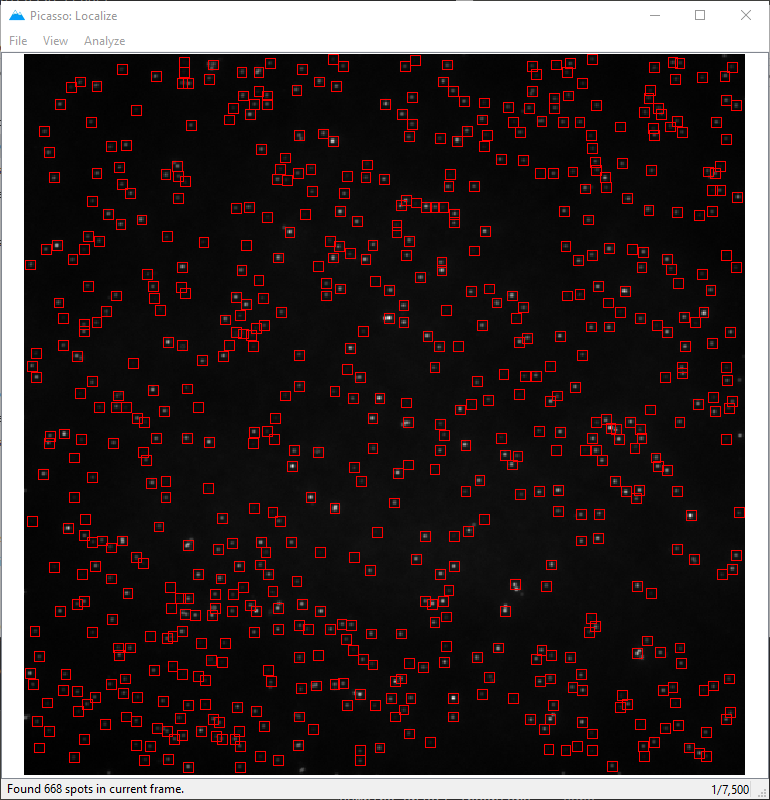

localize
========

Localize allows performing super-resolution reconstruction of image stacks. For spot detection, a gradient-based approach is used. For fitting, you choose a **PSF model** and, independently, an **optimizer**: least squares (LQ) or maximum likelihood (MLE, Poisson). Every PSF model can be fitted with either optimizer, on the CPU or on the GPU (see `GPU fitting`_ below).

The following PSF models are implemented:

- Elliptical Gaussian. Fits independent widths ``sx`` and ``sy``.
- Spherical (isotropic) Gaussian. Fits a single shared width, so ``sx`` and ``sy`` are always equal. The ``ellipticity`` column is not saved for this model. Supports multichannel fitting as well, see `Multichannel 2D Gaussian fitting`_ below.
- Rotated elliptical Gaussian. The fitted in-plane rotation angle is saved in the ``angle`` column, in degrees.
- Experimental PSF (cubic spline). Fits an experimentally measured PSF; a 3D calibration recovers ``z`` directly; see `Experimental PSF (cubic-spline) fitting`_ below. Supports multichannel fitting as well, see `Multichannel spline PSF (e.g. biplane)`_ below.

In addition, ``Average of ROI`` is available as a non-fitting option that simply sums the intensity of each spot.

Fitting can run on a CUDA-capable GPU (see `GPU fitting`_ below). The kernels are compiled at run time by Numba, so there is no library to build or install beyond the CUDA runtime (``pip install picassosr[gpu]``), on Windows and Linux alike. When no CUDA GPU is available, the GPU fitting option simply does not appear and Picasso uses the CPU algorithms.

**Please note:** Picasso Localize supports file formats:

- ``.ome.tif`` and plain ``.tif`` / ``.tiff`` image stacks,
- MicroManager "separate image files" acquisitions, saved as one ``img_*.tif`` per frame in a folder (see ``File`` > ``Open MicroManager image folder`` below),
- ``NDTiffStack`` with extension ``.tif``,
- BigTIFF, with extensions ``.tif``, ``.btf``, ``.tf8`` or ``.tf2``,
- Zeiss ``.lsm``,
- Zeiss ``.czi`` (requires ``pip install picassosr[czi]``, Python ≥ 3.12; available in the one-click installer),
- Leica ``.lif`` (requires ``pip install picassosr[lif]``, Python ≥ 3.12; available in the one-click installer),
- ``.raw``,
- ``.ims`` (supported only on Windows),
- ``.nd2`` (either time series or a z-stack; ``T`` or ``Z`` axis),
- ``.stk``.

TIFF-family files (``.tif``, ``.tiff``, ``.ome.tif``, ``.btf``, ``.tf8``, ``.tf2``, ``.lsm``) are read via the `tifffile <https://github.com/cgohlke/tifffile>`_ library. **Picasso expects grayscale image stacks with one frame per TIFF page; multi-channel, RGB or tiled whole-slide TIFF variants are not supported.** ImageJ "contiguous stack" files — where ImageJ stores the whole stack as a single TIFF page followed by all planes' pixel data (as its "Save As > Tiff" does for large stacks, e.g. when re-saving a folder of separate images as one ``.tiff``) — are also read correctly, with every plane detected as a frame.

Zeiss ``.czi`` and Leica ``.lif`` movies are read via the optional `czifile <https://github.com/cgohlke/czifile>`_ and `liffile <https://github.com/cgohlke/liffile>`_ libraries, installed with the ``czi`` / ``lif`` extras (e.g. ``pip install picassosr[czi,lif]``; both require Python ≥ 3.12). These files are reduced to a single-channel ``(frames, height, width)`` movie: when a file contains more than one channel a dialog asks which channel to load (a ``.lif`` file may also contain several acquisitions, in which case the one with the most frames is used). We are open to feature requests regarding support for other file formats, please visit our `GitHub page <https://github.com/jungmannlab/picasso>`_.

GPU fitting
-----------

Picasso can run all of its Gaussian and cubic-spline fitting on a CUDA-capable NVIDIA GPU. The fitting kernels are written in Python and compiled for the GPU at run time by numba.

The fitting algorithm — the Levenberg-Marquardt driver, its damping rule, its estimators and its PSF models — is a port of `Gpufit <https://github.com/gpufit/Gpufit>`_ (Przybylski et al., *Scientific Reports* **7**, 15722, 2017), which earlier versions of Picasso used as a compiled dependency. Picasso no longer ships or links against the Gpufit binary; its license is reproduced in ``LICENSES/Gpufit-LICENSE.txt``.

Installation
~~~~~~~~~~~~

The GPU kernels need the CUDA runtime, which is pulled in as an optional dependency::

   pip install picassosr[gpu]

Using it
~~~~~~~~

When a CUDA GPU is detected, the **Use GPU** checkbox becomes available in the ``Parameters`` dialog for both optimizers, since Picasso implements a least-squares and a maximum-likelihood estimator on the GPU. Otherwise the checkbox stays hidden and the CPU implementations are used. GPU fitting is entirely optional; it is typically one to two orders of magnitude faster than a serial CPU fit.

Identification and fitting of single-molecule spots
---------------------------------------------------

1. In ``Picasso: Localize``, open a movie file by dragging the file into the window or by selecting ``File`` > ``Open movie``. If the movie is split into multiple μManager .tif files, open only the first file. Picasso will automatically detect the remaining files according to their file names. Similarly, for consecutive .stk files (e.g. ``name_001.stk``, ``name_002.stk``, …), open the first file of the desired range and Picasso will automatically include all subsequent files with a higher numeric suffix. When opening a .raw file, a dialog will appear for file specifications. When opening an IMS file it should be displayed immediately in the localize window. When opening an IMS file with multiple channels, a dialog window will appear allowing you to select the channel that should be loaded. You can navigate through the file using the arrow keys on your keyboard. The current frame is displayed in the lower right corner.
2. Adjust the image contrast so that the single-molecule spots are clearly visible. The quickest way is the two-handle slider at the bottom of the window, below the frame slider. Alternatively, select ``View`` > ``Contrast`` to type in the black and white points, or to re-enable ``Auto``, which re-scales every frame to its own minimum and maximum.
3. To adjust spot identification and fit parameters, open the ``Parameters`` dialog (select ``Analyze`` > ``Parameters``).
4. In the ``Identification`` group, set the ``Box side length`` to the rounded integer value of 6 × σ + 1, where σ is the standard deviation of the PSF. In an optimized microscope setup, σ is one pixel, and the respective ``Box side length`` should be set to 7. The value of ``Min. net gradient`` specifies a minimum threshold above which spots should be considered for fitting. The net gradient value of a spot is roughly proportional to its intensity, independent of its local background. By checking ``Preview``, the spots identified with the current settings will be marked in the displayed frame. Adjust ``Min. net gradient`` to a value at which only spots are detected (no background).
5. (Optional) Tick ``Temporal median filter`` in the ``Identification`` group to subtract a rolling per-pixel background before spots are identified; see *Temporal median filter* below.
6. (Optional) Set ``Gaussian filter sigma`` in the ``Identification`` group to smooth every frame before spots are identified, which helps when spots are not Gaussian-shaped; see *Gaussian filter* below.
7. (Optional) Restrict the analysis to one or more regions of interest (ROIs) instead of the whole frame; see *Regions of interest (ROIs)* below.
8. In the ``Photon conversion`` group, adjust ``EM Gain``, ``Baseline``, ``Sensitivity`` and ``Quantum Efficiency`` according to your camera specifications and the experimental conditions. Set ``EM Gain`` to 1 for conventional output amplification. ``Baseline`` is the average dark camera count. ``Sensitivity`` is the conversion factor (electrons per analog-to-digital (A/D) count). ``Quantum Efficiency`` is not used since version 0.6.0 and is kept for backward compatibility only. These parameters are critical to converting camera counts to photons correctly. The quality of the upcoming maximum likelihood fit strongly depends on a Poisson photon noise model, and thus on the absolute photon count. For simulated data, generated with ``Picasso: Simulate``, set the parameters as follows: ``EM Gain`` = 1, ``Baseline`` = 0, ``Sensitivity`` = 1. If you use an sCMOS camera, consider loading a per-pixel camera calibration instead of relying on the two scalars; see *sCMOS camera calibration* below.
9. From the menu bar, select ``Analyze`` > ``Localize (Identify & Fit)`` to start spot identification and fitting in all movie frames. The status of this computation is displayed in the window's status bar. After completion, the fit results will be saved in a new file in the same folder as the movie, in which the filename is the base name of the movie file with the extension ``_locs.hdf5``. Furthermore, information about the movie and analysis procedure will be saved in an accompanying file with the extension ``_locs.yaml``; this file can be inspected using a text editor.

Temporal median filter
----------------------

Fluorescence movies often sit on an uneven background: out-of-focus haze, autofluorescent structures or a non-uniform illumination profile. Because a given pixel contains a blinking emitter only for a small fraction of the movie, the *median* of that pixel over a window of frames is a good estimate of its background. Ticking ``Temporal median filter`` in the ``Identification`` group subtracts that estimate from every frame (clipped at zero) before spots are identified, which removes both the uneven background and any static structure, and should make the detection less sensitive to where in the field of view a spot sits.

``Window (frames)`` sets how many frames go into the median. The default of 51 is a good starting point: it has to be long enough that a given emitter is dark for most of the window (otherwise the emitter ends up in its own background estimate) but short enough to follow slow drifts in the background.

Two things are worth keeping in mind:

- **The filter applies to identification only.** Spots are always cut out of, and fitted on, the *raw* movie, so photon counts, background estimates and the reported localization precisions are unaffected. It changes which spots are found, not how well they are localized.
- **The net gradient scale changes.** Subtracting a background removes its contribution to the local gradients, so ``Min. net gradient`` has to be re-tuned after switching the filter on or off. Turn on ``Preview`` and sweep the value again — while the filter is active the displayed frame is the filtered one, so what you see is what the spot detection sees.

The filter is deliberately **not** applied when calibrating a 3D or an experimental (cubic-spline) PSF: beads in a calibration stack are static and do not blink, so a temporal median would subtract the beads themselves.

For a description of temporal median filtering in the wider context of SMLM analysis, see Martens KJA, Turkowyd B, Endesfelder U, `Raw data to results: a hands-on introduction and overview of computational analysis for single-molecule localization microscopy <https://doi.org/10.3389/fbinf.2021.817254>`_, *Frontiers in Bioinformatics* 1, 817254 (2022).

Gaussian filter
---------------

Spot identification looks for a *single* local maximum per spot. A non-Gaussian point spread function may break up into several local maxima, making identification challenging. Setting ``Gaussian filter sigma`` in the ``Identification`` group smooths each frame with a Gaussian of that standard deviation (in camera pixels) before spots are identified, which merges those maxima back into one.

A sigma of 0 (the default, shown as ``Off``) disables the filter. Adapt the value until the multiple detections on a single spot collapse into one. Values that are much larger than the distance between neighboring emitters will merge genuinely distinct spots into one, so raise it only as far as needed.

The same two caveats as for the temporal median filter apply:

- **The filter applies to identification only.** Spots are always cut out of, and fitted on, the *raw* movie, so photon counts, background estimates and the reported localization precisions are unaffected. It changes which spots are found, not how well they are localized.
- **The net gradient scale changes.** Smoothing spreads each spot over more pixels and thereby lowers the gradients around it, so ``Min. net gradient`` has to be re-tuned after changing sigma — expect to need a considerably lower value. Turn on ``Preview`` and sweep the value again; while the filter is active the displayed frame is the smoothed one, so what you see is what the spot detection sees.

The two filters can be used together: the temporal median background is subtracted first, and the result is then smoothed. Unlike the temporal median filter, the Gaussian filter *is applied when calibrating* a 3D or an experimental (cubic-spline) PSF — smoothing does not erase static beads, and defocused beads are exactly the kind of multi-peaked PSF the filter helps with.

Hovering the mouse cursor over a fit marker or over an identification box shows a tooltip listing the properties of that localization — all columns produced by the fit (e.g. ``x``, ``y``, ``photons``, ``bg``, ``sx``, ``sy``).

Regions of interest (ROIs)
--------------------------

By default, Picasso analyzes the whole frame. If you are only interested in certain parts of the movie, you can restrict the analysis to one or more rectangular regions of interest (ROIs). Spots outside the ROIs are ignored, which also speeds up the analysis. There are two ways to work with ROIs:

- **With the mouse, directly on the image.** Drag a rectangle with the left mouse button to add a ROI; repeat to add as many as you like. To remove a ROI, double-click inside it. ROIs are outlined in blue, and the one currently selected is highlighted in cyan.

- **Numerically, in the Parameters dialog.** Open ``Analyze`` > ``Parameters``. The ``ROIs`` field in the ``Identification`` group summarizes the current selection:

  - empty (``Whole frame``) means the entire frame is analyzed,
  - a single ROI is shown as its four coordinates ``y_min, x_min, y_max, x_max`` (in camera pixels), which you can edit directly in the field,
  - several ROIs are shown as a count (e.g. ``3 ROIs``).

  Click ``Edit ROIs...`` to open a small dialog where you can add, edit, remove, or clear all ROIs in a table.

To go back to analyzing the whole frame, simply remove all ROIs (double-click them, empty the single-ROI field, or use ``Clear`` in the ``Edit ROIs...`` dialog). If ROIs overlap, Picasso automatically trims them so that no spot is detected twice, so you do not need to draw them precisely. As with the rest of the identification settings, turn on ``Preview`` to check which spots fall inside your ROIs before running the full analysis.

All ROIs are fitted together into one localization file. To keep them apart afterwards, the saved file carries an extra ``roi_id`` column holding the index of the ROI each localization was found in — 0 for the first ROI, 1 for the second, and so on, in the order the ``ROI`` entry of the metadata lists them (-1 marks a localization inside none of them, which a fitted position right at an ROI's edge can be). The ids are computed before drift correction, so they still name the ROI a localization was detected in even after the coordinates have been shifted. Split-FOV mode (``Regions = channels``) adds no ``roi_id``: there each region is a channel of its own and is saved to its own file anyway. The command line and ``picasso.localize.localize`` behave the same way.

Extra features
--------------

- ``File`` > ``Open one multichannel movie``: Opens a single multichannel file (``.ims``, ``.czi``, ``.lif`` or ``.nd2``) and loads **every** channel at once, one per channel, rather than prompting for a single channel to load.
- ``File`` > ``Open channels from several movies``: Opens several separate movie files and loads each as one channel. The channel name is taken from the file's metadata where available, otherwise from the file name.
- ``File`` > ``Open MicroManager image folder``: Opens a MicroManager acquisition that was saved as **separate image files** (one single-page ``img_*.tif`` per frame in a folder, e.g. ``img_channel000_position000_time000000000_z000.tif`` in MicroManager 2.0 or ``img_000000000_Default_000.tif`` in MicroManager 1.4), rather than as a single multi-page stack. Select the acquisition folder and Picasso assembles the whole sequence into one movie, ordered by frame index. Channel, position and z are held fixed at the first frame's values, so a multi-channel or multi-position acquisition is **not** interleaved into a single movie. Only the first frame is read when the movie is opened (the rest are read on demand during localization), so even acquisitions of tens of thousands of files open quickly. You can also reach the same result through ``File`` > ``Open movie`` by selecting any one ``img_*.tif`` file in the folder — Picasso detects the remaining frames automatically, exactly as it does for split μManager stacks.
- ``File`` > ``Concatenate movies``: Opens an acquisition that was split into several TIFF files, possibly spread over different folders, as a **single** movie whose frames run through the files one after another. Select a folder and Picasso searches it and all of its sub-folders for TIFF movies, then shows the list in the order the frames will be concatenated (sorted by folder and file name, with numbers compared numerically, so ``run_2`` comes before ``run_10``). Check that order before continuing — you can drag entries to reorder them, use ``Move up`` / ``Move down``, ``Remove`` files that do not belong, and ``Add files...`` from folders the search did not cover. Each entry is one whole movie: the continuation files of a split OME-TIFF stack (``*_1.ome.tif``, ...) and the individual frames of a MicroManager "separate image files" folder are collapsed into their parent movie, so no frames are repeated. All files must have the same frame size and data type; if one does not, Picasso names it and the movie is not opened. The metadata is taken from the first file, with the frame count set to the total, and the concatenated file paths and their frame counts are stored in the localization metadata (``Concatenated Files`` and ``Frames per File``), so it stays traceable which frame range came from which file.
- ``File`` > ``Save identifications``: Saves the current set of identifications (frame, x, y, net gradient and identification id, where applicable) to an HDF5 file with a companion YAML metadata file. By default the suggested filename is ``<movie_base>_identifications.hdf5``. The accompanying YAML stores the original movie metadata together with the ``Box Size``, ``Min. Net Gradient``, ``Temporal Median Window`` and ``Gaussian Filter Sigma`` used at the time of saving, so the parameters can be restored when the identifications are loaded again.
- ``File`` > ``Load identifications``: Loads identifications previously saved with ``Save identifications``. The identifications are clipped to the current movie's bounds (using the current ``Box Size``) and the identification parameters stored in the YAML sidecar (``Box Size``, ``Min. Net Gradient``, ``Temporal Median Window``, ``Gaussian Filter Sigma``) are restored. *As with the other identification loading actions, changing any identification parameter (box size, min. net gradient, etc.) will reset the loaded identifications, and ``Analyze`` > ``Fit`` should be used (rather than ``Localize (Identify & Fit)``) to fit them without resetting.*
- ``File`` > ``Load picks as identifications``: Allows the user to load circular picks (from Picasso Render) as identifications. Additionally, the drift correction file (.txt) can be loaded to adjust the positions of the identifications throughout acquisition. The current box size will be used to make the identification, however, min. net gradient will **not** be applied to the identifications. *Note that changing any of the identification parameters (box size, min. net gradient, etc) will reset the loaded identifications. Furthermore, use ``Analyze`` > ``Fit``, rather than ``Analyze`` > ``Localize (Identify & Fit)``, to fit the loaded identifications without reseting them.*
- ``File`` > ``Load locs as identifications``: Similar to loading picks as identifications (see above) but uses localizations as input. The user is asked to provide the number of frames around localizations to be used for the identifications, i.e., how many frames before and after the frame of the localization should be included in the identifications. For each localization, 2 * n_frames + 1 identifications will be assigned, thus if localizations are close together the identifications may overlap. *Note that changing any of the identification parameters (box size, min. net gradient, etc) will reset the loaded identifications. Furthermore, use ``Analyze`` > ``Fit``, rather than ``Analyze`` > ``Localize (Identify & Fit)``, to fit the loaded identifications without reseting them.*
- ``File`` > ``Save spots``: Cuts out and saves the identified spots (NxBxB array, with N spots and B being the box side length). The spots can be saved as a .npy file or as a .tif file.

When more than one channel is loaded (by either of the two actions above), a channel selector appears below the image so you can switch between channels; identification, fitting and saving then operate on the currently active channel.

Loading runs in the background, so the window stays responsive while the files are read, and a progress dialog with a ``Cancel`` button is shown. Canceling stops before the next file begins (a file already being read is finished first). This also applies to opening a single movie. Because the load no longer blocks the interface, large or multi-file datasets can be opened without freezing Picasso.

sCMOS camera calibration
------------------------

An sCMOS sensor has no single readout characteristic. Every pixel has its own offset, amplification gain and readout noise variance, and those variances range from a few to several thousand ADU² on the same chip. Fitting such data with one scalar ``Baseline`` and one scalar ``Sensitivity`` loses both precision and accuracy.

Picasso implements the pixel-dependent noise model of Huang et al. (`Nat. Methods 10, 653-658, 2013 <https://doi.org/10.1038/nmeth.2488>`_). Given per-pixel maps, the readout variance ``var_k`` (converted to photoelectrons²) is added to both the measured value and the model mean, which makes the sum approximately Poisson again and lets the established maximum-likelihood machinery carry over unchanged.

Measuring the maps
~~~~~~~~~~~~~~~~~~

Select ``Calibration`` > ``Characterize sCMOS camera (dark movie)``, which opens a dialog collecting the dark movie, any bright movies and the output file in one place, or using command window/terminal run::

    picasso camera-calibrate dark.raw -l light_01.raw -l light_02.raw ... -o mycam_scmos_calib.hdf5

Two acquisitions feed it:

- A **dark movie** — frames recorded with no light reaching the sensor (cap on the camera head, or a dark room). Its temporal mean per pixel is the offset map, its temporal variance the readout-variance map. This is the only required input. Huang et al. used 60,000 frames; the relative uncertainty of a variance estimate is ``sqrt(2 / (M - 1))``, so 1,000 frames give about 4.5 %, 10,000 about 1.4 % and 60,000 about 0.6 %. Picasso warns below 10,000 frames and refuses below 100.
- Optionally a **bright series** — several movies at different quasi-uniform illumination levels, taken with exactly the same camera settings. A pixel's output mean is ``g·u + o`` and its output variance ``g²·u + var``, so the pair ``(mean − o, variance − var)`` traces a photon-transfer curve whose slope is that pixel's gain. Huang et al. used 15 levels of 20,000 frames spanning roughly 20 to 200 photons per pixel. Without a bright series there is no gain map and the scalar ``Sensitivity`` keeps being used.

The maps are stored raw and camera-native — offset in ADU, variance in ADU², gain in ADU per photoelectron — in a single HDF5 file, so a calibration does not depend on any Picasso setting.

Make sure the camera's offset is high enough that readout noise never drives a pixel below zero ADU. That is what the offset is engineered for, but with an unusually noisy pixel and a low offset the raw counts can clip or wrap, and the measured variance for that pixel then becomes meaningless.

Optionally, record the illumination each bright movie was taken at — the laser power, the exposure time, whatever was varied — in the dialog's ``Illumination`` column, or with one ``-p`` per ``-l`` on the command line::

    picasso camera-calibrate dark.raw -l light_01.raw -p 0.1 -l light_02.raw -p 1 -l light_03.raw -p 10 --power-unit mW -o mycam_scmos_calib.hdf5

Nothing in the gain fit uses these numbers; they only label the x-axis of the linearity plot described below, which is what makes that plot readable when the levels are not evenly spaced. Give one per bright movie or none at all.

Reading the sCMOS calibration plot
~~~~~~~~~~~~~~~~~~~~~~~~~~~~~~~~~~

Alongside the ``.hdf5`` Picasso writes a ``*_maps.png``, from both the GUI and the command line. Each map appears next to its own histogram showing the distribution, as in Supplementary Fig. 1 of Huang et al. Readout variance, offset and gain are shown.

A bright series of more than one level adds a fourth row, asking whether the sensor responded linearly over the range the gain was fitted on. Both panels are chip medians, one point per illumination level:

- **Linearity** — the median signal (per-pixel temporal mean, minus the offset map) against the illumination it was recorded at, or against the level index when none was given. The points should lie on a straight line; the fitted line is drawn and the title reports the worst point's deviation as a percentage of the span. Levels that flatten off at the top are saturating, and every level above that knee biases the gain fit without making it fail. A nonzero intercept is not a nonlinearity — it usually means stray light or background — and the fit absorbs it. When no illumination was recorded the axis says so, the points are only joined by a guide line, and no deviation is quoted, because equal steps on the axis then stand for unknown steps in illumination.
- **Photon transfer curve** — the median excess variance (per-pixel temporal variance, minus the readout-variance map) against that same median signal, with the median of the fitted gain map drawn through the origin as a line. Since the signal is ``g·u`` and the excess variance ``g²·u``, the points lie on a line of slope ``g`` whatever the illumination levels were, which makes this the panel to read when they were uneven or unknown. Curving *down* at the bright end is saturation; curving *up* is can be an unstable laser, whose frame-to-frame intensity fluctuation adds a variance term growing as ``u²``; missing the origin means the dark movie does not describe these movies, through a changed camera setting, a temperature drift, or light leaking into the dark acquisition.

The two fail separately: a linear camera behind a nonlinear laser gives a straight transfer curve and a bent linearity panel, which says to fix the power calibration rather than the camera.

Using the maps
~~~~~~~~~~~~~~

In the ``Photon conversion`` group of the ``Parameters`` dialog, load the file next to ``sCMOS noise maps``, or pass it on the command line::

    picasso localize movie.raw -a mle -cm mycam_scmos_calib.hdf5

While a calibration is loaded, the scalars it supersedes are set to the maps' own medians and disabled: ``Baseline`` to the median offset, ``Sensitivity`` to the reciprocal of the median gain if the calibration carries a gain map, and ``EM gain`` to 1. Clearing the calibration restores the previous values. Only the maps are used in the fit; the medians are shown because those numbers still go into the localization metadata. The calibration path and a summary of the maps are recorded there too.

A calibration can also be selected automatically through a ``camera-calibrations`` section in ``config.yaml``, keyed by camera and then by emission wavelength exactly like ``z-calibrations`` and ``spline-calibrations`` (see *Camera Config* below)::

    camera-calibrations:
      HamamatsuHam_DCAM:
        525: C:/path/to/your_scmos_calib_525.hdf5
        595: C:/path/to/your_scmos_calib_595.hdf5

If one set of maps covers every wavelength, give the camera a single path instead of the mapping and it is used for all of them::

    camera-calibrations:
      HamamatsuHam_DCAM: C:/path/to/your_scmos_calib.hdf5

What it changes, per fitting method
~~~~~~~~~~~~~~~~~~~~~~~~~~~~~~~~~~~

- **Maximum likelihood** (``MLE`` with any PSF model) is where the noise model does its work. The likelihood becomes the one Huang et al. derive, the reported ``lpx`` / ``lpy`` become the sCMOS Cramér-Rao bound, and the goodness-of-fit statistic becomes their ``LLR_sCMOS``.
- **Least squares** is mathematically *unaffected* by the variance map. Its reported uncertainty does grow, because readout noise is a genuine part of the residual scatter and pretending otherwise makes the error bars optimistic. If the calibration carries offset or gain maps, the least-squares fit does move slightly — but through the improved counts-to-photons conversion, not through the noise model.

**For sCMOS data, prefer a maximum-likelihood method.** Its Cramér-Rao bound is evaluated pixel by pixel and is exact under the model, whereas the closed-form precision used by the least-squares methods assumes a spatially uniform background and can only take the *mean* readout variance over the fitting box.

Two further caveats:

- Set ``EM Gain`` to 1. An sCMOS sensor does not multiply, and combining an EM gain with a camera calibration applies the EMCCD excess-noise factor on top of the readout variance, double-counting the noise. Picasso warns if you do.
- The reported ``log_likelihood`` is evaluated on the shifted data, so its values are not comparable between runs with and without a calibration.

Checking a calibration
~~~~~~~~~~~~~~~~~~~~~~

The maps drift with the sensor: Huang et al. report that switching their camera from fan to liquid cooling, a change of about 30 K, was enough to invalidate a calibration. Bit depth, readout rate and any selectable gain setting change them outright.

``Calibration`` > ``Check sCMOS calibration (fresh dark movie)``, or ``picasso camera-validate mycam_scmos_calib.hdf5 fresh_dark.raw``, tests a stored calibration against a short fresh dark movie — about 1,000 frames is plenty. If the camera still behaves as characterized, the per-pixel p-values are uniform and their mean sits at 0.5; a mean outside 0.5 ± 0.1 means the camera has drifted and should be re-characterized.

Multichannel and split field of view
~~~~~~~~~~~~~~~~~~~~~~~~~~~~~~~~~~~~

The multichannel spline workflows take one calibration **per channel**, through the ``camera_calibrations`` argument of ``localize.fit_spline_multichannel``, ``fit_spline_multichannel_ratiometric`` and ``get_spots_multichannel``. Entries may individually be ``None`` when only some channels sit on a characterized camera; such a channel keeps the plain Poisson model.

Each channel's maps are cut at *that channel's* mapped and rounded box origin, the same origin its spot is cut at, so a calibration follows its channel through the affine registration. This matters as soon as the channels are registered more than a pixel apart: reading a non-reference channel's noise at the reference position would sample the wrong pixels.

Split field of view is one physical sensor whose sub-regions are the channels, so ``localize.fit_spline_split_fov`` takes a single ``camera_calibration`` and applies the same full-frame maps to every region — the maps are indexed by absolute frame coordinates, so each region reads its own pixels without further bookkeeping.

Still using the scalars
~~~~~~~~~~~~~~~~~~~~~~~

Spline PSF calibration from a bead z-stack converts its bead spots with the scalar camera parameters. This is harmless in practice, because calibration beads are bright enough that readout noise is negligible against their shot noise.

Camera Config
-------------

Picasso can remember default cameras and will use saved camera parameters. To use camera configs, create a file named ``config.yaml`` in your Picasso user folder ``~/.picasso`` (i.e. ``C:\Users\<you>\.picasso`` on Windows, ``/Users/<you>/.picasso`` on macOS, ``/home/<you>/.picasso`` on Linux). This is the same folder that already holds ``settings.yaml``, so the config no longer hides inside the installed package and is identical for every install type (one-click installer, PyPI, source).

**The config file is never created for you — you have to create it manually.** To locate the folder quickly, open ``Picasso: Localize`` and select ``File`` > ``Open camera config file location...``; this opens ``~/.picasso`` in your file browser (creating the folder if needed), where you place your ``config.yaml``. If a config is already in use, the same menu entry reveals wherever it actually lives.

To start with a template, copy ``config_template.yaml`` (bundled inside the ``picasso`` package, next to ``__init__.py``) into ``~/.picasso``, rename it to ``config.yaml``, and edit it. Picasso will compare the entries with Micro-Manager-Metadata and match the sensitivity values. If no matching entries can be found (e.g., if the file was not created with Micro-Manager) the config file will still be used to create a dropdown menu to select the different categories. The camera config can also be used to define a default camera that will always be used. Indentions are used for definitions.

Backward compatibility (legacy in-package config)
~~~~~~~~~~~~~~~~~~~~~~~~~~~~~~~~~~~~~~~~~~~~~~~~~~~

Older Picasso versions read ``config.yaml`` from inside the installed ``picasso`` package folder. That still works: if no ``~/.picasso/config.yaml`` exists, Picasso falls back to a ``config.yaml`` in the package folder and reads it **in place** (it is never moved or copied, so an existing setup keeps working unchanged). ``~/.picasso/config.yaml`` takes precedence when both are present. For reference, the legacy in-package location per install type is:

- **One-click installer (Windows):** the installation folder (by default ``C:/Picasso``; *before version 0.8.3,* ``C:/Program Files/Picasso``), then ``_internal/picasso``.
- **One-click installer (macOS):** right-click the picasso app in Applications, "Show Package Contents", then ``Contents/Frameworks/picasso``.
- **PyPI:** run ``pip show picassosr`` and look at the ``Location:`` line; the folder is ``<Location>/picasso``.
- **GitHub:** ``picasso/picasso/`` inside your cloned repository.

Example: Default Camera
~~~~~~~~~~~~~~~~~~~~~~~

::

   Cameras:
     Camera1:
       Baseline: 100
       Sensitivity: 0.5
       Quantum Efficiency: 1.0

If there is only one camera entry, picasso will create a dropdown menu that has always selected this camera. 

Gain
^^^^
If the string ``Gain Property Name`` can be found in the config, picasso will search for a value for this key in the Micro-Manager metadata and match if found.

Sensitivity
^^^^^^^^^^^

If the string ``Sensitivity Categories`` can be found in the config, picasso will create a dropdown menu for each entry, and if the property can be located in the Micro-Manager Metadata, it will be automatically set.

::

   Cameras:
     Camera1:
       Baseline: 100
       Quantum Efficiency:
         525: 0.5
       Sensitivity Categories:
         - PixelReadoutRate
         - Sensitivity/DynamicRange
       Sensitivity:
         540 MHz - fastest readout:
           12-bit (high well capacity): 7.18
           12-bit (low noise): 0.29
           16-bit (low noise & high well capacity): 0.46
         200 MHz - lowest noise:
           12-bit (high well capacity): 7.0
           12-bit (low noise): 0.26
           16-bit (low noise & high well capacity): 0.45

Here, two Sensitivity Categories are given ``PixelReadoutRate`` and ``Sensitivity/DynamicRange``. In the upper dropdown menu, one now will be able to choose from ``540 MHz - fastest readout`` and
``200 MHz - lowest noise``. Within 540 MHz it will be ``12-bit (high well capacity): 7.18``, ``12-bit (low noise): 0.29`` and ``16-bit (low noise & high well capacity): 0.46``. Accordingly for the 200 MHz entry. The dropdown menus can be further nested, e.g., when considering Gain modes:

::

       Sensitivity:
         Electron Multiplying:
           17.000 MHz:
             Gain 1: 15.9
             Gain 2: 9.34
             Gain 3: 5.32

Quantum Efficiency
^^^^^^^^^^^^^^^^^^

This feature is not used since Picasso 0.6.0. It is kept for backward compatibility only.

Several Cameras
^^^^^^^^^^^^^^^

::

   Cameras:
     Camera1:
     Camera2:
     Camera3:

Once there are several cameras present, Picasso will select the camera who's name matches the Micro-Manager Metadata. If no camera is found, the first one is automatically selected. In the dropdown menu, the configured cameras are displayed in alphabetical order.

Camera Priorities
^^^^^^^^^^^^^^^^^

::

   CameraPriority:
      - Camera3
      - Camera1

If many cameras are configured, the dropdown can become cluttered. For that reason, the config can additionally include a "CameraPriority" field. It describes a list of camera names which must match names in the "Cameras" field. The listed cameras are then displayed on top of the dropdown menu while the non-listed cameras are shown below in alphabetical order.

3D-Calibration
--------------

Theory
~~~~~~

3D Calibration is performed by an adapted version of `Huang et al., 2008 <https://www.ncbi.nlm.nih.gov/pubmed/18174397/>`_.

Calibrating z
~~~~~~~~~~~~~

After entering the step size, picasso will calculate the mean and the variance for sigma_x and sigma_y for each z position. Localizations that are not within one standard deviation are discarded. A six-degree polynomial is fitted to the mean values of x and y.

-  mean_sx = cx[6]z0 + cx[5]z1 .. + cx[0]z6
-  mean_sy = cy[6]z0 + cy[5]z1 .. + cy[0]z6

The calibration coefficients are stored in the YAML file and contain the parameters of cx and cy. The first entry being c[0], the last being c[6].

Reading the calibration plot
~~~~~~~~~~~~~~~~~~~~~~~~~~~~

When the calibration finishes, Picasso shows a six-panel diagnostic figure and saves it next to the calibration ``.yaml`` as a ``.png`` with the same base name. The first three panels show how well the polynomial describes the beads; the last three show how well the resulting calibration recovers a known z. Spot widths and heights are in camera pixels, z and stage positions in nm.

- **Mean spot width/height vs stage position** — the measured mean ``sx`` and ``sy`` per z step with the two fitted six-degree polynomials on top. Picasso shifts the stage axis such that the two polynomial fits meet at ``z = 0``.
- **Spot width vs spot height** — every kept localization (i.e., each bead at each z position) as a scatter, with the calibration curve through it. The cloud should follow the curve as a narrow band; a wide cloud means the beads disagree with each other (for example, field-dependent PSF or a tilted stage), and points far off the curve will be assigned a wrong z at fit time.
- **Spot width/height vs estimated z** — similar to the first plot, however, each bead at each z position is shown.
- **Estimated z vs stage position** — the recovered z against the known stage position, with the identity line. Points should sit on the diagonal over the whole intended z range. The range where they do is the usable depth of the calibration; beyond it the points flatten out or fold back. The vertical spread of the scatter in this plot is reflected further in "Mean z precision vs stage position", see below.
- **Deviation to true position** — histogram of ``estimated z − stage position`` over all localizations. It should be centered on 0 and single-peaked.
- **Mean z precision vs stage position** — the RMS deviation per z step. Note that these values are impacted by a tilted stage or field-dependent PSF! In this case, there is the data-driven range of the *real* z positions. Thus this is not necessarily the actual measure of axial localization precision.

Note that these panels are computed from the calibration beads themselves, so they report how self-consistent the calibration is — not how it performs on dim single molecules, which will likely be worse.

Fitting z
~~~~~~~~~

For each localization, sigma_x and sigma_y is determined. Similar to the Science paper, the following equation is used to minimize the Distance D:  ``D = (sx0.5 - wx0.5)^2 + (sy0.5 - wy0.5)^2`` with w being ``c[6]z0 +
c[5]z1 .. + c[0]z6``.

Lateral corrections of x and y
~~~~~~~~~~~~~~~~~~~~~~~~~~~~~~

Two things distort the lateral coordinates of a measurement: a cylindrical lens inserted for astigmatic 3D imaging shifts, rotates and stretches the image relative to the unmodified light path, and chromatic aberration displaces one color channel relative to another. Both are corrected the same way, by a geometric transform fitted from two bead images and applied to ``x`` / ``y`` after fitting.

Open ``3D`` > ``Calibrate lateral transform (astigmatism / chromatic)`` and choose what to correct:

- **Astigmatism (cylindrical lens)** — a reference image of in-focus beads *without* the cylindrical lens, and an image of the same beads *with* it.
- **Chromatic aberration** — an image of in-focus beads in the reference color channel, and an image of the same beads in the channel to be corrected.

Beads are detected with the current ``Box side length`` and ``Min. net gradient`` (use ``Show`` to tune them on either image with a live preview), refined by a 2D Gaussian fit, matched by mutual nearest neighbor, and a transform mapping the second image onto the reference is fitted by least squares. Bead pairs whose residual is far from the median are dropped and the transform is refitted, so a single mismatched bead cannot warp the result.

``Transform model`` chooses how the two frames are related:

- **Translation** (2 DOF, at least 1 bead pair) — a shift in x and y and nothing else. The right choice when the two frames are known to differ only by an offset: with one free parameter per axis it is the least noise-prone of the models, and a rotation or scale it cannot absorb shows up in the residual instead of being fitted away.
- **Affine** (6 DOF, at least 3 bead pairs) — translation, rotation, scale and shear. The default, and what a well-aligned optical path does to first order.
- **Projective** (8 DOF, at least 4 pairs) — adds the perspective (keystone) term that a tilted dichroic or an unequal path length introduces. The residual an affine leaves grows towards the edges of the field, which is exactly what this removes.
- **Polynomial2 / Polynomial3** (at least 6 / 10 pairs) — a smooth warp of that degree that follows genuine field distortion. This is not an optical model, and it extrapolates badly outside the region the beads span, so use it only with many, well-spread beads. Its reverse map is fitted independently rather than inverted algebraically, so round-tripping a coordinate is accurate only to the round-trip RMS reported with the calibration; no fitted coordinate depends on that reverse map.

The stated minima are hard requirements — fitting fails below them — but about three times as many pairs are wanted, otherwise the transform interpolates the noise in the bead positions instead of averaging it out. A diagnostic figure is shown and saved next to the calibration as ``<base>_lateral_<type>.png``: overlays before and after the correction, and the mean per-bead cross-correlation before and after, whose peak should sit at the origin once the correction is applied.

After the fit, the bead pairing is drawn in the main window as color-coded identification boxes: load either bead image (the ``Show`` buttons in the calibration dialog) and every detected bead is boxed — a bead and the bead it was matched with carry the **same color** in the reference and in the target image, while detections that stayed unmatched are gray. Hovering a box says which pair it belongs to. This is the same reading as the cross-channel link colors used for multichannel data, and it makes a wrong or missing match visible on the data itself.

The transform is stored as one entry of an ordered ``Lateral transforms`` list in the calibration file you select, which can be:

- an existing Gaussian 3D calibration (``.yaml``) or spline PSF calibration (``.hdf5``) — the transform is appended to it and applied automatically whenever that calibration is used to fit, whether the fit is Gaussian astigmatism or cubic spline;
- a standalone lateral calibration (``New``, a ``.yaml`` holding only lateral corrections) — loaded separately at fit time, and the only route for 2D data, where there is no 3D calibration to append to.

Corrections accumulate: calibrating both an astigmatism and a chromatic transform into the same file stores them as a list, and they are applied one after another in that order. Re-running a calibration of the same type replaces its entry rather than adding a second copy.

Appending or loading separately
^^^^^^^^^^^^^^^^^^^^^^^^^^^^^^^

Both routes give the **same coordinates**, so which one to use is a matter of bookkeeping:

- **Appended to the 3D or spline calibration** (recommended) — the correction travels with the calibration it belongs to and is applied automatically whenever that calibration is used to fit. There is nothing to load and nothing to forget.
- **Loaded separately** — the standalone ``.yaml`` is loaded through the ``Lateral correction (x, y)`` box in the ``Parameters`` dialog: ``Load correction`` takes one or more files (applied in the order listed) and ``Clear`` drops them. The setting belongs to the loaded movie, so several movies opened side by side can each carry their own correction.

The two mix. With astigmatic 3D fitting, the separately loaded corrections are applied after the z fit, on top of whatever the 3D calibration carries — so a 3D calibration holding the astigmatism correction plus a separately loaded chromatic one applies the astigmatism first and the chromatic second, exactly as if both had been appended to the same file.

The same correction is never applied twice. A file whose transform the loaded 3D or spline calibration already carries is refused at load time, and one that slips through as a copy saved under another name is skipped at fit time — the transforms themselves are compared, not the file names. Every correction that *was* applied is named in the saved metadata under ``Lateral corrections applied``.

**Lateral corrections apply to single-channel data only.** The multichannel (global) spline fit is a different mechanism: it fits all channels jointly and registers them itself from the per-channel transforms in its own calibration, so a lateral correction on top of that would be applied twice. Picasso therefore refuses to append a lateral transform to a multichannel spline calibration, and ignores loaded lateral corrections when a multichannel fit runs.

On the command line, ``picasso localize`` takes ``--affine-calibration <file>`` (repeat the flag to chain several); whichever model the file stores is used as saved. It combines with ``--zc`` the same way the GUI does::

    picasso localize movie.tif -zc astig_3d_calib.yaml -ac chromatic.yaml

From Python, ``localize.localize`` takes ``affine_calibration`` alongside ``calibration_3d``, and ``zfit.zfit`` takes ``lateral_transforms`` for localizations that are already fitted; both accept a calibration dictionary, a list of entries or a path, and both skip (with a ``DuplicateLateralTransformWarning``) a correction the 3D calibration already carries::

    locs, info = zfit.zfit(
        locs,
        info,
        calibration=z_calibration,
        lateral_transforms="chromatic.yaml",
    )

Incorporating calibrations in config file
~~~~~~~~~~~~~~~~~~~~~~~~~~~~~~~~~~~~~~~~~

The calibration depends on the microscope, camera, and emission wavelength used. It can become tedious to navigate to and select the correct calibration yaml file. Therefore, the config file can include a field to map camera and emission wavelength to path of the z calibration yaml file:

::

   z-calibrations:
      Camera1:
         525: /path/to/Camera1-GFP-zcalibration.yaml
         595: /path/to/Camera1-Cy3B-zcalibration.yaml

If the camera names and emission wavelengths match the settings in Micromanager, the correct z-calibration is automatically loaded. In any case an alternative calibration yaml file can be loaded by button.

The same mechanism is available for the experimental PSF (cubic spline) calibration, using a ``spline-calibrations`` field that maps camera and emission wavelength to the path of the spline calibration ``.hdf5`` file:

::

   spline-calibrations:
      Camera1:
         525: /path/to/Camera1-GFP-spline-calibration.hdf5
         595: /path/to/Camera1-Cy3B-spline-calibration.hdf5

As with the z-calibration, the matching spline calibration is loaded automatically when the camera and emission wavelength match the Micromanager settings, and an alternative calibration file can always be loaded via the "Load calibration" button in the "Experimental PSF (spline)" box.

Experimental PSF (cubic-spline) fitting
---------------------------------------

Picasso can fit an **experimentally measured PSF** to every spot. The measured PSF is stored as a cubic spline — a smooth, piecewise-polynomial model built from a bead z-stack — and each spot is fit to that spline. This captures aberrations and engineered PSFs (e.g. astigmatism) that a Gaussian cannot describe, and a 3D calibration recovers the axial position ``z`` directly: a single fit returns ``x``, ``y``, ``z``, photons and background, with no separate astigmatism z-calibration step. A 2D calibration models a single focal plane (no ``z``).

*This feature is experimental — please report any unexpected behavior on our `GitHub issues page <https://github.com/jungmannlab/picasso/issues>`_.*

Fitting runs on the CPU, or on any CUDA-capable GPU — see `GPU fitting`_ above; the kernels are compiled at run time by Numba, so no platform-specific binary is involved. *Building* a calibration follows the scheme of `Gpuspline <https://github.com/gpufit/Gpuspline>`_, its license is reproduced in ``LICENSES/Gpuspline-LICENSE.txt``.

**Localization precision.** The fit returns the fitted parameters but no uncertainties, so Picasso evaluates the Cramer-Rao lower bound separately to fill ``lpx``, ``lpy``, ``lpz``, ``photons_unc`` and ``bg_unc``. GPU with CUDA is used if detected, otherwise the process runs on the CPU.

The method combines three published works: the experimental-PSF localization workflow and bead alignment of `Li et al., Nature Methods 15, 367–369 (2018) <https://doi.org/10.1038/nmeth.4661>`_, the cubic-spline PSF model for single-molecule data introduced by `Babcock & Zhuang, Scientific Reports 7, 552 (2017) <https://doi.org/10.1038/s41598-017-00622-w>`_, and the fitting algorithm of `Przybylski et al., Scientific Reports 7, 15722 (2017) <https://doi.org/10.1038/s41598-017-15313-9>`_. The multichannel variant (see `Multichannel spline PSF (e.g. biplane)`_ below) additionally follows the global-fitting approach of globLoc, `Li et al., Nature Communications 13, 3133 (2022) <https://doi.org/10.1038/s41467-022-30719-4>`_.

Building a spline calibration
~~~~~~~~~~~~~~~~~~~~~~~~~~~~~~~

A calibration is built from a **bead z-stack**: image a sample of sparse, bright, sub-diffraction beads while scanning the stage through focus in even steps. Picasso detects the beads (once, near focus — they are static in x/y), cuts a box around each, averages them across all beads and fields of view, registers them in 3D, normalizes the result to a clean PSF volume, and computes the cubic-spline coefficients. This is the workflow described in `Li et al., Nature Methods 15, 367–369 (2018) <https://doi.org/10.1038/nmeth.4661>`_, however, PSF scaling was adapted to fit Gpufit's workflow.

In the GUI, load the bead movie and select ``Calibration`` > ``Calibrate spline PSF``. A dialog collects:

- **Calibration step size (nm)** — the axial stage step between consecutive frames (or z-positions).
- **Number of frames per step size** and **Frame order** — for multi-FOV stacks that image several fields of view at each z-position (as in the 3D astigmatism dialog).
- **Spline PSF model** — ``3D (recovers z)`` or ``2D (single plane)``.
- **Magnification factor** (default 0.79) — scales the fitted ``z`` to correct for the refractive-index mismatch, as in the astigmatism fit (Huang et al., 2008). It is stored in the calibration and applied at fit time, not during calibration.
- **Set z = 0 at max. intensity** — define ``z = 0`` at the axial intensity peak of the averaged PSF instead of the center of the stage scan. Only meaningful for a PSF with a single, well-defined focus (e.g. astigmatism); off by default. This will impact the behavior of magnification factor if the measured calibration data is offset.

The box size and minimum net gradient are taken from the main ``Parameters`` dialog. You are then asked where to save the calibration ``.hdf5``; a **diagnostic plot** (a ``.png`` with the same base name) and a **bead gallery** (``<base>_beads.png``, showing which individual beads were averaged into the PSF and which were rejected) are written next to it.

The same calibration can be built from the command line::

   picasso spline-calibrate my_beads.tif -s 20

where ``-s/--step`` (the z step in nm) is required. Useful options: ``-b`` box side length (default 13), ``-g`` minimum net gradient, ``-m`` model (``spline-3d`` / ``spline-2d``), ``-fps`` / ``-fo`` frames-per-step and order, ``-mf`` magnification factor, ``-cz`` to set ``z = 0`` at the intensity peak, the camera parameters ``-bl`` / ``-se`` / ``-ga`` / ``-px`` (baseline, sensitivity, gain, pixel size), and ``-o`` for the output path (default ``<movie>_spline_calib.hdf5``).

**The fit box size must not be larger the box size the calibration was built with.** If they differ, Picasso Localize shows a dialog and offers to set the box size to the calibration's value (you then re-run identification before fitting).

Reading the calibration plot
~~~~~~~~~~~~~~~~~~~~~~~~~~~~~~

The diagnostic ``.png`` summarizes the averaged PSF and lets you judge the calibration at a glance. Its title reports the number of beads, the z range, the box and pixel size, and — when available — the model-vs-data agreement (median R² and NRMSE). Every image panel shares one intensity scale, and one camera pixel is drawn at the same physical size in all panels.

- **xy slices (across z)** — the PSF seen face-on at evenly spaced z-planes; the in-focus (sharpest) slice is outlined. A good calibration shows a compact, symmetric spot at focus that changes smoothly and symmetrically with defocus (for astigmatism, orthogonal elongation on either side of focus).
- **xz and yz cross-sections** — side views with z on the vertical axis; a cyan line marks the sharpest slice. Look for a smooth, symmetric hourglass shape, without double-lobing or abrupt jumps between z-steps.
- **Axial intensity profile** (always shown) — the brightest normalized pixel per slice versus stage position. Expect a single clean peak, ≈ 1 at focus, decaying smoothly with defocus.

For a 3D calibration, Picasso also re-fits the individual beads through the new spline model (on the GPU when one is present, otherwise on the CPU) and adds three panels:

- **Estimated z vs stage** — recovered z against the known stage position, with the identity line. Points should be found around the diagonal across the whole z range.
- **Axial bias** — the mean signed z error per step; ideally flat and near 0 nm.
- **Axial precision** — the spread of the recovered z per step (nm).

Checking which beads went into the PSF
~~~~~~~~~~~~~~~~~~~~~~~~~~~~~~~~~~~~~~~

Not every detected bead is averaged into the PSF. While registering the beads, Picasso compares each one against the running average and discards those whose shape disagrees with it — by correlation and by residual — keeping at least half of them. This aims to remove doublets, aggregates, and beads sitting at a different height, but it is worth looking at: if many beads are dropped, the PSF may genuinely vary across the field of view, and the calibration is then built from a biased subset.

To look at the filtering, click ``Inspect beads...`` in the message shown when a calibration finishes, or use ``Calibration`` > ``Inspect calibration beads``; the same gallery is written next to the calibration as ``<base>_beads.png``. Each channel of a multichannel or split-FOV calibration builds its own PSF from its own beads and therefore filters independently: the inspector has a channel selector, and one gallery per channel is saved as ``<base>_ch{c}_beads.png``.

A healthy calibration rejects a few clearly odd beads. Rejected beads that look just like the kept ones — or rejections concentrated in one corner of the field of view — mean the PSF is field-dependent, and a smaller ROI will describe the data better.

Fitting with the spline PSF
~~~~~~~~~~~~~~~~~~~~~~~~~~~~~

1. Open ``Analyze`` > ``Parameters`` and set **Model** to ``Experimental PSF (cubic spline)``.
2. In the **Experimental PSF (spline)** box, click ``Load calibration`` and choose your ``.hdf5``. The last-used calibration is remembered between sessions, and calibrations can be loaded automatically per camera and emission wavelength via the ``spline-calibrations`` config field described above.
3. Choose the **Optimizer**: ``Least squares`` or ``MLE`` (Poisson maximum likelihood). ``MLE`` is recommended.
4. Tick **Use GPU** to run the fit on the GPU; leave it unticked to fit on the CPU. The checkbox is only available when a CUDA GPU is detected.
5. Run ``Analyze`` > ``Localize (Identify & Fit)`` (or ``Fit`` for already-identified spots).

In addition to the usual columns, spline fits report per-localization precisions (``lpx``, ``lpy``, and ``lpz`` for 3D, in nm), ``photons`` and ``bg`` with their uncertainties (``photons_unc``, ``bg_unc``), and, for MLE, ``log_likelihood`` and ``iterations``. A 3D calibration adds the recovered ``z`` (and ``lpz``). The accompanying ``_locs.yaml`` records the spline calibration model and file path used, and which device performed the fit.

Multichannel spline PSF (e.g. biplane)
~~~~~~~~~~~~~~~~~~~~~~~~~~~~~~~~~~~~~~

Several spatially-registered channels (e.g. biplane setups) can be fit simultaneously, sharing one ``x``, ``y`` and ``z`` per molecule. (To fit the channels one at a time instead, each with its own PSF, see `Analyzing each channel on its own`_ below.) The calibration needs one bead z-stack per channel, all scanned over the same z range with the same number of frames.

This implements the global-fitting (globLoc) approach of `Li et al., Nature Communications 13, 3133 (2022) <https://doi.org/10.1038/s41467-022-30719-4>`_ — one experimental PSF per channel, the channels registered to a reference channel, and all channels fitted jointly with linked parameters. Please cite that work when using multichannel spline fitting.

To build it in the GUI, first load the channels:

- **Separate movies** — ``File`` > ``Open channels from several movies`` (or ``Open one multichannel movie`` for a single file holding several channels). The first movie loaded is the **reference channel**.
- **Split field of view** — if the channels are imaged side by side on one camera, load the single movie, tick **Regions = channels** in the ``Parameters`` dialog and drag the ROIs onto the channels. The first region is the reference channel; all regions are kept the same size (drag once to set the size, click to drop more, drag a region or use the arrow keys to fine-tune it).

  In this mode each region also carries its **own minimum net gradient**. Select a region (click it in the image, or its row in ``Edit ROIs...``) and the ``Min. net gradient`` slider shows and tunes *that* region alone — turn on ``Preview`` and sweep it as usual. With no region selected the slider still sets every region at once. The current value is drawn next to each region's ``ref`` / ``ch1`` label and listed in the ``min_ng`` column of the ``Edit ROIs...`` table, where it can also be typed in directly. The per-region values are used for identification, for ``Calibrate spline PSF`` and for ``Re-align channels (current signal)``.

Then run ``Calibration`` > ``Calibrate spline PSF`` as for a single channel. The dialog is the same, with an additional option:

- **Link photon counts across channels** — on by default, so all channels share one photon count and background. Turn it off (2 to 6 channels) to fit per-channel photons and background instead, with only ``x``, ``y`` and ``z`` shared.

If photon counts are not linked, the resulting localizations contain per-channel columns, one set per channel ``c``:

- ``photons_ch<c>`` and ``bg_ch<c>`` — that channel's photon count and background. ``photons`` and ``bg`` are their sums.
- ``rel_photons_ch<c>`` — that channel's share of the total photons, so the values sum to 1 per localization.

Picasso builds a PSF for every channel and registers each non-reference channel to the reference by a transform estimated from matching beads; the per-channel PSFs and transforms are stored in one calibration ``.hdf5``. ``Channel registration`` in the calibration dialog chooses the model — ``translation`` (a pure xy shift), ``affine`` (the default), ``projective``, ``polynomial2`` or ``polynomial3`` — with the same trade-offs as the lateral corrections above; the choice is recorded in the calibration and used automatically at fit time, where each spot is linearized about its own position. Alongside the usual diagnostic plot, a ``<base>_registration.png`` is written showing how well the channels align (residuals and the decomposed shift / rotation / scale / mirror) — check it before fitting.

The registration is only as good as the bead stack it comes from: image **sparse beads** (so that a bead can only be paired with its own image in the other channel) over **several fields of view**, so that the correspondences cover the whole sensor rather than one part of it, and acquire the stack **on the same day as the measurement**, ideally directly before or after it to minimize the effect of drift.

To fit, load the same channels, load the multichannel calibration under **Experimental PSF (spline)**, and run the fit with the ``Experimental PSF (cubic spline)`` model. Only spots detected in *every* channel are fitted, so identify each channel first.

Multichannel spline fitting benefits greatly from re-aligning the channels on the data that is actually being fitted: the joint fit assumes each molecule maps onto the same ``x``, ``y``, ``z`` in every channel, so even a sub-pixel error in the transforms degrades the fit. After identifying the channels, run ``Calibration`` > ``Re-align channels (current signal)`` to re-estimate the transforms from the blinking data itself. **This is strongly recommended whenever the bead stack and the measurement were not acquired directly one after another** (e.g. calibration from a previous day or session). Because the correction is derived by pairing the shared single-molecule signal frame by frame, a dialog first asks for the frame window to use and how many frames are evenly sampled from it. The result is reported per channel as the number of paired signals and the residual RMS (in camera pixels). Additionally, we recommend using bright spots for the re-alignment (simply select higher min. net gradient). **The re-alignment updates the loaded calibration only; the calibration file is never modified.**

Identifying on the sum of the channels
~~~~~~~~~~~~~~~~~~~~~~~~~~~~~~~~~~~~~~

When one channel carries very little signal, identifying the channels separately loses most molecules: the dim channel detects only a few of them, and the joint fit keeps only the spots found in *every* channel. The ``Identify on`` setting in the ``Parameters`` dialog (shown for multichannel and split-FOV data) offers a second mode for exactly this case:

- **Each channel separately** — the default described above.
- **Sum of channels** — every channel is mapped onto the reference channel and added up in photons, and the spots are identified in that sum. A molecule that is too faint to detect in any single channel can still stand out in the combined signal.

The channels have to be (re)registered *before* they can be summed. The registration comes from the loaded multichannel / split-FOV spline calibration whenever one is loaded — the sum is then built with exactly the transforms the fit will use. Without a calibration, Picasso first identifies every channel (or region) as usual and estimates the transforms from those detections, and only then builds the sum; this needs enough detections in every channel, so lower the minimum net gradient of the dim channel until spots appear in it. A channel that cannot be registered is reported rather than assumed to be aligned, since summing it in at the wrong place would smear the very spots the mode is meant to recover.

A few things to be aware of in this mode:

- **The minimum net gradient has to be re-tuned.** The sum is in photons and over all channels, so its net gradients are on a different scale than a single channel's raw counts. In split-FOV mode the single shared threshold applies (there is one summed image), not the per-region thresholds.
- **The image on screen is the sum.** The display and ``Preview`` run on the summed movie, exactly as the identification does, so the threshold can be swept on what is actually being searched. The summed view appears as soon as ``Sum of channels`` is selected, wherever the channels can be registered without identifying them first (a loaded calibration, or per-channel identifications already made) — so the minimum net gradient can be tuned with ``Preview`` before running ``Identify``. If neither is available, the status bar says so and the summed view appears once ``Identify`` has identified the channels to register them. For split-FOV data only the reference region is filled — the other regions have been mapped into it.
- **The fit does not link across channels.** The sum detections are already the cross-channel consensus, so they go into the joint fit as they are; requiring a detection in every channel on top of that would undo the whole point. The detections are in reference-channel coordinates, as the fit expects.
- The temporal median and Gaussian identification filters apply to the sum.
- The mode applies to the experimental data only. ``Calibrate spline PSF`` and the z-calibration are built from bead stacks one channel at a time and always identify the channels separately.

If the loaded calibration's registration is off, re-align it first: ``Calibration`` > ``Re-align channels (current signal)`` re-fits the inter-channel transform from the current blinking data (use a high ``Min. net gradient``, so only bright spots are paired) and updates the loaded calibration in memory. It keeps the calibration's own model unless another is picked in the dialog, and reports the model it actually fitted — if too few pairs survive for the model asked for, it falls back to an affine and says so. The channel sum is then built from the refined transforms — any sum made before the re-alignment is discarded, so run ``Identify`` again afterwards. This is worth doing whenever the bead stack and the measurement were not acquired one after another, since the sum is only as sharp as the registration: a misaligned channel smears the summed spot and lowers its net gradient, which is exactly the signal the mode relies on.

The same is available from a script via :func:`picasso.localize.identify_multichannel_sum` (and :class:`picasso.localize.SummedChannelsMovie` for the summed view itself).

Multichannel 2D Gaussian fitting
--------------------------------

Several spatially-registered channels can also be fitted jointly with a **spherical Gaussian**, sharing one ``x``, ``y`` and width per molecule. This is the same global-fitting idea as `Multichannel spline PSF (e.g. biplane)`_ above (globLoc, `Li et al., Nature Communications 13, 3133 (2022) <https://doi.org/10.1038/s41467-022-30719-4>`_), but it needs **no measured PSF** — only a *channel registration*, which says where each channel sits relative to the first.

It is available for the ``2D spherical Gaussian`` model only: a joint fit ties the channels together through one shared width, which the elliptical and rotated models do not have.

*This feature is experimental — please report any unexpected behavior on our* `GitHub issues page <https://github.com/jungmannlab/picasso/issues>`_.

Registering the channels
~~~~~~~~~~~~~~~~~~~~~~~~

Load the channels first, in either of the two layouts:

- **Separate movies** — ``File`` > ``Open channels from several movies``, or ``Open one multichannel movie`` for a single file holding several. **The first channel loaded is the reference channel.**
- **Split field of view** — if the channels are imaged side by side on one sensor, load the single movie, tick **Regions = channels** in the ``Parameters`` dialog and drag one ROI onto each channel. **The first region is the reference channel**; all regions are kept the same size.

Either way the localizations come out in the reference channel's coordinates.

Then build a registration with ``Calibration`` > ``Register channels (2D)``, which offers two ways to measure it:

**Beads are the recommended way to measure the registration.** They are bright, static and present in every channel, so the correspondences are unambiguous and the transform is fitted from far more pairs than blinking data provides. The registration is best when **several fields of view are imaged with sparse beads** — sparse, so that neighboring beads cannot be mismatched, and several fields, so that the pairs cover the whole sensor instead of one corner of it — and when the bead stack is acquired **on the same day as the measurement**, ideally directly before or after it to minimize the effect of drift.

- **From bead data...** — measure the registration from the movie(s) currently open, so load the bead images themselves as the channels: one bead movie per channel, reference first (in split-FOV mode, the single bead movie holding every region). Beads are detected and fitted with the current ``Box side length`` and ``Min. net gradient``, matched to the reference channel's beads, and a transform is fitted per channel with outlier pairs dropped.

  Tick **Each frame is a different field of view** when the bead movie scans several stage positions rather than repeating one field. Beads are then detected frame by frame and **only ever paired with beads in the same frame** — every field images onto the same sensor coordinates, so pooling them would pair beads that are nowhere near each other — while every field's pairs constrain the one transform. More fields means more correspondences and a better-conditioned fit, which matters most for the flexible models. Left unticked, the frames are treated as repeats of a single field and averaged to beat down the noise, which is what a plain bead acquisition wants.

- **From current signal...** — the fallback when no bead data was acquired: measure the registration from the loaded movies themselves, with no extra acquisition. The channels are frame-synchronized, so the same molecule blinks in every channel in the *same* frame; pairing those detections frame by frame pins down the inter-channel transform. A dialog asks for the frame window and how many frames are evenly sampled from it, and the detection uses the current identification settings. **Use a high** ``Min. net gradient`` **so only bright, unambiguous spots are paired.**

  This route both **builds** a registration from scratch and **re-aligns** one that has drifted: when a registration is already loaded it seeds the pairing, otherwise the pairing is bootstrapped from the data alone.

``Transform model`` chooses how the channels are related — ``translation`` (a pure xy shift), ``affine`` (the default), ``projective``, ``polynomial2`` or ``polynomial3`` — with the same trade-offs as described under *Lateral corrections of x and y* above.

The registration is saved as a small ``.yaml`` (by default ``<movie>_channel_reg.yaml``) and loaded straight away. Picasso reports, per channel, how many correspondences were paired and the residual RMS in camera pixels — check those before fitting: a registration built from too few pairs, or with an RMS approaching a pixel, will hold the channels together at the wrong place.

Fitting
~~~~~~~

1. Open ``Analyze`` > ``Parameters`` and set **Model** to ``2D spherical Gaussian``.
2. In the **Multichannel: channel registration** box, click ``Load registration`` and choose the ``.yaml`` (``Clear`` drops it again).
3. Choose the **Optimizer** — ``Least squares`` or ``MLE``. ``MLE`` is recommended.
4. Decide whether to link the photon counts (below).
5. Tick **Use GPU** to fit on the GPU; leave it unticked for the CPU.
6. Identify the channels, then run ``Analyze`` > ``Fit`` (or ``Localize (Identify & Fit)``).

Only molecules detected in *every* channel are fitted, so identify each channel first — with several channels loaded, ``Identify`` (Ctrl+I) analyzes all of them in turn. In split-FOV mode the whole movie is identified at once and the detections are split by region, so nothing extra is needed; they are confined to the reference region automatically, and one localization comes out per molecule. When one channel is much dimmer than the others, identify on the channel sum instead; see `Identifying on the sum of the channels`_ above, which works from a loaded channel registration exactly as it does from a spline calibration.

**With no registration loaded, nothing changes:** the spherical Gaussian fits the active channel alone, as before. The joint fit runs only when a registration is loaded *and* the data actually has several channels — either several movies open, or ``Regions = channels`` with a split-FOV registration. To fit every channel on its own instead — with any model, and without a registration — set ``Fit`` to ``Each channel separately``; see `Analyzing each channel on its own`_ below.

Linking the photon counts
~~~~~~~~~~~~~~~~~~~~~~~~~

Link photon counts across channels is off by default.

A multichannel spline calibration carries one measured PSF per channel, and with it that channel's own brightness, so linking there means "one molecule's total emission, split as the calibration says". A channel registration carries no such brightness information — only geometry. Linking would therefore mean *the same photon count in every channel*, which is right for equally split, redundant channels and wrong for an uneven beam splitter or for channels of different spectral throughput.

So, unless the channels are known to be balanced:

- **Unlinked (default)** — each channel fits its own photon count and background; only ``x``, ``y`` and the width are shared. Adds per-channel columns, one set per channel ``c``:

  - ``photons_ch<c>`` and ``bg_ch<c>`` — that channel's photon count and background,
  - ``rel_photons_ch<c>`` — that channel's share of the total photons, so the values sum to 1 per localization.

  Supported for 2 to 6 channels.

- **Linked** — one photon count and background shared across the channels.

In both modes ``photons`` and ``bg`` are the **totals across all channels**, so the two are directly comparable with each other and with the spline fit.

Analyzing each channel on its own
---------------------------------

The two multichannel fits above tie the channels together: they need a registration (or a measured multichannel PSF), they fit one shared position per molecule, they keep only the molecules detected in *every* channel, and they exist for the spherical Gaussian and the spline PSF only. This section describes how to fit each channel independently of one another.

The ``Fit`` setting in the ``Parameters`` dialog chooses between the two:

- **Jointly (registered channels)** — the default: a loaded multichannel spline calibration or channel registration runs the global fit described above, and with none loaded the active channel is fitted by itself.
- **Each channel separately** — every loaded channel (or every split-FOV region) is fitted on its own, one after another, with **its own** fitting model, optimizer and calibrations, and each is saved to its own file. No registration is needed, nothing is dropped, and the channels come out independent.

*This feature is experimental — please report any unexpected behavior on our* `GitHub issues page <https://github.com/jungmannlab/picasso/issues>`_.

Running it
~~~~~~~~~~

1. Load the channels, in either layout: ``File`` > ``Open channels from several movies`` (or ``Open one multichannel movie``), or — for channels imaged side by side on one sensor — load the single movie, tick **Regions = channels** in the ``Parameters`` dialog and drag one ROI onto each channel, as described above for multichannel fitting.
2. Open ``Analyze`` > ``Parameters`` and set **Fit** to ``Each channel separately``.
3. Set up each channel: select it (the channel selector below the image, or the region in the image) and choose its ``Model``, ``Optimizer``, ``Min. net gradient`` and calibrations. See *What each channel carries* below.
4. Run ``Analyze`` > ``Identify`` (Ctrl+I), which analyzes every channel in turn, and then ``Analyze`` > ``Fit`` — or ``Localize (Identify & Fit)`` for both at once.
5. The status bar reports each channel as it is fitted and, at the end, how many spots were fitted in how many channels. ``Analyze`` > ``Abort`` stops the whole batch.

What each channel carries
~~~~~~~~~~~~~~~~~~~~~~~~~

Fitted separately, a channel is a dataset of its own, so these settings are kept per channel and swapped in when the channel is selected:

- **Model and optimizer** — every model is available, together with its convergence criterion, maximum iterations and the ``Use GPU`` choice.
- **Min. net gradient** — as before: per channel for separate movies, and per region in split-FOV mode (select a region and the slider tunes that region alone).
- **Experimental PSF (spline) calibration** — the PSF is measured per channel, so each channel usually needs its own. For separate movies, untick **PSF calibration** under ``Same settings across channels`` and load one calibration per channel; ticked (the default) one calibration is shared, which is what the joint fit needs. In split-FOV mode each region always keeps its own.
- **3D via astigmatism** — the z calibration and the ``Fit Z`` checkbox, likewise per channel: astigmatism is calibrated per optical path.
- **Camera settings** — baseline, sensitivity, gain and pixel size, unless ``Camera settings`` is ticked under ``Same settings across channels``.

The box size, the frame range and the identification filters (temporal median, Gaussian filter) stay shared: they describe the acquisition rather than the channel. In split-FOV mode the ``Edit ROIs...`` table lists each region's model and PSF calibration alongside its coordinates and threshold, so the whole setup can be checked at a glance.

A **multichannel** spline calibration cannot be used here. Picasso refuses it and asks for one single-channel calibration per channel rather than silently fitting every channel with the reference channel's PSF.

The resulting file
~~~~~~~~~~~~~~~~~~

One file per channel, saved next to its movie exactly as a single-channel run saves its own:

- **Separate movies** — ``<movie>_locs.hdf5`` per channel; when several channels come from one file, the channel name is appended (``<movie>_<channel>_locs.hdf5``).
- **Split field of view** — ``<movie>_ref_locs.hdf5``, ``<movie>_ch1_locs.hdf5``, ... , one per region, named after the labels drawn beside the regions.

Each split-FOV file holds **that region's own coordinates**: the region's top-left corner is subtracted from ``x`` and ``y``, and the metadata gives the region's width and height (with the region's position on the sensor recorded under ``Region``). A region is therefore a stand-alone channel, and loading the files side by side in Picasso: Render overlays them, rather than placing them next to each other as they sat on the camera. The metadata also records ``Fit mode: Each channel separately`` and which channel or region the file came from, so a file from this mode can always be told from one the joint fit produced.

Everything a single-channel run does afterwards is done per channel: the astigmatic z fit when ``Fit Z`` is ticked, and the drift correction when ``AIM`` or the fiducial-based correction is selected — each channel writing its own ``_locs_undrifted.hdf5`` and drift file.

From the command line
~~~~~~~~~~~~~~~~~~~~~

Separate movies are already independent runs — ``picasso localize`` processes each file on its own. For a split field of view, add ``--regions-separately`` (``-rs``) to a run with several ``--roi`` regions::

    picasso localize movie.tif -b 7 --regions-separately \
        --roi 0 0 256 256 --gradient 5000 --fit-method lq \
        --roi 0 256 256 512 --gradient 2000 --fit-method spline \
        --spline-calibration ref_psf.hdf5 --spline-calibration ch1_psf.hdf5

Each region is fitted on its own and written to ``movie_ref_locs.hdf5``, ``movie_ch1_locs.hdf5``, ... in that region's own coordinates. ``--gradient``, ``--fit-method`` and ``--spline-calibration`` may be given once per ``--roi`` (in the same order as the regions) or once for all of them; ``--gradient`` accepts per-region values in an ordinary run too, since regions imaged through different optics need not share a brightness scale.

From a script
~~~~~~~~~~~~~

The same is available from Python: :func:`picasso.localize.fit_independent` fits one set of detections per movie, and :func:`picasso.localize.fit_split_fov_independent` fits the regions of one movie, returning each region's localizations in its own coordinates together with its metadata. Both take the fitting method, the convergence settings and the spline calibration either once for all channels or once per channel. :func:`picasso.localize.split_locs_by_region` splits an existing set of localizations by region in the same way.

For **in-memory or streaming input** — frames already held as a NumPy array, or arriving batch by batch from a running acquisition rather than read from a file — :func:`picasso.localize.localize_frames` runs the same identification and fit on a frame stack and returns the localization table. Its ``start_frame`` argument offsets the ``frame`` column, so successive batches carry absolute, contiguous frame numbers and concatenate into one growing table; it imports and runs with no display (no Qt). The result is identical to :func:`picasso.localize.localize` on the same frames and parameters.
