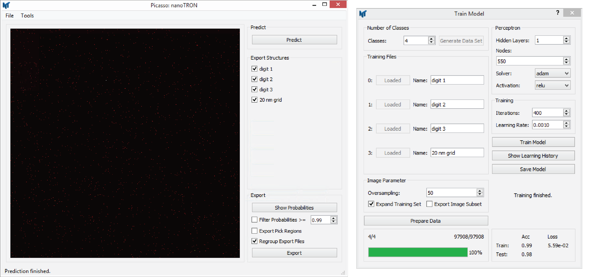

========
nanoTRON
========
The training module uses `scikit-learn <https://scikit-learn.org>`_
's multi-layer perceptron (MLP) to train an artificial neural network (ANN).
If you use nanoTRON, please cite the publication:

- A Auer, M T Strauss, S Strauss, and R Jungmann. ”nanoTRON: a Picasso module for MLP-based classification of super-resolution data”. Bioinformatics, 2020. doi: `10.1093/bioinformatics/btaa154 <https://academic.oup.com/bioinformatics/advance-article/doi/10.1093/bioinformatics/btaa154/5799075#supplementary-data>`_ 

Detailed recommendation for the use of nanoTRON can be found in the supplementary information, `here <https://oup.silverchair-cdn.com/oup/backfile/Content_public/Journal/bioinformatics/PAP/10.1093_bioinformatics_btaa154/1/btaa154_supplementary-data.pdf?Expires=1588259001&Signature=BrtT3NkXnq5HlrZOHhyUg5qjDv7r2ctqCeVa8eN71N8cNfJvWXBe7Lealg7lZgQAjETLTO8DRNSRN9lYWZk8ZI85fAtkAjtDlmmWxadqRkhnYxQd2uXOaaHJcHOvMsLGHbTh0jRHd2AEWtHer8rBn1ejbLBhLz-t3UHf8tBqJqk44CCSpce9wygh-KH0n3TxXB4pj~R59OVn3RDI-vMpEz-XOnmYnwrSvMYGdyAgY8DZKv~Qe4Tu7WeSaHHbNPTLQwRAoEIumRGPQejJIAdem6AYUopk-2ZfLjbGua6Y3bDyRwSi0m9GLTfHXinyVTtwF~~CKFQ6su~vZkN9mbhDLA__&Key-Pair-Id=APKAIE5G5CRDK6RD3PGA>`_.

nanoTRON Train
--------------
Train a MLP model for nanopattern prediction using nanoTRON.

1. In ``Picasso: nanoTRON``, select ``Tools`` > ``Train Model`` to open the training user interface.
2. Set the number of different classes of the model via ``Number of Classes`` and press ``Generate Data Set``.
3. Load all the training files via the various buttons ``Load File``. Greyed out buttons indicate that the data set slot is loaded.
4. Name every data set (class) with a unique name.
5. Set up the image parameters in the box ``Image Parameter``. Set the oversampling factor via ``Oversampling``. This factor determines the sub-pixel resolution of the training images. We recommend lower resolution as the data would provide for better generalization. Augment the training data sets via the check button ``Expand Training Set``. Here every data set point is rotated eleven times. Exemplary images training data images can be exported via ``Export Image Subset``.
6. If the data is loaded and the image parameters are set, press ``Prepare Data`` to convert the localization (molecule) tables into images.
7. Set up the MLP in the box ``Perceptron`` Set the number of hidden layers via ``Hidden Layers``. The number of nodes in every layer can be set via ``Nodes``. Choose the type of training algorithm via the dropdown box ``Solver``. We recommend using ``adam``. Choose the activation function of the layer via the dropdown box ``Activation``. Note, the activation function can only be set for the whole network.
8. Set up the training in the box ``Training``. Set the maximum number of iterations (epochs) via the box ``Iterations``. Set the learning rate via ``Learning Rate`` (only necessary if SGD solver is chosen).
9. To start the training, press ``Train Model``. Depending on the CPU and the size of the training data, this can take up to a few hours.
10. When the training is finished, the learning curve and the confusion matrix can be plotted via ``Show Learning History``.
11. A summary of the achieved train and test accuracies is given at the bottom of the ``Train Model`` window.
12. Save the model for later use via ``Save Model``.

nanoTRON Predict
----------------
Use a trained nanoTRON model to classify nanopatterns on new data.

1. Load the model via ``Tools`` > ``Train Model``. The different classes should now be listed on the right side.
2. Drag and drop the Picasso localization table file (HDF5) that should be used for prediction into the large grey box. If the file was loaded correctly, the box displays the image.
3. Start the classification via the button ``Predict``.
4. Choose the classes that should be exported in the box ``Export Structures``. By default, each class is exported.
5. Set the export parameters in the box ``Export``. The distribution of the prediction probability can be plotted via the button ``Show Probabilities``. Optional, set a probability filter via the check button ``Filter Probabilities``. Optional, enable the additional export of the pick regions via the check button ``Export Pick Regions``. Choose if the new localization files, segmented by the classified nanopatterns, should be regrouped via the check button ``Regroup Export Files``. Note, the group id in every exported file start with 0 then. Identification of picks in the original file will be lost.
