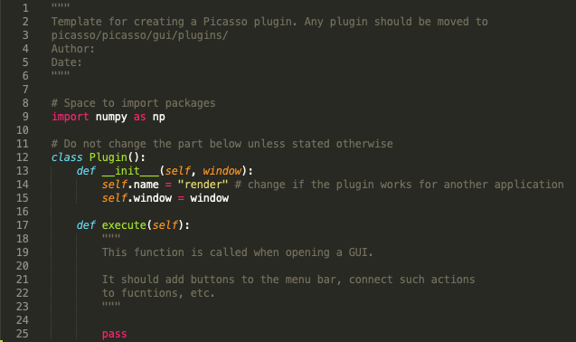

=======
Plugins
=======

Usage
-----
Starting in version 0.5.0, Picasso supports plugins. Please find the instructions on how to add them to your Picasso below. 

Please keep in mind that the ``__init__.py`` file in the ``picasso/picasso/gui/plugins`` folder must not be modified or deleted.

GitHub
~~~~~~
If you cloned the GitHub repository, you can add plugins by following these steps:
- Find the directory where you cloned the GitHub repository with Picasso.
- Go to ``picasso/picasso/gui/plugins``.
- Copy the plugin(s) to this folder.

PyPI
~~~~
If you installed Picasso using ``pip install picassosr``, you can add plugins by following these steps:
- To find the location of the environment where ``picassosr`` is installed, type ``conda env list``.
- If your environment can be found under ``YOUR_ENVIRONMENT``, go to ``YOUR_ENVIRONMENT/Lib/site-packages/picasso/gui/plugins``.
- Copy the plugin(s) to this folder.

One click installer
~~~~~~~~~~~~~~~~~~~
**NOTE**: After deinstalling Picasso, ``Program Files/Picasso`` folder needs to be deleted manually, as the uninstaller currently does not remove the plugins automatically.

- Find the location where you installed Picasso. By default, it is ``C:/Program Files/Picasso``.
- Go to the following subfolder in the `Picasso` directory: ``picasso/gui/plugins``.
- Copy the plugin(s) to this folder.

.. **NOTE**: Plugins added in this distribution will not be able to use packages that are not installed automatically (from the file ``requirements.txt``).

For developers
--------------
To create a plugin, you can use the template provided in ``picasso/plugin_template.py``, see below.

As an example, please see any of the plugins in the `GitHub repo <https://github.com/rafalkowalewski1/picasso_plugins>`_.