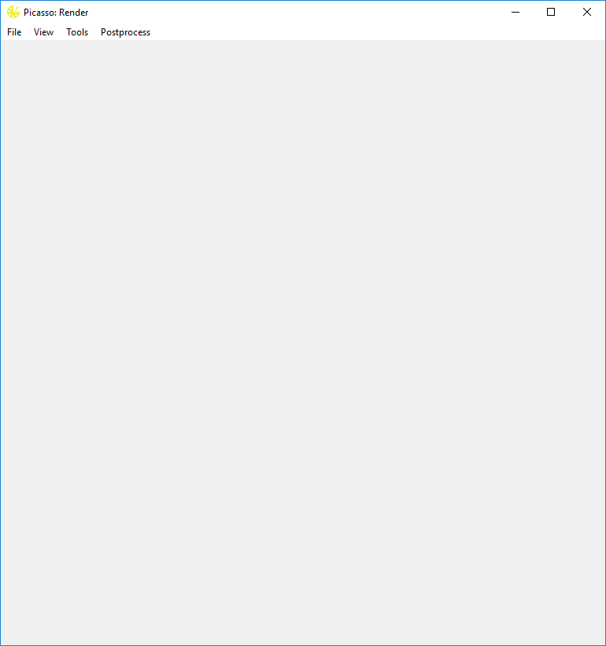
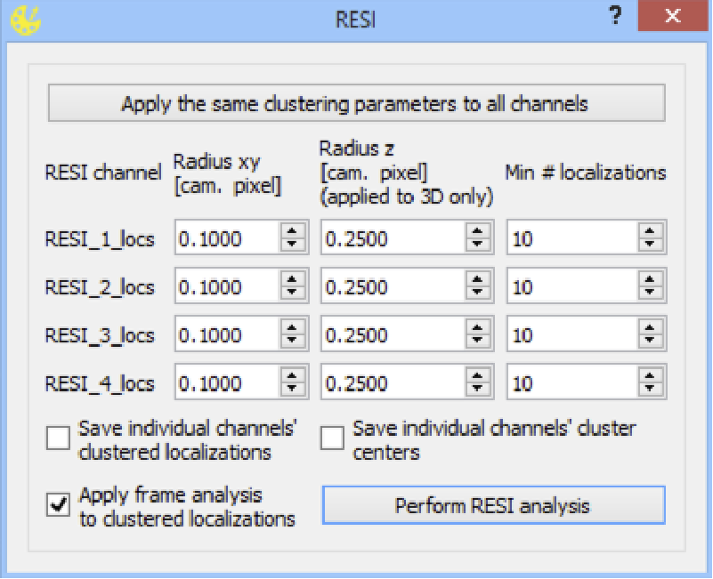

render
======

Opening Files
-------------
1. Rendering of the super-resolution image: In ``Picasso: Render``, open a movie file by dragging a localization file (ending with '.hdf5') into the window or by selecting ``File > Open``. The super-resolution image will be rendered automatically. A region of choice can be zoomed into by a rectangular selection using the left mouse button. The 'View' menu contains more options for zooming and panning.
2. (Optional) Adjust rendering options by selecting ``View > Display Settings``. The field 'Oversampling' defines the number of super-resolution pixels per camera pixel. The contrast settings ``Min. Density`` and ``Max. Density`` define at which number of localizations per super-resolution pixel the minimum and maximum color of the colormap should be applied.
3. (Optional) For multiplexed image acquisition, open HDF5 localization files from other channels subsequently. Alternatively, drag and drop all HDF5 files to be displayed simultaneously.

Drift Correction
----------------
Picasso offers three procedures to correct for drift: AIM (Ma, H., et al. Science Advances. 2024., option A), use of specific structures in the image as drift markers (option B) and an RCC algorithm (option C). AIM is precise, robust, quick, requires no user interaction or fiducial markers (although adding them will may improve performance).  Although RCC does not require any additional sample preparation, option B depends on the presence of either fiducial markers or inherently clustered structures in the image. On the other hand, option B often supports more precise drift estimation and thus allows for higher image resolution. To achieve the highest possible resolution (ultra-resolution), we recommend AIM or consecutive applications of option C and multiple rounds of option B. The drift markers for option B can be features of the image itself (e.g., protein complexes or DNA origami) or intentionally included markers (e.g., DNA origami or gold nanoparticles). When using DNA origami as drift markers, the correction is typically applied in two rounds: first, with whole DNA origami structures as markers, and, second, using single DNA-PAINT binding sites as markers. In both cases, the precision of drift correction strongly depends on the number of selected drift markers.

Adaptive Intersection Maximization (AIM) drift correction
~~~~~~~~~~~~~~~~~~~~~~~~~~~~~~~~~~~~~~~~~~~~~~~~~~~~~~~~~

1. In ``Picasso: Render``, select ``Postprocess > Undrift by AIM``.
2. The dialog asks the user to select:
  a. ``Segmentation`` - the number of frames per interval to calculate the drift. The lower the value, the better the temporal resolution of the drift correction, but the higher the computational cost.
  b. ``Intersection distance (nm)`` - the maximum distance between two localizations in two consecutive temporal segments to be considered the same molecule. This parameter is robust, 3*NeNA for optimal result is recommended.
  c. ``Max. drift in segment (nm)`` - the maximum expected drift between two consecutive temporal segments. If the drift is larger, the algorithm will likely diverge. Setting the parameter up to ``3 * intersection_distance`` will result in fast computation.
3. After the algorithm finishes, the estimated drift will be displayed in a pop-up window, and the display will show the drift-corrected image.

Marker-based drift correction
~~~~~~~~~~~~~~~~~~~~~~~~~~~~~

1. In ``Picasso: Render``, pick drift markers as described in **Picking of regions of interest**. Use the ``Pick similar`` option to automatically detect a large number of drift markers similar to a few manually selected ones.
2. If the structures used as drift markers have an intrinsic size larger than the precision of individual localizations (e.g., DNA origami, large protein complexes), it is critical to select a large number of structures. Otherwise, the statistic for calculating the drift in each frame (the mean displacement of localization to the structure's center of mass) is not valid.
3. Select ``Postprocess > Undrift from picked`` to compute and apply the drift correction.
4. (Optional) Save the drift-corrected localizations by selecting ``File > Save localizations``.

Redundant cross-correlation drift correction
~~~~~~~~~~~~~~~~~~~~~~~~~~~~~~~~~~~~~~~~~~~~

1. In ``Picasso: Render``, select ``Postprocess > Undrift by RCC``.
2. A dialog will appear asking for the segmentation parameter. Although the default value, 1,000 frames, is a sensible choice for most movies, it might be necessary to adjust the segmentation parameter of the algorithm, depending on the total number of frames in the movie and the number of localizations per frame. A smaller segment size results in better temporal drift resolution but requires a movie with more localizations per frame.
3. After the algorithm finishes, the estimated drift will be displayed in a pop-up window, and the display will show the drift-corrected image.

Picking of regions of interest
------------------------------

1. Manual selection. Open ``Picasso: Render`` and load the localization HDF5 file to be processed.
2. Switch the active tool by selecting ``Tools > Pick``. The mouse cursor will now change to a circle. Alternatively, open ``Tools > Tools Settings`` to change the shape into a rectangle. Lastly, choosing ``Polygon`` allows for drawing polygons of any shape.
3. Set the size of the pick circle by adjusting the ``Diameter`` field in the tool settings dialog (``Tools > Tools Settings``). Alternatively, choose ``Width`` for a rectangular shape.
4. Pick regions of interest using the circular mouse cursor by clicking the left mouse button. All localizations within the circle will be selected for further processing.
5. (Optional) Automated region of interest selection. Select ``Tools > Pick similar`` to automatically detect and pick structures that have similar numbers of localizations and RMS deviation (RMSD) from their center of mass than already-picked structures. The upper and lower thresholds for these similarity measures are the respective standard deviations of already-picked regions, scaled by a tunable factor. This factor can be adjusted using the field ``Tools > Tools Settings > Pick similar ± range``. To display the mean and standard deviation of localization number and RMSD for currently picked regions, select ``View > Show info`` and click ``Calculate info below``.
6. (Optional) Exporting of pick information. All localizations in picked regions can be saved by selecting ``File > Save picked localizations``. The resulting HDF5 file will contain a new integer column ``group`` indicating to which pick each localization is assigned.
7. (Optional) Statistics about each pick region can be saved by selecting ``File > Save pick properties``. The resulting HDF5 file is not a localization file. Instead, it holds a data set called ``groups`` in which the rows show statistical values for each pick region.
8. (Optional) The picked positions and diameter itself can be saved by selecting ``File > Save pick regions``. Such saved pick information can also be loaded into ``Picasso: Render`` by selecting ``File > Load pick regions``.

3D rotation window
------------------

The 3D rotation window allows the user to render 3D localization data. To use it, select a single pick region (``Tools > Pick``) and click ``View > Update rotation window``. Some of the display settings (colors, blur method, etc.) are automatically uploaded to the rotation window. 

The user may perform multiple actions in the rotation window, including: saving rotated localizations, building animations (.mp4 format), rotating by a specified angle, etc.

Note that to build animations, the user must have ``ffmpeg`` installed on their system. 

Rotation around z-axis is available by pressing Ctrl/Command. Rotation axis can be frozen by pressing x/y/z to freeze around the corresponding axes (to freeze around the z-axis, Ctrl/Command must be pressed as well).

There are several things to keep in mind when using the rotation window. Firstly, using individual localization precision is very slow and is not recommended as a default blur method. Also, the size of the rotation window can be altered, however, if it becomes too large, rendering may start to lag.

RESI
----

In Picasso 0.6.0, a new RESI (Resolution Enhancement by Sequential Imaging) dialog was introduced. It allows for a substantial resolution boost by sequential imaging of a single target with multiple labels with Exchange-PAINT (*Reinhardt, et al., Nature, 2023.* DOI: 10.1038/s41586-023-05925-9).

To use RESI, prepare your individual RESI channels (localization, undrifting, filtering and **alignment**). Load such localization lists into Picasso Render and open ``Postprocess > RESI``. The dialog shown above will appear. Each channel will be clustered using the SMLM clusterer (other clustering algorithms could be applied as well although only the SMLM clusterer is implemented for RESI in Picasso). Clustering parameters can be defined for each RESI channel individually, although it is possible to apply the same parameters to all channels by clicking ``Apply the same clustering parameters to all channels``, which will copy the clustering parameters from the first row and paste it to all other channels.

Next, the user needs to specify whether or not to save clustered localizations or cluster centers from each of the RESI channels individually, and whether to apply basic frame analysis (to minimize the effect of sticking events). For the explanation of the parameters, see **SMLM clusterer** below.

Upon clicking ``Perform RESI analysis``, each of the loaded channels is clustered, cluster centers are extracted and combined from all RESI channels to create the final RESI file.

Dialogs
-------

Display Settings
~~~~~~~~~~~~~~~~
Allows to change the display settings. Open via ``View > Display Settings``.

General
^^^^^^^
Adjust the general display settings.

Zoom
+++++
Set the magnification factor.

Oversampling
++++++++++++
Set the oversampling. Choose ``dynamic`` to automatically adjust to current window size when zooming.

Minimap
+++++++
Click ``show minimap`` to display a minimap in the upper left corner to localize where the current field of view is within the image.

Contrast
^^^^^^^^
Define the minimum and maximum density of the and select a colormap. Over 100 colormaps are available. The last option ``Custom`` requires the user to load their own ``.npy`` file containg a numpy array with a custom colormap. The selected colormap will be saved when closing render.

Blur
^^^^
Select a blur method. Available options are:
* None
* One-Pixel-Blur
* Individual Localization Precision
* Individual Localization Precision, iso

Camera
^^^^^^
Select the pixel size of the camera. This will be automatically set to a default value or the value specified in the *.yaml file.

Scale Bar
^^^^^^^^^
Activate scalebar. The length of the scale bar is calculated with the Pixel Size set in the Camera dialog. Activate  ``Print scale bar length`` to additionally print the length.

Render properties
^^^^^^^^^^^^^^^^^
This allows rendering properties by color.

Show Info
~~~~~~~~~
Displays the info dialog.

Display
^^^^^^^
Shows the image width/height, the coordinates, and dimensions of the current FoV.

Movie
^^^^^
Displays the median fit precision of the dataset. Clicking on ``Calculate`` allows calculating the precision via the NeNA approach. See `DOI: 10.1007/s00418-014-1192-3 <https://doi.org/10.1007/s00418-014-1192-3>`_.

Field of view
^^^^^^^^^^^^^
Shows the number of localizations in the current FoV.

Picks
^^^^^
Allows calculating statistics about the picked localizations. Press ``Calculate info below`` to calculate. ``Ignore dark times`` allows treating consecutive localizations as on, even if there are localizations (specified by the parameter) missing between them. When defining the number of units per pick, you can calibrate the influx rate via ``Calibrate influx``. A histogram of the dark and bright time can be plotted when clicking ``Histograms``. 

Menu items
----------

File
~~~~

Open [Ctrl+O]
^^^^^^^^^^^^^
Open an .hdf5 file to open in render.

Open rotated localizations [Ctrl+Shift+O]
^^^^^^^^^^^^^^^^^^^^^^^^^^^^^^^^^^^^^^^^^
Opens localizations that were saved via the rotation window, see above.

Save localizations [Ctrl+S]
^^^^^^^^^^^^^^^^^^^^^^^^^^^
Save the localizations that are currently loaded in render to an hdf5 file.

Save picked localizations [Ctrl+Shift+S]
^^^^^^^^^^^^^^^^^^^^^^^^^^^^^^^^^^^^^^^^
Save the localizations that are within a picked region (yellow circle, rectangle or polygon). Each pick will get a different group number. To display the group number in Render, select ``Annotate picks`` in Tools/Tools Settings.
In case of rectangular picks, the saved localizations file will contain new columns `x_pick_rot` and `y_pick_rot`, which are localization coordinates into the coordinate system of the pick rectangle (coordinate (0,0) is where the rectangle was started to be drawn, and `y_pick_rot` is in the direction of the drawn line.)
These columns can be used to plot density profiles of localizations along the rectangle dimensions easily (e.g., with "Filter").

Save pick properties
^^^^^^^^^^^^^^^^^^^^
Calculates the properties of each pick (i.e., mean frame, mean x mean y as well as kinetic information and saves it as an hdf5 file.

Save pick regions
^^^^^^^^^^^^^^^^^
Saves the positions of the picked regions (yellow circles) in a .yaml file. The file will contain the following: A list of center positions and the value of the diameter. It is possible to manually add center positions or copy from another pick regions file with a text editor.

Load pick regions
^^^^^^^^^^^^^^^^^
Resets the current picked regions and loads regions from a .yaml file that contains pick regions.

Export ROI for Imaris
^^^^^^^^^^^^^^^^^^^^^
This function allows to export the current ROI for Imaris. Note that this is currently only implemented for Windows.
Click on File / Export ROI for imaris and enter a filename for export. Picasso will export the current region of interest with the current oversampling settings. If multiple channels are loaded it will export the channels with the same colors as set in Picasso (Shortcut CTRL+F or View / Files to change.)
Depending on the size of the ROI, the export will take a couple of seconds. Once exporting is finished, the file will be saved at the set location.
The resulting file can be opened e.g. with ImarisViewer or Imaris. Note that the orientation is the same as in Picasso.

Export localizations
^^^^^^^^^^^^^^^^^^^^
Select export for various other programs. Note that some exporters only work for 3D files (with z coordinates). For additional file converters check out the convert folder at Picasso's GitHub page.

Export as .csv for ThunderSTORM
+++++++++++++++++++++++++++++++

This will export the dataset in a .csv file to use with ThunderSTORM.

Note that for large datasets the writing of the file may take some time.

Note that the pixel size value that is set in Display Settings will be
used for exporting.

Thefollowing columns will be exported:
3D: id, frame, x [nm], y [nm], z [nm], sigma1 [nm], sigma2 [nm], intensity[photon], offset[photon], uncertainty_xy [nm]
2D: id, frame, x [nm], y [nm], sigma [nm], intensity [photon], offset [photon], uncertainty_xy [nm]

The uncertainty_xy is calculated as the mean of lpx and lpy. For 2D, sigma is calculated as the mean of sx and sy.

For the case of linked localizations, a column named ``detections`` will be added, which contains the len parameter - that’s the duration of a blinking event and not the number n of linked localizations. This is meant to be better for downstream kinetic analysis. For a gradient that is well-chosen n ~ len and for a gap size of 0 len = n.

Export as .txt for FRC
++++++++++++++++++++++
Export as .txt file to be used for the fourier ring correlation plugin in ImageJ.

Export as .xyz for Chimera
++++++++++++++++++++++++++
Export as .txt file to be used for Chimera import.

Export as .3d for ViSP
++++++++++++++++++++++
Export as .3d file to be used ViSP.

Remove all localizations
^^^^^^^^^^^^^^^^^^^^^^^^
Removes all .hdf5 files loaded, restarts the render window.

View
~~~~

Display settings (CTRL + D)
^^^^^^^^^^^^^^^^^^^^^^^^^^^
Opens the Display Settings Dialog.

Files (CTRL + F)
^^^^^^^^^^^^^^^^
Open a dialog to select the color and toggle visibility for each loaded dataset.

Left / Right / Up / Down
^^^^^^^^^^^^^^^^^^^^^^^^
Moves the current field of view in a particular direction. Also possible by using the arrow keys.

Zoom in (CTRL +)
^^^^^^^^^^^^^^^^
Zoom into the image.

Zoom out (CTRL -)
^^^^^^^^^^^^^^^^^
Zoom out of the image.

Fit image to window
^^^^^^^^^^^^^^^^^^^
Fits the reconstructed image to be fully displayed in the window.

Slice (3D)
^^^^^^^^^^
Opens the slicer dialog which allows for slicing through 3D datasets.

Update rotation window (3D) [Ctrl+Shift+R]
^^^^^^^^^^^^^^^^^^^^^^^^^^^^^^^^^^^^^^^^^^
Opens/updates rotation window, see above. Requires a single picked region of interest to be selected.

Show info
^^^^^^^^^
Shows info for the current dataset. See Info Dialog.

Tools
~~~~~

Zoom (CTRL + Z)
^^^^^^^^^^^^^^^
Selects the zoom tool. The mouse can now be used for zoom and pan.

Pick (CTRL + P)
^^^^^^^^^^^^^^^
Selects the pick tool. The mouse can now be used for picking localizations. The user can set the pick shape in the `Tools settings` (CTRL + T) dialog. The default shape is Circle with the diameter to be set. For rectangles, the user draws the length, while the width is controlled via a parameter for all drawn rectangles, similar to the diameter for circular picks. For a polygonal pick, the user clicks with the left button to draw the desired polygon. The right button deletes the last selected vertex. The polygon can be close by clicking with the left button on the starting vertex.

Measure (CTRL + M)
^^^^^^^^^^^^^^^^^^
Selects the measure tool. The mouse can now be used for measuring distances. Left click adds a crosshair for measuring; right-click deletes the last crosshair.

Tools settings (CTRL + T)
^^^^^^^^^^^^^^^^^^^^^^^^^
Define the settings of the tools, i.e., the radius of the pick and an option to annotate each pick. For the circular picks the range of pick similar can be set.

Pick similar (CTRL + Shift + P)
^^^^^^^^^^^^^^^^^^^^^^^^^^^^^^^
Automatically identifies picks that are similar to the current picks.

Remove localizations in picks
^^^^^^^^^^^^^^^^^^^^^^^^^^^^^
Remove localizations found in picked region(s) of interest. Can be applied to separate or all channels simultaneously.

Move to pick
^^^^^^^^^^^^
Changes FoV to display a pick region specified by the user.

Pick fiducials
^^^^^^^^^^^^^^
Automatically picks fiducials. To do so, the whole FOV image is rendered at one-pixel-blur. Then, such image pixel intesities are histogramed and the 99th is used as a threshold for selecting image maxima using Localize's identification.

Show trace (CTRL + R)
^^^^^^^^^^^^^^^^^^^^^
Shows the time trace of the currently selected pick(s).

Select picks (trace)
^^^^^^^^^^^^^^^^^^^^
Opens a dialog to that goes through all picks, displays its trace and asks to keep or discard it.

Select picks (XY scatter)
^^^^^^^^^^^^^^^^^^^^^^^^^
Opens a dialog to that goes through all picks, displays a xy-scatterplot and asks to keep or discard it.

Plot pick (XYZ scatter) (CTRL + 3)
^^^^^^^^^^^^^^^^^^^^^^^^^^^^^^^^^^
Displays a 3D scatterplot of the localizations of the currently selected pick(s).

Select picks (XYZ scatter)
^^^^^^^^^^^^^^^^^^^^^^^^^^
Opens a dialog to that goes through all picks, displays an xyz-scatterplot and asks to keep or discard it.

Select picks (XYZ scatter, 4 panels)
^^^^^^^^^^^^^^^^^^^^^^^^^^^^^^^^^^^^
Opens a dialog to that goes through all picks, displays four panels with an xyz-scatterplot and a top, bottom and side projection and asks to keep or discard it.

Filter picks by locs
^^^^^^^^^^^^^^^^^^^^
Allows filtering picks by the number of localizations in each pick. When clicking, a histogram of the number of localizations of all selected picks will be calculated. A lower and upper boundary can be selected to filter the picks.

Clear picks (Ctrl + C)
^^^^^^^^^^^^^^^^^^^^^^
Clears all currently selected picks.

Subtract pick regions
^^^^^^^^^^^^^^^^^^^^^^
Allows loading another pick regions file to subtract from the currently selected picks. Can be slow for a large number of picks.

Cluster in pick (k-means)
^^^^^^^^^^^^^^^^^^^^^^^^^
Allows performing k-means clustering in picks. Users can specify the number of clusters and deselect individual clusters. Picks can be kept or removed. After looping through all picks an hdf5 file with the cluster information can be saved.

Mask image
^^^^^^^^^^
Opens a dialog that allows the user to specify a mask for filtering localizations within and outside it.

Fast rendering
^^^^^^^^^^^^^^
Allows the user to display only a fraction of localizations to speed up rendering.

Postprocess
~~~~~~~~~~~

Undrift by AIM
^^^^^^^^^^^^^^
Performs drift correction using the AIM algorithm (Ma, H., et al. Science Advances. 2024).

Undrift from picked (3D)
^^^^^^^^^^^^^^^^^^^^^^^^
Performs drift correction using the picked localizations as fiducials. Also performs drift correction in z if the dataset has 3D information.

Undrift from picked (2D)
^^^^^^^^^^^^^^^^^^^^^^^^
Performs drift correction using the picked localizations as fiducials. Does not perform drift correction in z even if dataset has 3D information.

Undrift by RCC
^^^^^^^^^^^^^^
Performs drift correction by redundant cross-correlation.

Undo drift (2D)
^^^^^^^^^^^^^^^
Undo previous drift correction (only 2D part). Can be pressed again to redo.

Show drift
^^^^^^^^^^
After drift correction, a drift file is created. If the drift file is present, the drift can be displayed with this option.

Apply drift from an external file
^^^^^^^^^^^^^^^^^^^^^^^^^^^^^^^^^
Applies drift from a user-specified. txt file. Keep in mind that the .txt drift files after consecutive undrifting rounds produce cumulative drift. Therefore, if 3 rounds of undrifing were performed, only the last file specifies the drift calculated in the 3 steps.

Remove group info
^^^^^^^^^^^^^^^^^
Removes the group information when loading a dataset that contains group information. This will, i.e., turn the multicolor representation into a single color representation.

Unfold / Refold groups
^^^^^^^^^^^^^^^^^^^^^^
Allows to "unfold" an average to display each structure individually in a line. Also works with picks.

Unfold groups (square)
^^^^^^^^^^^^^^^^^^^^^^
Arranges an average in a square so that each structure is displayed individually

Link localizations
^^^^^^^^^^^^^^^^^^
Links consecutive localizations

Align channels (RCC or from picked)
^^^^^^^^^^^^^^^^^^^^^^^^^^^^^^^^^^^
Aligns channels to each other when several datasets are loaded. If picks are selected, the alignment will be via the center of mass of the picks; otherwise, an RCC will be used. 

Combine locs in picks
^^^^^^^^^^^^^^^^^^^^^
Combines all localizations in each pick to one.

Apply expressions to localizations
^^^^^^^^^^^^^^^^^^^^^^^^^^^^^^^^^^
This tool allows you to apply expressions to localizations, for example:

- ``x +=1`` will shift all localization by one to the right
- ``x +=1; y+=1`` will shift all localization by one to the right and one up.
- ``flip x z`` will exchange the x-axis with y-axis if z localizations are present (side projection), similar for ``flip y z``.
- ``spiral r n`` will plot each localization over the time of the movie in a spiral with radius r and n number of turns (e.g., to detect repetitive binding), ``uspiral`` to reverse.

**NOTE:** using two variables in one statement is not supported (e.g. ``x = y``) To filter localizations use picasso filter.

DBSCAN
^^^^^^
Cluster localizations with the dbscan clustering algorithm.

HDBSCAN
^^^^^^^
Cluster localizations with the hdbscan clustering algorithm.

SMLM clusterer
^^^^^^^^^^^^^^
Cluster localizations with the custom algorithm designed for SMLM. In short, localizations with the maximum number of neighboring localizations within a user-defined radius are chosen as cluster centers, around which all localizations within the given radius belong to one cluster. If two or more local maxima are within the radius, the clusters are merged.

SMLM clusterer requires three (or four if 3D data is processed) arguments:

- Radius: final size of the clusters.
- Radius z (3D only): final size of the clusters in the z axis. If the value is different from radius in xy plane, clusters have ellipsoidal shape. Radius z can have a different value to account for a difference in localization precision in lateral and axial directions.
- Min. locs: minimum number of localizations in a cluster.
- Basic frame analysis: If True, each cluster is checked for its value of mean frame (if it is within the first or the last 20% of the total acquisition time, it is discarded). Moreover, localizations inside each cluster are split into 20 time bins (across the whole acquisition time). If a single time bin contains more than 80% of localizations per cluster, the cluster is discarded.

**Note to all clustering algorithms:** it is highly recommended to remove any fiducial markers before clustering, to lower clustering time, given they are of no interest to the user. To do that, the markers can be picked and removed using ``Tools > Remove localizations in picks``.

Test clusterer
^^^^^^^^^^^^^^
Opens a dialog where different clustering parameters can be checked on the loaded dataset. Requires a single pick region of interest to be selected.

Nearest Neighbor Analysis
^^^^^^^^^^^^^^^^^^^^^^^^^
Calculates distances to the ``k``-th nearest neighbors between two channels (can be the same channel). ``k`` is defined by the user. The distances are stored in nm as a .csv file.