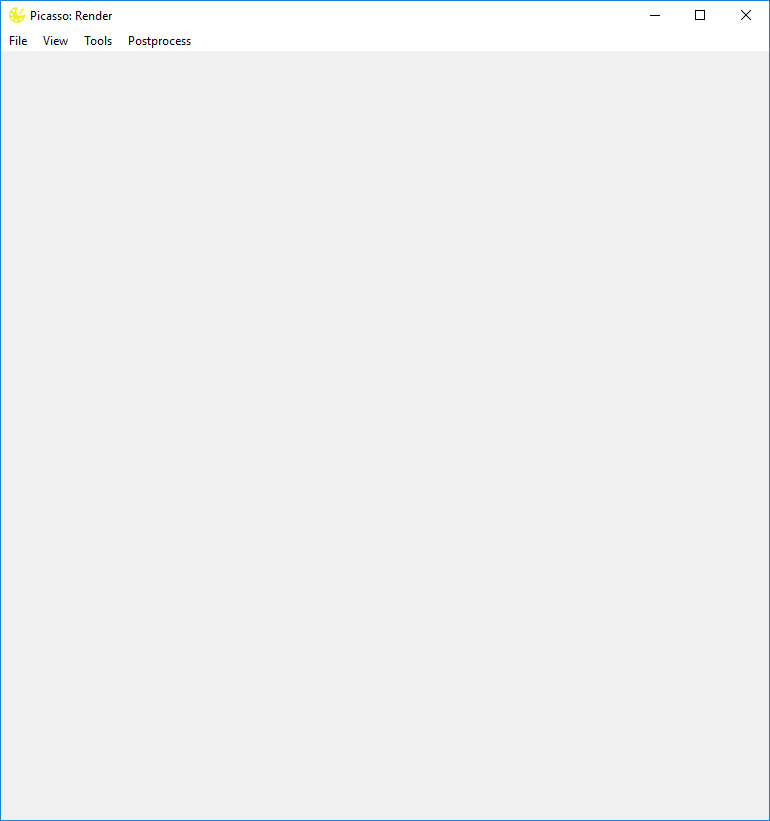
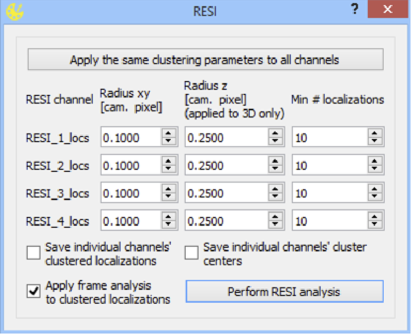

render
======

Opening Files
-------------
1. Rendering of the super-resolution image: In ``Picasso: Render``, open a movie file by dragging a localization file (ending with '.hdf5') into the window or by selecting ``File > Open``. The super-resolution image will be rendered automatically. Zoom into a region by dragging a rectangle with the left mouse button and pan by dragging with the right mouse button; see :ref:`render-navigation` for all mouse and keyboard controls.
2. (Optional) Adjust rendering options by selecting ``View > Display Settings``. The field 'Display pixel size (nm)' defines the size of the rendered pixels of the super-resolution image. The contrast settings ``Min. Density`` and ``Max. Density`` define at which number of localizations per super-resolution pixel the minimum and maximum color of the colormap should be applied. They can be typed in or dragged on the two-handle slider below them, whose track is logarithmic and spans the densities present in the rendered image.
3. (Optional) For multiplexed image acquisition, open HDF5 localization files from other channels subsequently. Alternatively, drag and drop all HDF5 files to be displayed simultaneously.

.. _render-navigation:

Navigating the image
~~~~~~~~~~~~~~~~~~~~
The ``Tools`` menu selects the active tool (Zoom, Pick, Measure or Move; ``Ctrl+Z``, ``Ctrl+P``, ``Ctrl+M``, ``Ctrl+G``). The following controls move the view; those marked *every tool* also work while picking or measuring, so the tool need not be changed to look around.

- **Zoom**: with the Zoom tool, drag a rectangle with the left mouse button to zoom to it. The rectangle stretches towards the bottom right; releasing above or left of the start cancels. ``Shift`` + the left button drags the same rectangle in *every tool*. ``Ctrl`` (``Cmd`` on macOS) + the mouse wheel (or trackpad scroll) and a trackpad pinch zoom about the cursor; ``Ctrl`` +/- zoom about the center (``View`` menu).
- **Pan**: drag with the right mouse button (Zoom tool), or, in *every tool*, with the middle mouse button, with ``Ctrl`` (``Cmd``) + the left button or with ``Alt`` (``Option`` on macOS) + the left button. The arrow keys (or ``W``/``A``/``S``/``D``) move the view by a fraction of the window.
- **Fit**: ``View > Fit image to window`` (``Ctrl+W`` or ``Home``) shows the whole image; a triple click with the Zoom tool does the same.

The 3D rotation window uses the same controls, plus rotation; see *Navigating the 3D window* below.

Drift Correction
----------------
Picasso offers three procedures to correct for drift: AIM (Ma, H., et al. Science Advances. 2024., option A), use of specific structures in the image as drift markers (option B) and an RCC algorithm (option C). AIM is precise, robust, quick, requires no user interaction or fiducial markers (although adding them will may improve performance).  Although RCC does not require any additional sample preparation, option B depends on the presence of either fiducial markers or inherently clustered structures in the image. On the other hand, option B often supports more precise drift estimation and thus allows for higher image resolution. To achieve the highest possible resolution (ultra-resolution), we recommend AIM or consecutive applications of option C and multiple rounds of option B. The drift markers for option B can be features of the image itself (e.g., protein complexes or DNA origami) or intentionally included markers (e.g., DNA origami or gold nanoparticles). When using DNA origami as drift markers, the correction is typically applied in two rounds: first, with whole DNA origami structures as markers, and, second, using single DNA-PAINT binding sites as markers. In both cases, the precision of drift correction strongly depends on the number of selected drift markers.

Adaptive Intersection Maximization (AIM) drift correction
~~~~~~~~~~~~~~~~~~~~~~~~~~~~~~~~~~~~~~~~~~~~~~~~~~~~~~~~~

1. In ``Picasso: Render``, select ``Postprocess > Undrift by AIM``.
2. The dialog asks the user to select:
  a. ``Segmentation`` - the number of frames per interval to calculate the drift. The lower the value, the better the temporal resolution of the drift correction, but the higher the computational cost.
  b. ``Intersection distance (nm)`` - the maximum distance between two localizations in two consecutive temporal segments to be considered the same molecule. This parameter is robust, 3*NeNA for optimal result is recommended.
  c. ``Max. drift in segment (nm)`` - the maximum expected drift between two consecutive temporal segments. If the drift is larger, the algorithm will likely diverge. Setting the parameter up to ``3 * intersection_distance`` will result in fast computation.
3. After the algorithm finishes, the estimated drift will be displayed in a pop-up window, and the display will show the drift-corrected image.

Marker-based drift correction
~~~~~~~~~~~~~~~~~~~~~~~~~~~~~

1. In ``Picasso: Render``, pick drift markers as described in **Picking of regions of interest**. Use the ``Pick similar`` option to automatically detect a large number of drift markers similar to a few manually selected ones.
2. If the structures used as drift markers have an intrinsic size larger than the precision of individual localizations (e.g., DNA origami, large protein complexes), it is critical to select a large number of structures. Otherwise, the statistic for calculating the drift in each frame (the mean displacement of localization to the structure's center of mass) is not valid.
3. Select ``Postprocess > Undrift from picked`` to compute and apply the drift correction.
4. (Optional) Save the drift-corrected localizations by selecting ``File > Save localizations``.

Redundant cross-correlation drift correction
~~~~~~~~~~~~~~~~~~~~~~~~~~~~~~~~~~~~~~~~~~~~

1. In ``Picasso: Render``, select ``Postprocess > Undrift by RCC``.
2. A dialog will appear asking for the segmentation parameter. Although the default value, 1,000 frames, is a sensible choice for most movies, it might be necessary to adjust the segmentation parameter of the algorithm, depending on the total number of frames in the movie and the number of localizations per frame. A smaller segment size results in better temporal drift resolution but requires a movie with more localizations per frame.
3. After the algorithm finishes, the estimated drift will be displayed in a pop-up window, and the display will show the drift-corrected image.

Picking of regions of interest
------------------------------

Pick shapes
~~~~~~~~~~~

``Picasso: Render`` offers six pick shapes, selected in ``Tools > Tools Settings``. They differ in how they are drawn and in whether all picks share one size or each pick carries its own extent:

.. list-table::
   :widths: 10 30 25 35
   :header-rows: 1

   * - Shape
     - Drawn by
     - Size
     - Suited to
   * - ``Circle``
     - A single left click at its center.
     - ``Diameter``, shared by all picks.
     - The default. Compact, roughly round structures.
   * - ``Square``
     - A single left click at its center.
     - ``Side length``, shared by all picks.
     - The same use as the circle, where a square footprint is preferred.
   * - ``Rectangle``
     - Dragging from one end of its center axis to the other, so it can take any orientation and length.
     - ``Width`` (across the axis) shared by all picks; the length is per pick.
     - Elongated structures - filaments, nanorulers, edges - and the only shape that can be projected onto its own axes, see ``Plot pick profile`` below.
   * - ``Polygon``
     - One left click per vertex; click the first vertex again to close the outline. A right click removes the last vertex.
     - None; each polygon carries its own extent.
     - Irregular regions that no fixed shape follows, e.g., an outlined cell or organelle.
   * - ``Box``
     - Pressing the left mouse button at one corner, dragging to the opposite one and releasing. A green outline follows the cursor while you drag.
     - None; each box carries its own extent.
     - Quickly grabbing an arbitrary axis-aligned region, without first setting a size.
   * - ``Brush``
     - Painting freehand with the left mouse button held down. Keep painting to extend a region: strokes whose painted areas touch merge into a single pick.
     - ``Stroke width``, kept per stroke. The setting applies to the next stroke only, so changing it never reshapes what is already painted.
     - Irregular regions that are quicker to sweep over than to outline vertex by vertex.

Clicking the right mouse button inside a pick removes that pick. Two shapes are drawn incrementally and undo their last step instead: ``Polygon`` removes the last vertex, and ``Brush`` removes the last stroke, wherever you click. Undoing a brush stroke that was joining two painted regions leaves them as two separate picks again. ``Tools > Clear picks`` (Ctrl+C) removes all of them. The shapes are not interchangeable, so changing the shape while picks exist asks for confirmation and then discards them; save them first (``File > Save pick regions``) if you want to keep them.

Picking
~~~~~~~

1. Manual selection. Open ``Picasso: Render`` and load the localization HDF5 file to be processed.
2. Switch the active tool by selecting ``Tools > Pick``. The mouse cursor will now change to a circle. Open ``Tools > Tools Settings`` to change to any of the other shapes described above.
3. Set the size of the pick in the tool settings dialog (``Tools > Tools Settings``): ``Diameter`` for circles, ``Side length`` for squares, ``Width`` for rectangles or ``Stroke width`` for the brush. ``Polygon`` and ``Box`` picks need no size setting.
4. Pick regions of interest by clicking or dragging, as listed in the table above. All localizations within the pick will be selected for further processing.
5. (Optional, not applicable to ``Polygon`` or ``Brush``) Automated region of interest selection. Select ``Tools > Pick similar`` to automatically detect and pick structures that have similar numbers of localizations and RMS deviation (RMSD) from their center of mass than already-picked structures. The upper and lower thresholds for these similarity measures are the respective standard deviations of already-picked regions, scaled by a tunable factor. This factor can be adjusted using the field ``Tools > Tools Settings > Pick similar ± range``. To display the mean and standard deviation of localization number and RMSD for currently picked regions, select ``View > Show info`` and click ``Calculate info below``. ``Pick similar`` works with circular, square, rectangular and box picks (not with polygon or brush picks, which have no size or canonical form to replicate). Rectangular picks all take the median length of the already-picked regions and are automatically rotated onto the principal axis of the localizations they contain, so elongated structures are found at any orientation; for them the RMSD along and across that axis are used as two separate similarity measures. Box picks likewise all take the median width and height of the already-picked regions, while the regions you drew yourself are kept exactly as drawn.
6. (Optional) Exporting of pick information. All localizations in picked regions can be saved by selecting ``File > Save picked localizations``. The resulting HDF5 file will contain a new integer column ``group`` indicating to which pick each localization is assigned.
7. (Optional) Statistics about each pick region can be saved by selecting ``File > Save pick properties``. The resulting HDF5 file is not a localization file. Instead, it holds a data set called ``groups`` in which the rows show statistical values for each pick region.
8. (Optional) The picked positions and diameter itself can be saved by selecting ``File > Save pick regions``. Such saved pick information can also be loaded into ``Picasso: Render`` by selecting ``File > Load pick regions``.

*NOTE*: ``Plot pick profile`` (and the ``x_pick_rot``/``y_pick_rot`` columns it relies on) is available for rectangular picks only, since they are the only shape with an unambiguous long axis. ``Pick fiducials`` and ``Subtract pick regions`` are likewise restricted to circular picks.

3D rotation window
------------------

The 3D rotation window allows the user to render 3D localization data. Open it with ``View > 3D view`` (Ctrl+Shift+R): with a single pick region selected (``Tools > Pick``) it shows that pick, as before; without a pick (or with several) it shows the current field of view of the main window, rotated about its center - so any region can be looked at in 3D by zooming to it and pressing the shortcut. Pressed again with nothing changed, it only brings the window to the front, keeping the rotation; a new pick or a new field of view reloads it. Some of the display settings (colors, blur method, etc.) are automatically uploaded to the rotation window. In the field-of-view mode the arrow keys move the shown region (there is no pick to move), and *Save rotated localizations* records the field of view instead of a pick.

The user may perform multiple actions in the rotation window, including: saving rotated localizations, building animations (.mp4 format), rotating by a specified angle, etc.

Rendering in the rotation window runs in the background, as in the main window: rotating and panning never block the interface, a burst of mouse movements renders only the newest orientation, and large picks are previewed with a subset of the localizations while you drag (``interaction_subsample``, see *CPU usage on shared workstations*, counted over the localizations in view) and sharpened as soon as the drag pauses. The renders use the GPU when it is enabled (see *GPU rendering*).

When rotating by a specified angle, the dialog offers a ``Rotate around`` choice between **Localizations** (the default) and **World**. ``Localizations`` rotates around the data's own axes - the axes shown by the axes icon, which rotate together with the data - so each entered angle changes the corresponding displayed angle by exactly that amount. ``World`` rotates around the fixed screen/camera axes instead.

Navigating the 3D window (the zoom and pan controls match the main window's, see :ref:`render-navigation`):

- **Rotate**: drag with the left mouse button (trackball). Hold ``S`` while dragging to rotate in steps of 15 degrees.
- **Zoom**: ``Ctrl`` (``Cmd`` on macOS) + the mouse wheel (or trackpad scroll; a pinch works too) zooms about the cursor; drag a rectangle with ``Shift`` + the left button to zoom to it (as in the main window, the rectangle stretches towards the bottom right and releasing above or left of the start cancels); ``Ctrl`` +/- zoom about the center.
- **Pan**: drag with the right or the middle mouse button, or with ``Alt`` (``Option`` on macOS) + the left button; the arrow keys move the view too. With the Measure tool the right button keeps freezing and deleting measurements (as in the main window), so pan with the middle button or ``Alt`` + the left button there.
- **Reset**: triple click fits the loaded region into the window (``Home`` does the same); ``Shift`` + triple click also resets the rotation. ``1``, ``2`` and ``3`` select the XY, XZ and YZ projections.

Rotations turn the data about the point at the center of the view, at the depth of the localizations shown there, so zooming in and panning to a structure lets you rotate around it. Rotation around the z-axis is available by pressing Ctrl/Command. Rotation axis can be frozen by pressing x/y/z to freeze around the corresponding axis. By default the frozen rotation is around the data's own axes (Localizations frame); holding Ctrl/Command together with x/y/z instead rotates around the fixed screen/World axes. The z-axis can now be frozen by pressing z alone (vertical dragging spins around it); Ctrl/Command is only needed for the z-axis if you want to rotate it in the World frame, or to spin around the screen z-axis when no axis is frozen.

Build an animation
~~~~~~~~~~~~~~~~~~

Build an animation with ``File > Build an animation...`` (Ctrl+Shift+E): rotate, zoom and pan to each view the video should show and click ``Add this position`` (``Stay in the position`` adds a pause), then set the durations of the transitions and click ``Build animation``. The frames are rendered in the background, at the resolution set in the animation dialog (``Resolution (px)``, by default the window's size, e.g. 1920 x 1080 for a full-HD video whatever the window's size), so the windows stay usable while the video is built; a progress dialog shows the frames done and lets you cancel, in which case no partial video is left behind. The frames use the GPU when it is enabled. ``Transition`` sets how the motion is timed between the positions: *Stop at each position* (default) accelerates and decelerates between every two positions, coming to rest at each of them, *Smooth* starts and ends at rest and passes through the positions without abrupt changes of direction or speed (it still comes to rest where the motion reverses, stops or turns by 90 degrees or more), and *Constant speed* moves at a constant speed between every two positions, with sharp turns at the positions. The durations are kept in each case, so the rotation speed only sets the average speed.

RESI
----

In Picasso 0.6.0, a new RESI (Resolution Enhancement by Sequential Imaging) dialog was introduced. It allows for a substantial resolution boost by sequential imaging of a single target with multiple labels with Exchange-PAINT (*Reinhardt, Masullo, Baudrexel, Steen, et al., Nature, 2023.* DOI: 10.1038/s41586-023-05925-9).

To use RESI, prepare your individual RESI channels (localization, undrifting, filtering and **alignment**). Load such localization lists into Picasso Render and open ``Postprocess > RESI``. The dialog shown above will appear. Each channel will be clustered using the SMLM clusterer (other clustering algorithms could be applied as well although only the SMLM clusterer is implemented for RESI in Picasso). Clustering parameters can be defined for each RESI channel individually, although it is possible to apply the same parameters to all channels by clicking ``Apply the same clustering parameters to all channels``, which will copy the clustering parameters from the first row and paste it to all other channels.

Next, the user needs to specify whether or not to save clustered localizations or cluster centers from each of the RESI channels individually, and whether to apply basic frame analysis (to minimize the effect of sticking events). For the explanation of the parameters, see **SMLM clusterer** below.

Upon clicking ``Perform RESI analysis``, each of the loaded channels is clustered, cluster centers are extracted and combined from all RESI channels to create the final RESI file.

G5M
---

In Picasso 0.9.5, a new algorithm for molecular mapping (i.e., finding the positions of individual molecules from localizations) was introduced: G5M (Gaussian Mixture Modeling with Modifications for Molecular Mapping; Kowalewski, Reinhardt et al. *Nature Comms*, 2026. DOI: 10.1038/s41467-026-70198-5). G5M is based on Gaussian Mixture Modeling (GMM) but includes several modifications to make it suitable for molecular mapping. All the technicalities as well as the user guide of the method are explained in the publication mentioned and its Supplementary Information. Please refer to ``picasso.g5m`` for the details of the implementation. Below is a brief summary of the user guide.

G5M requires some preprocessing of localizations to filter out the badly fitted ones, especially the ones arising from crosstalk (overlapping blinking). These can be excluded from 2D data where the ellipticity and size of the image of an emitter in x and y can be filtered (in Picasso these are found under names “ellipticity”, “sx” and “sy”, respectively). Moreover, the photon count can be cut-off as crosstalk is likely to result in a higher-intensity signal. In 3D data these filters are less reliable due to astigmatism, however, “d_zcalib” could be used. We strongly encourage avoiding dense blinking, where emission signals from neighboring molecules overlap, especially during 3D image acquisition.

Note that G5M assumes that the localization precision values (``lpx``, ``lpy`` and ``lpz`` columns) correspond to the real spread of the localization clouds. For example, drift correction needs to done precisely. In astigmatic imaging, great care needs to be taken if fiducials are used for drift correction, especially if they lie at a different plane from the target localizations. In fact, we recommend using the new fiducial-free algorithms such as `COMET <https://www.biorxiv.org/content/10.64898/2026.03.27.714864v1>`_ and `AIM <https://www.science.org/doi/10.1126/sciadv.adm7765>`_. This prevenents overfitting of too many molecules.

Prior to molecular mapping, clustering of localizations is required to split the data into smaller chunks. For many datasets, DBSCAN works well. While in some cases some adjustments may be needed, we recommend the following DBSCAN parameters: In 2D, DBSCAN radius (epsilon) of 2*LP, in 3D - 3*LP (LP - average localization precision of the dataset, for example, NeNA or median localization precision). Default min. samples is set to 4. Clustering in Picasso adds the ``group`` column to the localization file, which is required for G5M. **Note: G5M relies on the information in the ``group`` column, therefore, if it is overwritten (for example, by picking localizations after DBSCAN clustering), G5M will not work.**

Localizations obtained with the rotated elliptical Gaussian model will automatically take the mean value of the xy-plane rotation and apply it to the fitted molecule.

To account for fluorophore non-specific sticking, frame analysis is normally recommended (especially the filtering of st. dev. of frame per molecule). However, if localizations from neighboring localization clouds overlap, this is not sufficient due to ambigous assignment of localizations to molecules. Therefore, we recommend filtering of molecules that express too few binding events (saved in the column ``n_events``). In the publication, we recommend a threshold of at least 3 binding events per molecule.

The final postprocessing step is log-likelihood filtering (using the column ``p_val``). The recommended threshold is ``> 0.0015``, however, it might need to be adjusted for your data, especially in 3D this can be too conservative.

As a final check for overfitting (i.e., too many assigned molecules), G5M automatically saves a bar plot of the number of binding events per molecule (``n_events`` column) for clustered (with neighbors within 25 nm) and sparse (without neighbors within 80 nm) molecules. If the clustered molecules show fewer binding events that the sparse molecules, overfitting likely occurred. See Fig. S15 of the publication for an example of well-behaved data. As of v0.9.8, Picasso saves the plot showing relative σ values (i.e., the fitted Gaussian σ divided by the average loc. precision around the molecule). This can be used to estimate if the loc. precision values are accurate (if not, many molecules will have relative σ values close to the user-selected min./max. σ). As of version 0.9.10, Picasso runs KS 2 sample test to compare the two distributions. The output test statistic and theoretical p value correspond to the KS test, while the permutation p value is calculated by randomly permuting the labels of clustered and sparse molecules 1,000 times and calculating the fraction of permutations that result in a KS test statistic as extreme as the one observed with the original labels.

If the outcome of G5M seems unsatisfactory, please check the following:

- Make sure that ``group`` column is present in the localization file and contains the correct information (i.e., from DBSCAN clustering, not from picking localizations). ``group_input`` can also be used;
- Make sure that the loc. precision values (columns ``lpx``, ``lpy``, ``lpz``) are correct, comparing NeNA and median loc. precision is a reasonable proxy (without fiducial markers); the most common issue is a miscalibrated camera, leading to incorrect photon counts and thus incorrect loc. precisions;
- Consider using a more accurate fitting model, such as spline fitting; we found that switching to it with optional increase in max. sigma can be very beneficial
- Another reason why the loc. precision values can be off is due to the small box size in the localization step; especially in 3D astigmatic imaging, single-emitter images can be quite large, potentially exceeding the user-defined box size; in such cases, we recommend increasing the box size in the localization step and rerunning the analysis;
- Inspect if the localizations were preprocessed as described above;
- Rerun the analysis without postprocessing (filtering) and redo it manually, since some steps may be too stringent, such as ``p_val`` or ``n_events`` (latter especially for short acquisition times);
- Adjust min./max. σ, especially too low max. σ may lead to high false positive error rates (i.e., overfitting); We suggest inspecting ``rel_sigma`` values of the assigned molecules, which are calculated as the fitted σ divided by the mean localization precision of the surrounding localizations. If the values are close to the user-selected min./max. σ, min./max. σ might need to be adjusted. Alternatively, this might be a sign of inaccurate/inprecise loc. precision values, see above;
- Adjust min. locs;
- Adjust DBSCAN (or other clustering algorithm) parameters. For example, if G5M takes too long to run, the DBSCAN clusters most likely contain too many molecules. In such a case, we recommend splitting such clusters further;

Dialogs
-------

Display Settings
~~~~~~~~~~~~~~~~
Allows to change the display settings. Open via ``View > Display Settings``.

General
^^^^^^^
Adjust the general display settings.

Zoom
+++++
Set the magnification factor.

Display pixel size (nm)
+++++++++++++++++++++++
Set the size of the pixel in the rendered image. Choose ``dynamic`` to automatically adjust to current window size when zooming.

Minimap
+++++++
Click ``show minimap`` to display a minimap in the upper left corner to localize where the current field of view is within the image.

.. _render-colormap-setting:

Contrast
^^^^^^^^
Define the minimum and maximum density of the and select a colormap. Over 100 colormaps are available. The last option ``Custom`` requires the user to load their own ``.npy`` file containg a numpy array with a custom colormap. The selected colormap will be saved when closing render, under ``Colormap`` in the ``Render`` section of ``~/.picasso/settings.yaml`` (see :ref:`user-settings-file`), and restored the next time Render starts.

Colormaps built with the custom colormap editor (``Edit custom colormaps`` in the **Datasets** dialog, see ``View > Files``/``Ctrl+F`` below, one per channel with its own list of color stops) are kept separately, under ``Render: CustomColormaps``, keyed by name.

Blur
^^^^
Select a blur method. Available options are:

* None: each localization adds one count to the display pixel it falls in (a histogram).
* One-Pixel-Blur: the histogram blurred with a Gaussian of one display pixel.
* Global Localization Precision: every localization is drawn with the same Gaussian, the median precision of the whole channel (computed once per channel).
* Individual Localization Precision: each localization is drawn as a Gaussian whose width is its own localization precision (``lpx``, ``lpy``); *iso* uses the mean of the two. Note that this blurs the data a second time by the localization error already contained in the positions, which costs a factor of about 1.4 in resolution (Baddeley, Cannell & Soeller, *Microsc. Microanal.* 2010).
* Adaptive Histogram (Quad-Tree): the quad-tree adaptive histogram of Baddeley, Cannell & Soeller (2010). A bin is split into four while it holds more localizations than the **leaf capacity**, so every bin has about the same signal-to-noise ratio whatever the local density: bin counts are Poisson distributed and bins hold between about a quarter of the capacity and the capacity, so the mean SNR is the square root of half the capacity (the paper's estimate; the dialog shows it), and the bin size shows the local sampling: large bins where localizations are sparse, small ones where they are dense. Choose the capacity below the number of localizations of the smallest structure you want to see; structures with fewer than about half the capacity are merged into their surroundings, which suppresses spurious detail in undersampled regions. The default of 10 (SNR about 2.2) suits DNA-PAINT data with tens of localizations per binding site; the original paper used 5 for STORM data. Bins never split below a display pixel, so zoomed out the image is the histogram; the mode renders on the CPU from the spatial index of each channel (see :ref:`files <spatial-index>`), which makes it fast at any zoom. In the 3D rotation window the same method is applied to the projected localizations: the tree is rebuilt from the rows in view for every orientation (a sort of those rows per frame, so whole large channels rotate more slowly than with the other methods; drag previews use a subset as usual).
* Jittered Triangulation: the adaptively jittered, averaged Delaunay triangulation of Baddeley, Cannell & Soeller (2010). The localizations in view are triangulated and every triangle is drawn with an intensity inverse to its area, which is linear in the local density; to blur to the local sampling limit, every localization is displaced by a random jitter whose width is its mean distance to its neighbors (times the **Jitter** factor: 1, the paper's choice, or 0.5 for known periodic structures) and the images of **Passes** many such triangulations are averaged (25 by default). Dense regions therefore keep their resolution while isolated localizations are dimmed instead of shown as confident dots, and there is no second blur by the localization precision. It is computed on the CPU (the passes in parallel) and quite computationally expensive, so it is a mode for zoomed-in views: above **Max. localizations in view** (100,000 by default) the histogram is rendered instead and the dialog says so. While panning and zooming a single unjittered triangulation is previewed and the average follows when the mouse pauses. In the 3D rotation window the projected localizations are triangulated for every orientation, within the same limit. In scripts: ``blur_method="triangulation"`` with ``triangulation_passes`` and ``triangulation_jitter`` in ``picasso.render.render`` and ``render_scene``; ``picasso.render.triangulation.render_triangulation`` works on arrays.

Camera
^^^^^^
Select the pixel size of the camera. This will be automatically set to a default value or the value specified in the *.yaml file.

Scale Bar
^^^^^^^^^
Activate scale bar. The length of the scale bar is calculated with the Pixel Size set in the Camera dialog. Activate  ``Print scale bar length`` to additionally print the length.

Render properties
^^^^^^^^^^^^^^^^^
This allows rendering properties by color. The colormap chosen here is kept separately from the channel colormap above, under ``Colormap Property`` in the ``Render`` section of ``~/.picasso/settings.yaml`` (default ``gist_rainbow``, see :ref:`user-settings-file`), and restored the next time a property is rendered.

.. _render-colorbar-format:

Color bar (LUT)
+++++++++++++++
When rendering by property is active, exporting an image additionally saves the color bar (LUT) next to it, named after the image with the suffix ``_colorbar`` (e.g., ``locs_view.png`` and ``locs_view_colorbar.png``) - for instance, to annotate z color-coding in a figure. It displays the colors that localizations are rendered with, one band per color as set by ``Colors``, and the property values along the bar.

This applies to ``Export current view``, ``Export complete image`` and ``Export view manually``, as well as to ``Export current view`` in the 3D rotation window. The property, its limits, the number of colors and the colormap are additionally written to the ``.yaml`` file that accompanies the exported image.

The color bar is saved as a ``.png`` by default. To save it as a vector graphic instead - whose bands, ticks and text stay editable in figure software - set ``Colorbar format`` to ``.svg`` under ``Render`` in ``~/.picasso/settings.yaml`` (also available under File > Picasso settings in any module)::

    Render:
      Colorbar format: .svg

The setting applies to the color bar only; the image itself keeps the format chosen in the save dialog.

Show Info
~~~~~~~~~
Displays the info dialog.

Display
^^^^^^^
Shows the image width/height, the coordinates, and dimensions of the current FoV.

Movie
^^^^^
Displays the median fit precision of the dataset. Clicking on ``Calculate`` allows calculating the precision via the NeNA approach. See `DOI: 10.1007/s00418-014-1192-3 <https://doi.org/10.1007/s00418-014-1192-3>`_.

FRC
^^^
Displays the FRC resolution of the dataset. Takes in the image in the current FOV and calculates the FRC resolution via splitting the localizations into two halves. Based on the approach from `10.1038/nmeth.2448 <https://doi.org/10.1038/nmeth.2448>`_. Does not take into account the Q factor for multiple blinking.

Field of view
^^^^^^^^^^^^^
Shows the number of localizations in the current FoV.

Picks
^^^^^
Allows calculating statistics about the picked localizations. Press ``Calculate info below`` to calculate. ``Ignore dark times`` allows treating consecutive localizations as on, even if there are localizations (specified by the parameter) missing between them. When defining the number of units per pick, you can calibrate the influx rate via ``Calibrate influx``. A histogram of the dark and bright time can be plotted when clicking ``Histograms``. Dark times are counted as the number of frames without signal between two binding events in a pick; see "HDF5 Pick Property Files" in the file format documentation for the exact convention. **Note:** since Picasso 0.11.3, dark times are one frame shorter than in earlier versions, so influx rates calibrated with earlier versions should be recalibrated.

Menu items
----------

File
~~~~

Open [Ctrl+O]
^^^^^^^^^^^^^
Open a localization file in render. Picasso ``.hdf5`` files are loaded directly; ThunderSTORM ``.csv`` and SMAP ``_sml.mat`` files are imported (you will be asked for the camera pixel size in nm). Localization files can also be imported by dragging and dropping them onto the render window.

Open rotated localizations [Ctrl+Shift+O]
^^^^^^^^^^^^^^^^^^^^^^^^^^^^^^^^^^^^^^^^^
Opens localizations that were saved via the rotation window, see above.

Save localizations [Ctrl+S]
^^^^^^^^^^^^^^^^^^^^^^^^^^^
Save the localizations that are currently loaded in render to an hdf5 file.

.. _render-save-picks-in-metadata:

Save picked localizations [Ctrl+Shift+S]
^^^^^^^^^^^^^^^^^^^^^^^^^^^^^^^^^^^^^^^^
Save the localizations that are within a picked region (yellow circle, square, rectangle, polygon, box or brushed area). Each pick will get a different group number. To display the group number in Render, select ``Annotate picks`` in Tools/Tools Settings.
In case of rectangular picks, the saved localizations file will contain new columns `x_pick_rot` and `y_pick_rot`, which are localization coordinates into the coordinate system of the pick rectangle (coordinate (0,0) is where the rectangle was started to be drawn, and `y_pick_rot` is in the direction of the drawn line.)
These columns can be used to plot density profiles of localizations along the rectangle dimensions easily (e.g., with "Filter").

The picked regions themselves (shape, size and positions, in the same format as a pick regions ``.yaml`` file, see "Save pick regions" below) can additionally be stored in the metadata of the saved file, under the key ``Picks``. This is switched off by default, since it can add a substantial amount of data to the metadata. To switch it on, set ``Save picks in metadata`` to ``True`` in ``~/.picasso/settings.yaml`` (also available under File > Picasso settings in any module).

Save pick properties
^^^^^^^^^^^^^^^^^^^^
Calculates the properties of each pick (i.e., mean frame, mean x mean y as well as kinetic information) and saves it as an hdf5 file.

Save pick regions
^^^^^^^^^^^^^^^^^
Saves the positions of the picked regions (yellow circles) in a .yaml file. It is possible to manually add regions or copy them from another pick regions file with a text editor. The file always carries a ``Shape`` key; the remaining keys depend on it. All coordinates are in camera pixels and all sizes in nm:

- ``Circle``: ``Centers`` (a list of ``[x, y]``) and ``Diameter (nm)``.
- ``Square``: ``Centers`` and ``Side Length (nm)``.
- ``Rectangle``: ``Center-Axis-Points`` (a list of ``[[x_start, y_start], [x_end, y_end]]``) and ``Width (nm)``.
- ``Polygon``: ``Vertices`` (a list of vertex lists, each closed by repeating its first vertex).
- ``Box``: ``Corners`` (a list of ``[[x0, y0], [x1, y1]]``, two opposite corners). No size is stored, since each box has its own.
- ``Brush``: ``Strokes``, a flat list in painting order, each with its own ``Width (nm)`` and the ``Path`` the cursor swept. Which strokes form one pick is not stored: it follows from their geometry and is worked out again when the file is loaded, so overlapping strokes always come back as a single pick.

For example:

.. code-block:: yaml

    Shape: Box
    Corners:
    - [[12.5, 30.1], [40.2, 55.7]]
    - [[80.0, 10.0], [95.5, 22.3]]

.. code-block:: yaml

    Shape: Brush
    Strokes:
    - Width (nm): 300.0
      Path:
      - [10.1, 20.4]
      - [10.9, 21.2]
    - Width (nm): 80.0
      Path:
      - [15.0, 25.0]

Load pick regions
^^^^^^^^^^^^^^^^^
Resets the current picked regions and loads regions from a .yaml file that contains pick regions.

Export ROI for Imaris
^^^^^^^^^^^^^^^^^^^^^
This function allows to export the current ROI for Imaris. Note that this is currently only implemented for Windows.
Click on File / Export ROI for imaris and enter a filename for export. Picasso will export the current region of interest with the current display pixel size settings. If multiple channels are loaded it will export the channels with the same colors as set in Picasso (Shortcut CTRL+F or View / Files to change.)
Depending on the size of the ROI, the export will take a couple of seconds. Once exporting is finished, the file will be saved at the set location.
The resulting file can be opened e.g. with ImarisViewer or Imaris. Note that the orientation is the same as in Picasso.

Export localizations
^^^^^^^^^^^^^^^^^^^^
Select export for various other programs. Note that some exporters only work for 3D files (with z coordinates). For additional file converters check out the convert folder at Picasso's GitHub page.

Export as .csv for ThunderSTORM
+++++++++++++++++++++++++++++++

This will export the dataset in a .csv file to use with ThunderSTORM.

Note that for large datasets the writing of the file may take some time.

Note that the pixel size value that is set in Display Settings will be
used for exporting.

Thefollowing columns will be exported:
3D: id, frame, x [nm], y [nm], z [nm], sigma1 [nm], sigma2 [nm], intensity[photon], offset[photon], uncertainty_xy [nm]
2D: id, frame, x [nm], y [nm], sigma [nm], intensity [photon], offset [photon], uncertainty_xy [nm]

The uncertainty_xy is calculated as the mean of lpx and lpy. For 2D, sigma is calculated as the mean of sx and sy.

For the case of linked localizations, a column named ``detections`` will be added, which contains the len parameter - that’s the duration of a blinking event and not the number n of linked localizations. This is meant to be better for downstream kinetic analysis. For a gradient that is well-chosen n ~ len and for a gap size of 0 len = n.

Export as .txt for FRC
++++++++++++++++++++++
Export as .txt file to be used for the fourier ring correlation plugin in ImageJ.

Export as .xyz for Chimera
++++++++++++++++++++++++++
Export as .txt file to be used for Chimera import.

Export as .3d for ViSP
++++++++++++++++++++++
Export as .3d file to be used ViSP.

Export as .mat for SMAP
+++++++++++++++++++++++
Export the dataset as a SMAP (`https://github.com/jries/SMAP <https://github.com/jries/SMAP>`_) ``_sml.mat`` file that can be loaded in SMAP via File > Load. The output is named ``<file>_sml.mat`` (the ``_sml`` suffix is required for SMAP to recognize the file).

Coordinates and localization precision are converted from camera pixels to nm using the pixel size set in Display Settings; z and its precision (``lpz``) are written in nm; frames are made 1-based (SMAP convention). ``lpx`` and ``lpy`` are combined into SMAP's single ``locprecnm`` field as their mean.

Remove all localizations
^^^^^^^^^^^^^^^^^^^^^^^^
Removes all .hdf5 files loaded, restarts the render window.

View
~~~~

Display settings (CTRL + D)
^^^^^^^^^^^^^^^^^^^^^^^^^^^
Opens the Display Settings Dialog.

Files (CTRL + F)
^^^^^^^^^^^^^^^^
Opens the **Datasets** dialog, which lists every loaded channel and lets you
control its title, visibility, color (or colormap), and relative intensity.
A small horizontal gradient next to each channel previews what that channel
will look like at intensity 0 → intensity 1.

**Left click** on a channel's checkbox ticks/unticks it, i.e., shows or
hides that channel. **Right click** on a checkbox displays that channel
only - it is ticked and all other channels are unticked at once, which is
convenient for quickly inspecting individual channels in multiplexed data.

Each channel's *Color* dropdown is organized into three sections:

* **Solid colors** — the 14 default named colors (``red``, ``cyan``,
  ``green``, …). You can also type a hexadecimal code such as ``#FF5733``
  directly into the dropdown. Solid colors are rendered as a black →
  color ramp, exactly matching the previous "intensity × RGB" behavior.
* **Built-in colormaps** — one 3-stop *black → color → white* gradient
  per default solid color, named ``<color>_gradient`` (e.g.
  ``blue_gradient``, ``red_gradient``).
* **Custom** — any user-defined colormaps (see "Edit custom colormaps…"
  below). This section only appears once at least one custom colormap
  has been defined.

Channels are blended additively in the final image and clipped to 1.0,
so overlapping high-intensity regions saturate toward the sum of the
channel colors.

The ``Automatic coloring`` checkbox overrides per-channel selections with
HSV-spaced colors for as long as it's ticked. ``Save colors`` /
``Load colors`` write / read a one-identifier-per-line ``.txt`` file —
any name from the three dropdown sections (or a hex code) is valid.

Edit custom colormaps
+++++++++++++++++++++
Opens a small editor where you can create, rename, duplicate, or delete
your own colormaps. Each custom colormap is a list of 2-5 *stops*; each
stop has a position in [0, 1] and an RGB color. Stops are linearly
interpolated into the 256-row look-up table (LUT) used at render time. Click any of the R / G / B cells to type a value, or **double-click** the row to pick the
stop color from a standard color dialog. Use ``Add stop`` /
``Remove stop`` to grow or shrink the gradient.

Programmatic use
++++++++++++++++
The underlying conversion from solid colors or stops to a ``(256, 3)``
LUT is also exposed as part of ``picasso.render``::

    from picasso import render
    lut_red   = render.solid_to_lut((1.0, 0.0, 0.0))     # black → red
    lut_fire  = render.stops_to_lut([(0, 0, 0, 0),
                                     (0.5, 1, 0, 0),
                                     (1, 1, 1, 0)])      # black → red → yellow
    qimage, *_ = render.render_scene(
        locs=..., info=..., colors=[lut_red, lut_fire], ...
    )

Passing a list of LUTs to ``render_scene`` selects the per-channel
colormap path; passing a list of plain RGB triplets (legacy) still works
and is equivalent to ``solid_to_lut`` per channel.

Overlay image
^^^^^^^^^^^^^
Overlays a PNG or TIFF image (``.png``, ``.tif``, ``.tiff``), e.g., a widefield or brightfield image of the same field of view, on the rendered localizations. Grayscale images of any data type (e.g., 8- or 16-bit integers or 32-bit floats) and RGB images are supported, with or without an alpha channel; RGB images with more than 8 bits per channel are scaled to 8 bits. For a multi-page TIFF, e.g., a raw movie, the first page is shown and the *Page* box selects another one; the contrast is kept when changing pages. Opening the dialog without a loaded image asks for one right away; an image can also be dropped onto the Render window.

The dialog shows the size of the image and the size of the camera chip given by the localizations' metadata (``Width`` and ``Height``), states whether they match, and reports the resulting size of one image pixel in camera pixels and nm. The image is placed on the camera chip using one of the following scalings:

* **Fit to camera (keep aspect ratio)** (default) - the largest uniform scaling at which the whole image fits on the chip; the image is centered. For an image with the chip's size, this places each image pixel onto one camera pixel.
* **Stretch to camera** - width and height are scaled independently so that the image covers the whole chip. The image is distorted if its aspect ratio differs from the chip's.
* **Image pixel size** - each image pixel is scaled to the given pixel size (nm); the top left corners of the image and the chip coincide.

In every mode, the image can additionally be shifted by a given number of camera pixels in x and y, e.g., to correct a known offset between the cameras.

The placement follows the localization coordinates: a localization at ``x = 0`` lies at the center of the first camera pixel, so the chip spans from -0.5 to ``Width`` - 0.5 camera pixels. An image acquired on the same camera region thus registers with the localizations to the sub-pixel level.

Under *Display*, the overlay can be hidden, its opacity is set, and the blending with the localizations is chosen: *Additive* (default) sums image and localizations; *Over localizations* paints the image over the localizations; *Behind localizations* paints the localizations over the image, so that the image shows where there are no localizations and shows through dim ones (a pixel is opaque at the maximum contrast and transparent without localizations; in between, its opacity is its color's distance from the color of empty pixels relative to the color at the maximum contrast, both given by the colormap, the background color and whether the background is white); and *Multiply* multiplies them (for a white background). A grayscale image is shown in the chosen color between the minimum and maximum intensity (by default, the image's full range; *Reset contrast* restores it). RGB images are shown with their own colors.

The API functions are available as ``picasso.render.load_overlay_image``, ``overlay_extent``, ``overlay_to_qimage`` and ``draw_image_overlay``.

Left / Right / Up / Down
^^^^^^^^^^^^^^^^^^^^^^^^
Moves the current field of view in a particular direction. Also possible by using the arrow keys.

Zoom in (CTRL +)
^^^^^^^^^^^^^^^^
Zoom into the image.

Zoom out (CTRL -)
^^^^^^^^^^^^^^^^^
Zoom out of the image.

Fit image to window
^^^^^^^^^^^^^^^^^^^
Fits the reconstructed image to be fully displayed in the window.

Slice (3D)
^^^^^^^^^^
Opens the slicer dialog which allows for slicing through 3D datasets.

3D view [Ctrl+Shift+R]
^^^^^^^^^^^^^^^^^^^^^^
Opens/updates the rotation window, see above: with a single picked region of interest it shows that pick, otherwise the current field of view. Requires localizations with z coordinates.

Show info
^^^^^^^^^
Shows info for the current dataset. See Info Dialog.

New linked window
^^^^^^^^^^^^^^^^^
Opens another, complete Render window with its own channels, for example to compare channels side by side. A dialog asks which of the current window's channels the new window starts with. They are taken as they are, including unsaved changes such as filtering or drift correction, and by default both windows share them in memory: filtering, drift correction, the Move tool, etc. in either window update both. More files can be opened in the new window later; they belong to that window only. By default the linked windows pan and zoom together; windows of different sizes show the same center at the same scale. Closing a linked window leaves the others open; closing the first window closes all of them.

Link settings
^^^^^^^^^^^^^
Chooses which attributes the linked windows share: the localizations of shared channels (switching this off gives each window its own copy of them), pan, zoom, a crosshair marking the cursor position of the window the mouse is in, the active tool, render settings, contrast, colormap, render by property, scale bar, minimap, background and legend, camera pixel size, pick shape and size, the picks themselves, and slicing (the slice position is matched in nm). Channel colors and visibility are never shared. When an attribute is switched on, the other windows take it from the window the dialog was opened from; shared localizations, however, apply only to channels taken into a linked window while the option is on. The dialog also lists the linked windows and can bring one to the front or unlink it; an unlinked window keeps copies of the channels it shared. The choice is saved for the next session.

Tools
~~~~~

Zoom (CTRL + Z)
^^^^^^^^^^^^^^^
Selects the zoom tool. Dragging a rectangle with the left mouse button zooms into it; dragging with the right mouse button pans. Panning is also available in every tool by dragging with the left mouse button while holding Ctrl (Cmd on macOS).

Pick (CTRL + P)
^^^^^^^^^^^^^^^
Selects the pick tool. The mouse can now be used for picking localizations. The user can set the pick shape in the `Tools settings` (CTRL + T) dialog. The default shape is Circle with the diameter to be set. For rectangles, the user draws the length, while the width is controlled via a parameter for all drawn rectangles, similar to the diameter for circular picks. For a polygonal pick, the user clicks with the left button to draw the desired polygon. The right button deletes the last selected vertex. The polygon can be close by clicking with the left button on the starting vertex.

Measure (CTRL + M)
^^^^^^^^^^^^^^^^^^
Selects the measure tool, which is used to measure distances on the rendered image.

While the tool is active, the cursor is shown as a crosshair that follows the mouse. **Left click** drops a measurement point: each new point is connected to the previous one by a line, and the running total distance (in nm) is displayed live next to the line as you move the mouse, before the next point is even placed. Chaining several left clicks measures a multi-segment path.

**Right click** has two functions:

* The **first** right click *freezes* the current measurement set: the crosshair stops following the mouse and the measured path stays drawn on the image. A new, independent set of measurements can then be started simply by left-clicking again.
* While in this frozen state, a **further** right click *deletes* the most recently finalized set. Repeating it removes the previous sets one by one.

Distances and lines are only drawn within a set, never across sets, so multiple independent measurements can be displayed at the same time.

Move (CTRL + G)
^^^^^^^^^^^^^^^
Selects the move tool, which changes the x and y coordinates of localizations by dragging them with the left mouse button, e.g., to register channels by eye. The channels that are dragged together are selected in the `Tools settings` (CTRL + T) dialog: *Select...* opens a list of the loaded channels with a checkbox each. By default, the first channel is dragged. *Undo last move* in the `Tools settings` dialog reverses the moves one by one.

Normally, localizations outside the image (x or y at or beyond ``Width`` or ``Height`` in the metadata, or negative) would be removed when saving. Instead, the image (the canvas) is fitted to the localizations after every move:

* Dragging beyond the right or bottom edge increases ``Width`` or ``Height``.
* Dragging beyond the left or top edge translates all channels, picks and measured points by the same whole number of camera pixels, so that no coordinate is negative and the channels stay registered. ``Width`` and ``Height`` grow by the same amount, so the camera field of view stays inside the canvas. The translation is saved in the metadata as ``Canvas offset x (cam. px)`` and ``Canvas offset y (cam. px)``; subtract it to return to the camera coordinates, e.g., for picks saved before the translation.
* The canvas shrinks again when the localizations are moved back, but it is never smaller than the camera image, whose size is saved as ``Camera Width`` and ``Camera Height``. For example, dragging a channel beyond the left edge and back to where it was restores the original canvas and coordinates.

A channel loaded later, or saved with a different canvas offset, is brought into the same frame as the loaded channels.

The shift of each channel done with the move tool is saved in its metadata as ``Manual shift x (cam. px)`` and ``Manual shift y (cam. px)``.

Tools settings (CTRL + T)
^^^^^^^^^^^^^^^^^^^^^^^^^
Define the settings of the tools, i.e., the radius of the pick and an option to annotate each pick. The range of pick similar can be set here as well.

How the tools are drawn is set in the **Appearance** section at the bottom, hidden by default; click its title to show it. It has one tab per tool: **Pick**, **Measure** and **Move** (the label showing the shift while dragging). The settings apply to the main window, to exported images and, for the Measure tool, to the 3D window. If the dialog does not fit on the screen, it scrolls.

* *Color*: *Auto* is yellow on a black and red on a white background. You can choose a preset color, or *Custom...* to pick any color.
* *Line*: solid, dashed, dotted or dash-dot lines. The crosses of the Measure tool are always solid.
* *Width*: line width in screen pixels. Lines wider than one pixel are smoothed (antialiased).
* *Opacity*: opacity of the lines and labels.
* *Fill* (picks only): opacity of the fill of closed picks, in the line color; 0% draws outlines only. *Default* fills only brush picks. A polygon is filled once it is closed.
* *Label size*: size of the pick indices (see *Annotate picks*), the measured distances and the shift label, in screen pixels.
* *While drawing* (picks only): color of a rectangle, box or brush stroke that is still being dragged.
* *Marker size* (Measure only): size of the crosses marking the measured points.

*Reset* restores the default appearance. The appearance is saved when Render is closed and restored at the next start (``ToolStyles`` in the ``Render`` section of the :ref:`user-settings-file`).

Pick similar (CTRL + Shift + P)
^^^^^^^^^^^^^^^^^^^^^^^^^^^^^^^
Automatically identifies picks that are similar to the current picks. Available for circular, square and rectangular picks. For rectangular picks, the new picks take the median length of the current picks and are oriented along the localizations they contain.

Remove localizations in picks
^^^^^^^^^^^^^^^^^^^^^^^^^^^^^
Remove localizations found in picked region(s) of interest. Can be applied to separate or all channels simultaneously.

Move to pick
^^^^^^^^^^^^
Changes FoV to display a pick region specified by the user.

Pick fiducials
^^^^^^^^^^^^^^
Automatically picks fiducials. To do so, the whole FOV image is rendered at one-pixel-blur. Then, such image pixel intesities are histogramed and the 99th is used as a threshold for selecting image maxima using Localize's identification.

Show trace (CTRL + R)
^^^^^^^^^^^^^^^^^^^^^
Shows the time trace of the currently selected pick(s).

Select picks (trace)
^^^^^^^^^^^^^^^^^^^^
Opens a dialog to that goes through all picks, displays its trace and asks to keep or discard it.

Select picks (XY scatter)
^^^^^^^^^^^^^^^^^^^^^^^^^
Opens a dialog to that goes through all picks, displays a xy-scatterplot and asks to keep or discard it.

Plot pick (XYZ scatter) (CTRL + 3)
^^^^^^^^^^^^^^^^^^^^^^^^^^^^^^^^^^
Displays a 3D scatterplot of the localizations of the currently selected pick(s).

Select picks (XYZ scatter)
^^^^^^^^^^^^^^^^^^^^^^^^^^
Opens a dialog to that goes through all picks, displays an xyz-scatterplot and asks to keep or discard it.

Select picks (XYZ scatter, 4 panels)
^^^^^^^^^^^^^^^^^^^^^^^^^^^^^^^^^^^^
Opens a dialog to that goes through all picks, displays four panels with an xyz-scatterplot and a top, bottom and side projection and asks to keep or discard it.

Filter picks by locs
^^^^^^^^^^^^^^^^^^^^
Allows filtering picks by the number of localizations in each pick. When clicking, a histogram of the number of localizations of all selected picks will be calculated. A lower and upper boundary can be selected to filter the picks.

Clear picks (Ctrl + C)
^^^^^^^^^^^^^^^^^^^^^^
Clears all currently selected picks.

Subtract pick regions
^^^^^^^^^^^^^^^^^^^^^^
Allows loading another pick regions file to subtract from the currently selected picks. Can be slow for a large number of picks.

Cluster in pick (k-means)
^^^^^^^^^^^^^^^^^^^^^^^^^
Allows performing k-means clustering in picks. Users can specify the number of clusters and deselect individual clusters. Picks can be kept or removed. After looping through all picks an hdf5 file with the cluster information can be saved.

Mask image
^^^^^^^^^^
Opens a dialog that allows the user to specify a mask for filtering localizations within and outside it. The user can adjust the histogram bin size, blur thereof and the threshold applied.

The images can be zoomed in/out (Ctrl/Cmd + scrolling) and panned (dragging with the right mouse button, or with Ctrl/Cmd + the left mouse button). Double clicking resets the zoom.

Postprocess
~~~~~~~~~~~

Undrift by AIM
^^^^^^^^^^^^^^
Performs drift correction using the AIM algorithm (Ma, H., et al. Science Advances. 2024).

Undrift from picked (3D)
^^^^^^^^^^^^^^^^^^^^^^^^
Performs drift correction using the picked localizations as fiducials. Also performs drift correction in z if the dataset has 3D information.

Undrift from picked (2D)
^^^^^^^^^^^^^^^^^^^^^^^^
Performs drift correction using the picked localizations as fiducials. Does not perform drift correction in z even if dataset has 3D information.

Undrift by RCC
^^^^^^^^^^^^^^
Performs drift correction by redundant cross-correlation.

Undo drift (2D)
^^^^^^^^^^^^^^^
Undo previous drift correction (only 2D part). Can be pressed again to redo.

Show drift
^^^^^^^^^^
After drift correction, a drift file is created. If the drift file is present, the drift can be displayed with this option.

Apply drift from an external file
^^^^^^^^^^^^^^^^^^^^^^^^^^^^^^^^^
Applies drift from a user-specified. txt file. Keep in mind that the .txt drift files after consecutive undrifting rounds produce cumulative drift. Therefore, if 3 rounds of undrifing were performed, only the last file specifies the drift calculated in the 3 steps.

Remove group info
^^^^^^^^^^^^^^^^^
Removes the group information when loading a dataset that contains group information. This will, i.e., turn the multicolor representation into a single color representation.

Sync groups across channels
^^^^^^^^^^^^^^^^^^^^^^^^^^^
If more than one channel is present, this function rejects localizations from across the channels whose *group* field is not present in all channels. This is useful for removing, for example, clustered localizations after their cluster centers were filtered with frame analysis.

Unfold / Refold groups
^^^^^^^^^^^^^^^^^^^^^^
Allows to "unfold" an average to display each structure individually in a line.Note that the structures need to be grouped and processed with Picasso: Average beforehand.

Unfold groups (square)
^^^^^^^^^^^^^^^^^^^^^^
Arranges an average in a square so that each structure is displayed individually. This function does not require Picasso: Average beforehand. Instead, grouped or picked (circular picks) localizations are accepted.

Link localizations
^^^^^^^^^^^^^^^^^^
Links localizations originating from individual binding events. If the localizations were already grouped the binding events are never linked across two input groups.

Select central frames localizations
^^^^^^^^^^^^^^^^^^^^^^^^^^^^^^^^^^^
Groups localizations into binding events, exactly like *Link localizations* (same dialog: maximum distance and maximum number of transient dark frames), but instead of merging each binding event into a single localization, it keeps the localizations that are not at the borders of the event, i.e., those in the first and the last frame of each event are discarded, see `Steen et al., Nature Methods 21, 1755-1762 (2024) <https://doi.org/10.1038/s41592-024-02374-8>`_, Extended Data Fig. 1f.

The retained localizations of each binding event are assigned a unique value in the *group* column. If the localizations were already grouped (e.g., by picking or clustering), the previous grouping is preserved in the *group_input* column, and binding events are never linked across two input groups.

Align channels (RCC or from picked)
^^^^^^^^^^^^^^^^^^^^^^^^^^^^^^^^^^^
Aligns channels to each other when several datasets are loaded. If picks are selected, the alignment will be via the center of mass of the picks; otherwise, an RCC will be used. 

Combine locs in picks
^^^^^^^^^^^^^^^^^^^^^
Combines all localizations in each pick to one.

Apply expressions to localizations
^^^^^^^^^^^^^^^^^^^^^^^^^^^^^^^^^^
This tool allows you to apply expressions to localizations, for example:

- ``x +=1`` will shift all localization by one to the right
- ``x +=1; y+=1`` will shift all localization by one to the right and one up.
- ``flip x z`` will exchange the x-axis with y-axis if z localizations are present (side projection), similar for ``flip y z``.
- ``spiral r n`` will plot each localization over the time of the movie in a spiral with radius r and n number of turns (e.g., to detect repetitive binding), ``uspiral`` to reverse.

**NOTE:** using two variables in one statement is not supported (e.g. ``x = y``) To filter localizations use picasso filter.

Localizations moved outside the image by an expression are kept: the canvas is fitted to them as described for the `Move tool <#move-ctrl-g>`_. Invalid localizations (e.g., NaN or negative localization precision) are removed.

DBSCAN
^^^^^^
Cluster localizations with the dbscan clustering algorithm.

HDBSCAN
^^^^^^^
Cluster localizations with the hdbscan clustering algorithm.

SMLM clusterer
^^^^^^^^^^^^^^
Cluster localizations with the custom algorithm designed for SMLM. In short, localizations with the maximum number of neighboring localizations within a user-defined radius are chosen as cluster centers, around which all localizations within the given radius belong to one cluster. If two or more local maxima are within the radius, the clusters are merged.

SMLM clusterer requires three (or four if 3D data is processed) arguments:

- Radius: final size of the clusters.
- Radius z (3D only): final size of the clusters in the z axis. If the value is different from radius in xy plane, clusters have ellipsoidal shape. Radius z can have a different value to account for a difference in localization precision in lateral and axial directions.
- Min. locs: minimum number of localizations in a cluster.
- Basic frame analysis: If True, each cluster is checked for its value of mean frame (if it is within the first or the last 20% of the total acquisition time, it is discarded). Moreover, localizations inside each cluster are split into 20 time bins (across the whole acquisition time). If a single time bin contains more than 80% of localizations per cluster, the cluster is discarded.

**Note to all clustering algorithms:** it is highly recommended to remove any fiducial markers before clustering, to lower clustering time, given they are of no interest to the user. To do that, the markers can be picked and removed using ``Tools > Remove localizations in picks``.

Test clusterer
^^^^^^^^^^^^^^
Opens a dialog where different clustering parameters can be checked on the loaded dataset. Requires a single pick region of interest to be selected.

Nearest Neighbor Analysis
^^^^^^^^^^^^^^^^^^^^^^^^^
Calculates distances to the ``k``-th nearest neighbors between two channels (can be the same channel). ``k`` is defined by the user. The distances are stored in nm as a .hdf5 localizations file with new columns ``nnd_1``, ``nnd_2``, ..., ``nnd_k`` for each localization in channel 1. The distances are calculated in 3D if both datasets have z information.

.. _render-cpu-usage:

CPU usage on shared workstations
--------------------------------
Rendering uses a limited number of CPU worker threads so that Picasso stays polite on shared analysis computers where several users work at the same time. The budget is set in the user settings file ``~/.picasso/settings.yaml`` (also editable via ``File > Picasso settings`` in any module):

.. code-block:: yaml

    Render:
      cpu_utilization: 0.5
      max_workers: 4
      interaction_subsample: auto
      max_blur_width: 100
      gpu:
        vram_budget_mb: 8192

- ``cpu_utilization`` is the fraction of CPU cores that rendering may use, a number between 0 and 1 (exclusive). The default is 0.5 — lower than the 0.8 that ``Picasso: Localize`` uses for fitting (``Localize: cpu_utilization``): localization is a one-off batch job, whereas rendering runs continuously while you pan, zoom and adjust the display, often for many users at once on a shared machine. Invalid values silently fall back to the default.
- ``max_workers`` (optional) is an absolute cap on the number of worker threads and wins over ``cpu_utilization``. For example, set it to 4 on a 64-core workstation to leave the remaining cores to your colleagues regardless of the fraction. Remove the key to disable the cap.
- ``interaction_subsample`` controls the live previews shown *while* you pan or zoom: during a gesture, Picasso renders a subset of localizations (with the contrast compensated, so brightness does not change) and follows up with the full-quality image a moment after the gesture pauses. ``auto`` (the default) renders at least 500,000 localizations per preview and at least a tenth of those in the visible field of view, whichever is more, so the faint structures of large datasets stay visible while you move; an integer sets a fixed target instead; ``0`` or ``off`` disables previews so every frame renders at full quality.
- ``max_blur_width`` (nm) applies to the two blur methods that use each localization's own precision (*Individual loc. prec.* and its isotropic variant): localizations whose ``lpx`` or ``lpy`` exceeds this value are **not rendered** at all. Unfiltered data occasionally contains localizations with absurd precisions of hundreds of pixels — their Gaussian would spread a negligible intensity over a large FOV, yet drawing one is computationally expensive. The default is 100 nm. ``0`` or ``off`` renders everything regardless of precision. We recommend removing such localizations upstream in Picasso: Filter.
- The ``gpu`` keys are described in the next section.

The settings file is read every time a render starts, so changes apply immediately, without restarting Picasso. At least one worker is always used and, on Windows, the number of workers is capped at 61 (a limitation of Python's process handling).

Picasso: Render writes the ``Render`` keys it does not find in the file with their defaults when it starts (``max_workers`` excepted, as it is optional), so every setting is visible and editable. How the settings file is kept safe from editing mistakes is described under :ref:`user-settings-file`.

.. _render-gpu-rendering:

GPU rendering
-------------
Localizations can be rendered on the graphics card instead of the CPU, which makes large multiplexed datasets interactive: the whole dataset is uploaded to the GPU once and every view afterwards is computed there, typically several times faster than the CPU worker threads, with the sharp image arriving where the CPU path shows a preview. It works on any recent graphics card — Metal on macOS, Direct3D 12 on Windows, Vulkan on Linux — through the ``wgpu`` package: it is included in the one-click installers, and pip users install it with ``pip install picassosr[wgpu]`` (or ``[gpu]`` for all GPU features, including CUDA). The rendering is controlled by the ``gpu`` section of the ``Render`` settings shown above:

.. code-block:: yaml

    Render:
      gpu:
        enabled: auto
        adapter: high-performance
        vram_budget_mb: 8192

- ``enabled``: ``auto`` (the default) renders on the GPU whenever one can be initialized and silently uses the CPU otherwise; ``on`` does the same but records a warning in the log (``~/.picasso/logs/picasso.log``) when the GPU cannot be used, for troubleshooting; ``off`` never touches the GPU. Whatever the setting, a problem on the GPU never interrupts your work: the affected image is simply rendered on the CPU. Very small renders (fewer than 20,000 localizations) always use the CPU, which is faster for them; a rotated 3D render counts twenty-fold, as it costs the CPU that much more, so the rotation window uses the GPU from about a thousand localizations on. ``View > Show info`` shows which renderer is in use, and when the last render was handed from the GPU to the CPU it names the reason (the full traceback is in the log).
- ``adapter``: which graphics card to use on computers with several, e.g. laptops with an integrated and a dedicated GPU. ``high-performance`` (the default) asks the system for the dedicated one, ``low-power`` for the integrated one; any other text selects the first adapter whose name contains it, e.g. ``NVIDIA`` or ``Intel``. The chosen adapter is recorded in the log.
- ``vram_budget_mb`` caps the GPU memory (in MB) the uploaded localizations may occupy; the default is 8192 (8 GB). When the cap is reached, the least recently rendered channels are released, and a single channel larger than the cap is rendered in pieces instead of failing. ``0`` removes the cap. As a rule of thumb, a two-dimensional dataset needs 16 bytes per localization (about 1 GB for 60 milion localizations), a three-dimensional one with per-localization angles up to 28 bytes.

**Requirements.** A graphics card with a current driver that supports Metal (macOS 10.13 or later, all Apple silicon Macs), Direct3D 12 (Windows 10 or later) or Vulkan (Linux, with the vendor's Vulkan driver installed), and the ``wgpu`` package: the one-click installers ship it, pip users install ``picassosr[wgpu]``. Any vendor works (NVIDIA, AMD, Intel, Apple); integrated GPUs work too, discrete cards are faster. No CUDA is needed for rendering.

**When ``View > Show info`` says CPU**, check in this order:

- ``Render: gpu: enabled`` in ``File > Picasso settings`` is not set to ``off``.
- The dataset is not too small: renders of fewer than 20,000 localizations always use the CPU, and the info dialog reports the renderer of the last render.
- ``wgpu`` is installed in the environment that runs Picasso (``pip install picassosr[wgpu]``); the one-click installers include it.
- Set ``enabled: on``, restart Picasso, open the data again and read ``~/.picasso/logs/picasso.log``: the line *GPU rendering unavailable* names the reason (no adapter found, a driver too old for Direct3D 12 or Vulkan, a name given under ``adapter`` that matches no card).
- On a computer with several GPUs, set ``adapter`` to (part of) the name of the card you want, e.g. ``NVIDIA``.
- Remote desktop sessions and virtual machines may expose no usable GPU at all; run Picasso locally on such machines or accept the CPU renderer there.

Every blur method renders on the GPU, in 2D and in the 3D rotation window. Zoomed-in views use the same spatial index as the CPU path: once the field of view covers less than a tenth of the image, only the localizations around it are handed to the GPU, so rendering cost follows what is visible. The live previews during panning and zooming work exactly as on the CPU (``interaction_subsample``, counted over the localizations in the visible field of view) and are drawn straight from the localizations already resident on the GPU; the sharp image follows a moment after the gesture pauses. GPU and CPU images agree to well within display precision: raw intensities match to about a thousandth of the image maximum, and histogram counts are exact save for a localization that sits within floating-point rounding of a pixel edge. The GPU sums the contributions to a pixel in a hardware-dependent order, so repeated GPU renders can differ in the last decimal places of the raw intensities; the CPU renderer sums in a fixed order and reproduces its images exactly. Quantitative exports and the Python API (``picasso.render``) use whichever renderer the settings select, so set ``enabled: off`` if bit-for-bit reproducible CPU images are required.