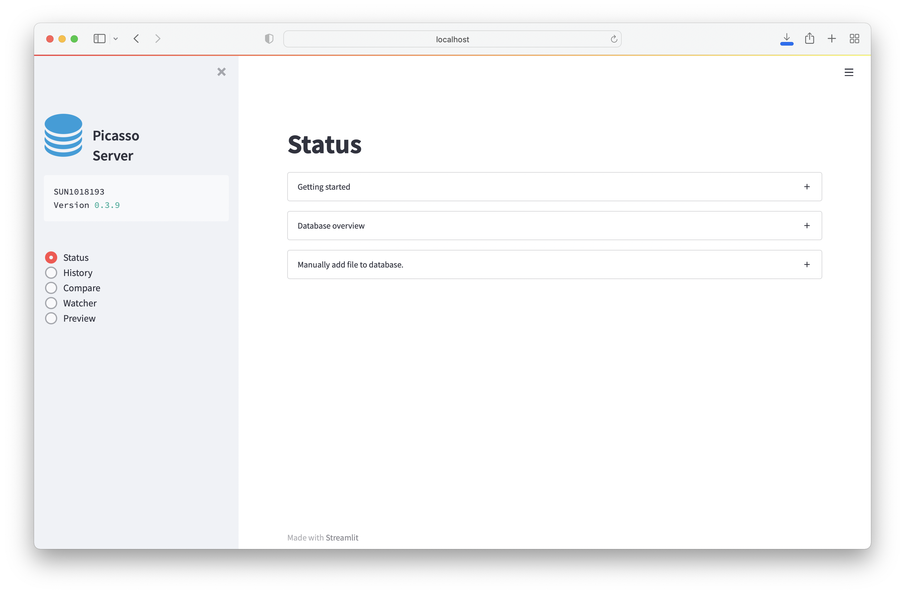
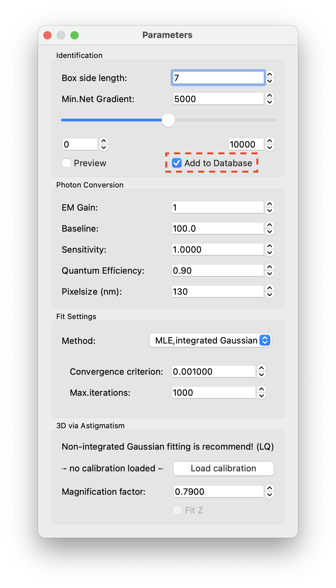
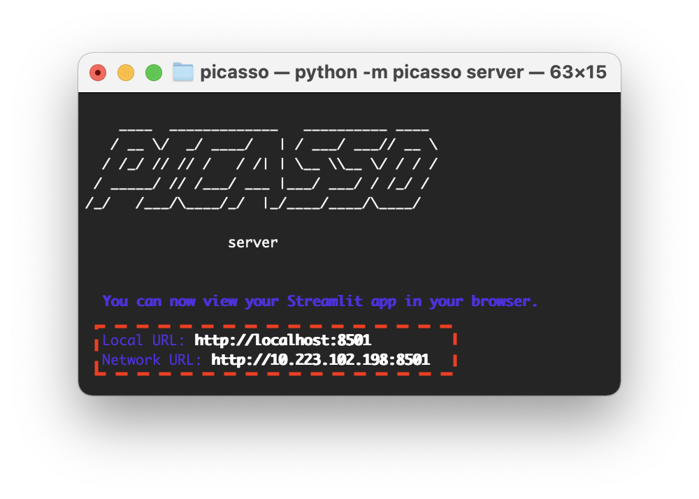
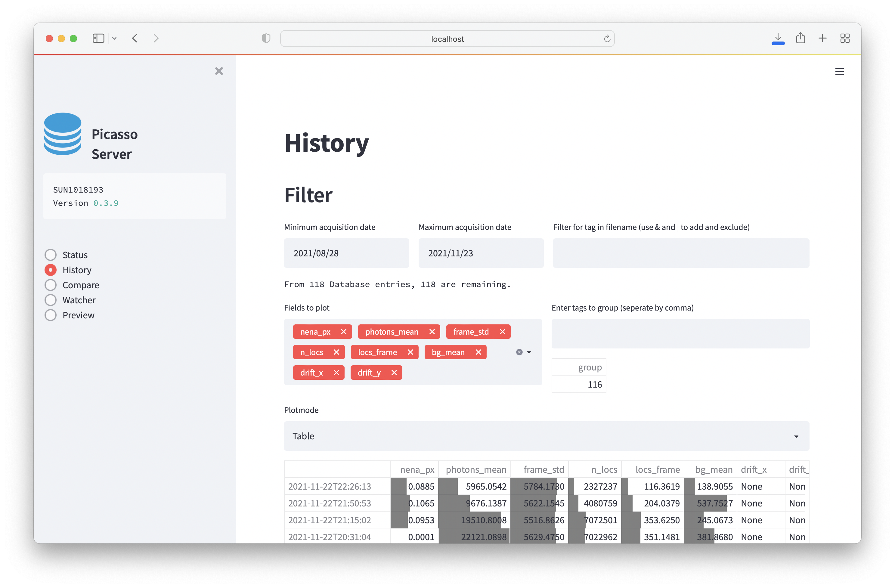
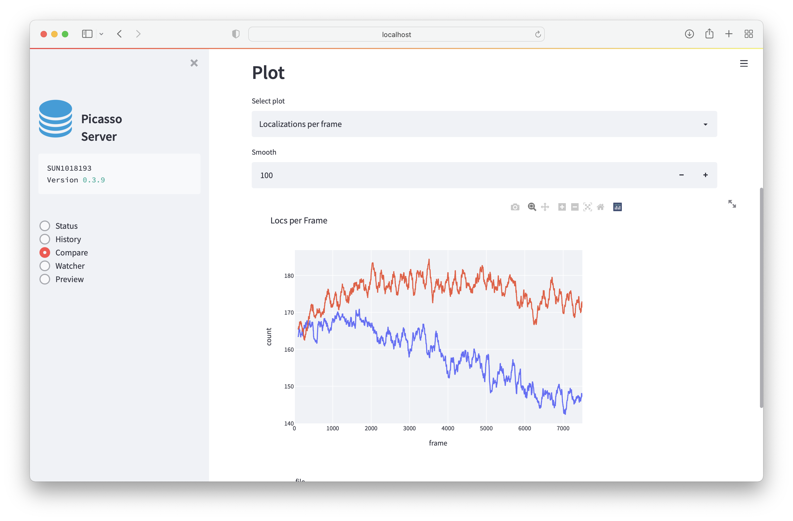
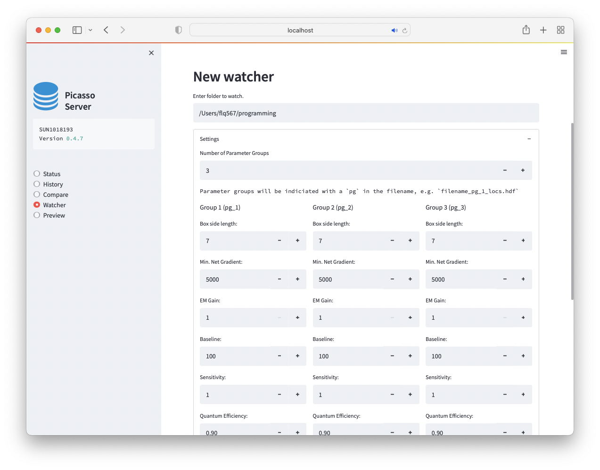
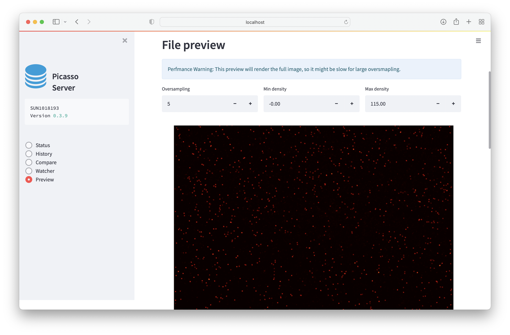

server
======

Functionality
-------------
Picasso Server allows to continuously track performance metrics of your super-resolution experiments.
It does so by recording the metadata, derived summary statistics, and results of post-processing algorithms (such as the NeNA value) to a local SQL database. 
The database can be interactively explored via a browser application.

You can also set up a ``Watcher`` that allows to continuously process new files in a folder.

Database
--------
The local SQL database will be stored in the ``.picasso`` folder in your home directory. The path is also displayed in the `Getting started`-tab in the `Status` page. To directly access the database
the tool `DB Browser for SQLite <https://sqlitebrowser.org>`_ is recommended.

Localize
--------
The integration within ``Localize`` is by pressing the ``Estimate``- button in the ``Sample Quality`` field in ``Parameters``.
The button can be pressed once the image stack has been localized. It calculates Localizations per Frame, NeNA, Drift and bright time based on a subset of the data (i.e. max. 1 Mio localizations).
The estimate and additional summary statistics will then be stored in the local database.

Server
------
Server is a tool to interactively explore the database and to enable continuous processing workflows.
When launching server, i.e. clicking on the shortcut or executing the Python command ``picasso server``, the command line will start and show you the local IP address on where the server is running.
When launching picasso server, it should open your default browser automatically and redirect to the Picasso Server page.
You can also use this IP to e.g., connect to ``Picasso Server`` from within a network. For this, take the ``Network URL`` that is displayed in the command line and access it via browser.

In case you close the website tab or the browser, ``Picasso Server`` will run in the background until the command line window is closed.
You can go back to the website by re-entering the URL.

Status
~~~~~~
Displays the current database status and documentation.
The page also has a menu called ``Manually add file to database.``. Here, you can add folders with already processed files to the database.

History
~~~~~~~

Explore summary statistics of processed files.
It is possible to filter by filename and group.
The following modes of display exist:

- Table: A table of the results. Each field contains a barplot showing the value relative to the column's maximum.
- Scatter: Scatterplot of results. This also allows to draw trendlines
- Boxplot: Daily Boxplot

Compare
~~~~~~~
Compare two files against each other.

**The database will store the file path when it is localized. If the file is moved, it will not be selectable.**

To compare experiments, select one or multiple experiments from the dropdown menu.
If multiple hdf files are present, you can select hdf files that belong to the same file family.

**Comparing files will load the entire hdf file and could mean that one is comparing millions of localizations.
Creating the plots might, therefore, not be instantaneous.**

- Localizations per frame: this will plot the localization per frame. This is useful to inspect the performance of an experiment over time.
- Histogram: creates a histogram for the population. This is useful e.g., for comparing background signals.

.. image:: ../docs/server_compare_histogram.png
   :scale: 10 %
   :alt: Histogram

Watcher
~~~~~~~
- Set up a file watcher to process files in a folder with pre-defined settings automatically.
- All new files and raw files that aren't yet in the database will be processed.
- You can define different parameter groups so that a file will be processed with different settings.
- You can also chain custom commands to the watcher.
- The watcher will check for the following filetypes: ('.raw', '.ome.tif', '.ims')
- The watcher will be able to process consecutive files created with MicroManager (e.g. `Pos0`, `Pos0_1`, `Pos0_2`) if they contain `MMStack_Pos0` in the filename

Logging
"""""""
Each watcher will write their statust to a logfile. The path is visible when setting up the logfile and when checking the currently running watchers. To view the log, select the logfile and expand the `Log`-field.

Multiple Parameter Groups
"""""""""""""""""""""""""

With multiple parameter groups a file will be processed with different settings. To make multiple parameter groups available, set the `Number of Parameter Groups` to a value larger than 1. 
The file ending will be different according to the parameter group used. E.g. if you have two parameter groups, file `testfile.raw` will be processed as `testfile_pg_1_locs.hdf5` and `testfile_pg_2_locs.hdf5`.

Custom commands
"""""""""""""""
You can use the "Custom command" to execute a custom script after a file was processed.
Consider the following example for a script that you want to execute named test.py:::

  import sys
  from slack_sdk.webhook import WebhookClient
  url = "REPLACE_WITH_SLACKHOOK"
  webhook = WebhookClient(url)

  _, filename = sys.argv[0], sys.argv[1]

  response = webhook.send(text=f"Processed file {filename}!")

This script would send a message to a slack webhook with the first argument as filename. To call this from the watcher, we need to point to a python environment.
E.g. for a conda installation at ``C:\ProgramData\Miniconda3\python.exe`` and the script being located at ``C:\Users\Maximilian\Desktop\test.py`` the complete command to enter in Picasso server would be:
``C:\ProgramData\Miniconda3\python.exe C:\Users\Maximilian\Desktop\test.py $FILENAME``.

When having an existing Picasso one-click installation, Picasso can directly be called via the command-line. Some example commands would then be:

* ``picasso undrift $FILENAME`` for drift correction
* ``picasso link $FILENAME`` for linking localizations
* ``picasso dbscan $FILENAME 0.1 2`` for performing DBSCAN cluster analysis with 0.1 / 2

Preview
~~~~~~~
Preview will render the super-resolution data in the browser.

**The database will store the file path when it is localized. If the file is moved, it will not be selectable.**

Docker
~~~~~~
If you want to install picasso server in a headless linux or mac system, the provided dockerfile might be useful for installation.
* Build the docker image from the dockerfile (clone the github repository): ``docker build -t picasso .``
* Run the docker image (interactive mode, port forwarding and with a mounted drive): ``docker run -it -p 8501:8501 --volume "C:/Users/Maximilian/Desktop/data:/home/picasso/data" picasso`` Note that you need to replace the respective paths.
* Launch picasso server in the docker image: ``python3 -m picasso server``
