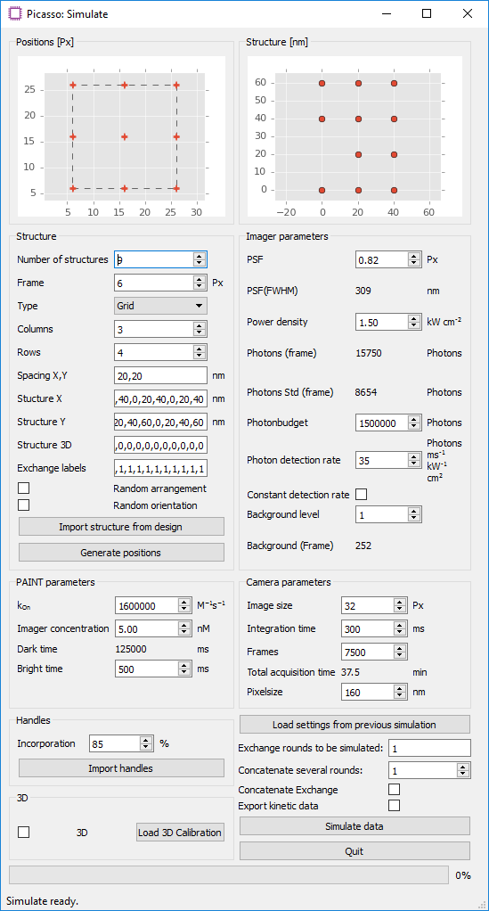

simulate
========

Picasso's simulation module (``Picasso: Simulate``) is a tool for evaluating experimental conditions for DNA-PAINT and generating ground-truth data for test purposes. This allows systematic analysis of how different experimental parameters such as imager concentration, target density or integration time influence the imaging quality and whether the target structure can be resolved with DNA-PAINT.
By default, ``Picasso: Simulate`` starts with preset parameters that are typical for a DNA-PAINT experiment. Thus, meaningful raw DNA-PAINT data can be readily simulated for a given input structure without the need of a super-resolution microscope. The simulation output is a movie file in .raw format, as it would be generated during an in vitro DNA-PAINT experiment on a microscope.

Simulate DNA-PAINT image acquistions
------------------------------------

1. Start ``Picasso: Simulate``.
2. Define the number and type of structures that should be simulated in the group ``Structure``. Predefined grid- and circle-like structures can be readily defined by their number of columns and rows, or their diameter and the number of handles, respectively. Alternatively, a custom structure can be defined in an arbitrary coordinate system. To do so, enter comma-separated coordinates into ``Structure X`` and ``Structure Y``. The unit of length of the respective axes can be changed by setting the spacing in ``Spacing X, Y``. For each coordinate point, an identifier for the docking site sequence needs to be set in ``Exchange labels`` as a comma-separated list. Correctly defined points will be updated live in the ``Structure [nm]`` window. Note that entries with missing x coordinate, y coordinate or exchange label will be disregarded. When a structure has been previously designed with ``Picasso: Design``, it can be imported with ``Import structure from design``. A probability for the presence of a handle can be set with ``Incorporation``. By default, all structures are arranged on a grid with boundaries defined by ``Image size`` in ``Camera parameters`` and the ``Frame`` parameter in the ``Structure`` group. ``Random arrangement`` distributes the structures randomly within that area, whereas ``Random orientation`` rotates the structures randomly. Selecting the button ``Generate positions`` will generate a list of positions with the current settings and update the preview panels. A preview of the arrangement of all structures is shown in ``Positions [Px]``, whereas an individual structure is shown in ``Structure [nm]``.
3. The group ``PAINT Parameters`` allows adjustment of the duty cycle of the DNA-PAINT imaging system. The mean dark time is calculated by τd = 1/(kon·c). The mean ON time in a DNA-PAINT system is dependent on the DNA duplex properties. For typical 9-bp imager/docking interactions, the ON time is ~500 ms.
4. In ``Imager Parameters``, fluorophore characteristics such as PSF width and photon budget can be set. Adjusting the ``Power density`` field affects the simulation analogously to changing the laser power in an experiment.
5. The ``Camera parameters`` group allows the user to set the number of acquisition frames and integration time. The default image size is set to 32 pixels. As the computation time increases considerably with image size, it is recommended to simulate only a subset of the actual camera field of view.
6. Select ``Simulate data`` to start the simulation. The simulation will begin by calculating the photons for each handle site of every structure and then converting it to a movie that will be saved as a .raw file, ready for subsequent localization. All simulation settings are saved and can be loaded at a later time with ``Load from previous simulation``. 
7. (Optional step for multiplexing) Multiplexed Exchange-PAINT data can be simulated by adjusting the ``Exchange Labels`` setting. For each handle in the custom coordinate system (``Structure X``, ``Structure Y``), an Exchange round can be specified. The different imaging rounds can be visually identified by color in the ``Structure [nm]`` figure. For each round, a new movie file will be generated. By default, the simulation software detects the number of exchange rounds based on the structure definition and will simulate all multiplexing rounds with the same imaging parameters. It is possible to have different imaging parameters for each round, e.g. when using image s with different ON-times. To do so, one can simulate multiplexing rounds individually. In the ``Exchange rounds to be simulated`` field, enter only the rounds that should be simulated with the current set of parameters. Change the set parameters and the multiplexing round and simulate the next data sets. Repeat until all multiplexing rounds are simulated.

