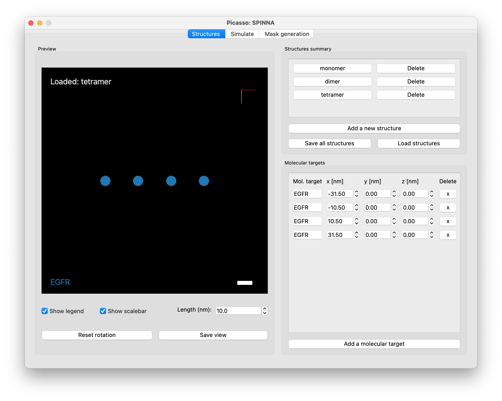
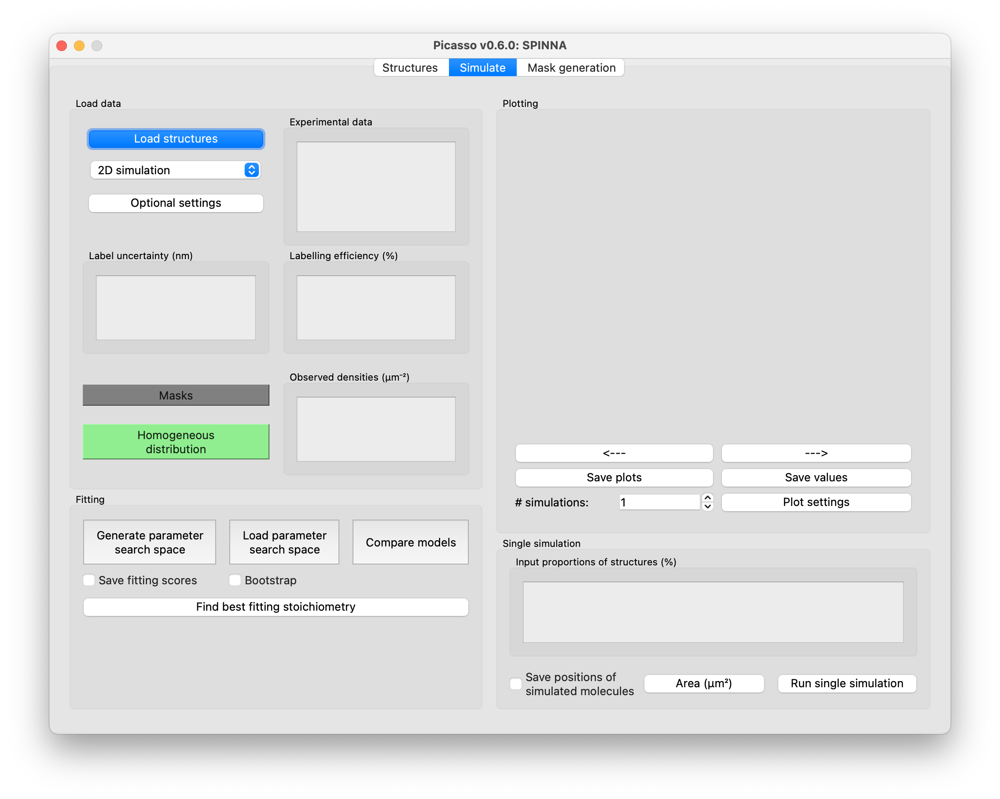
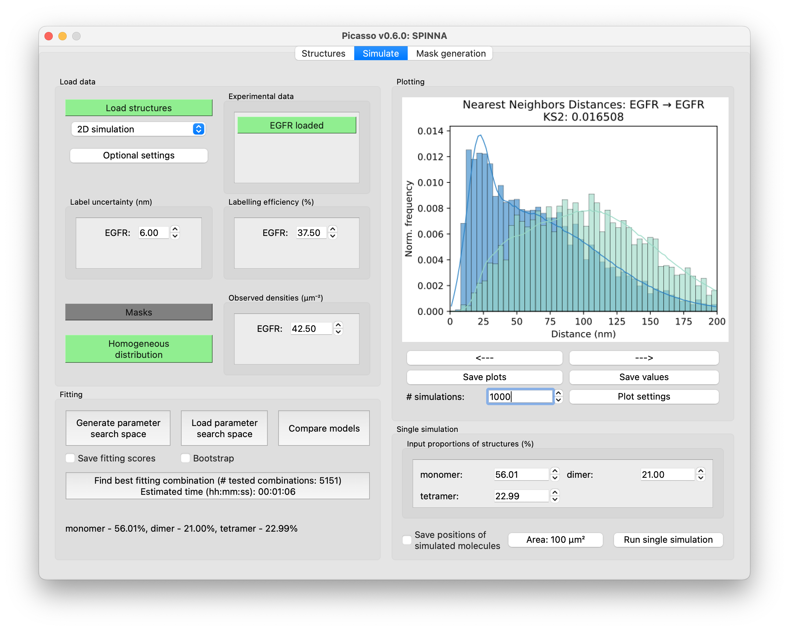
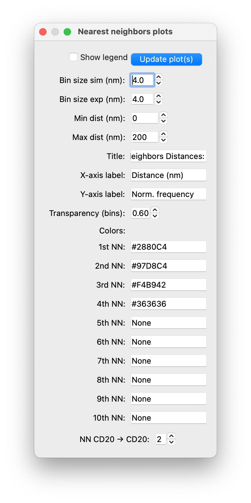
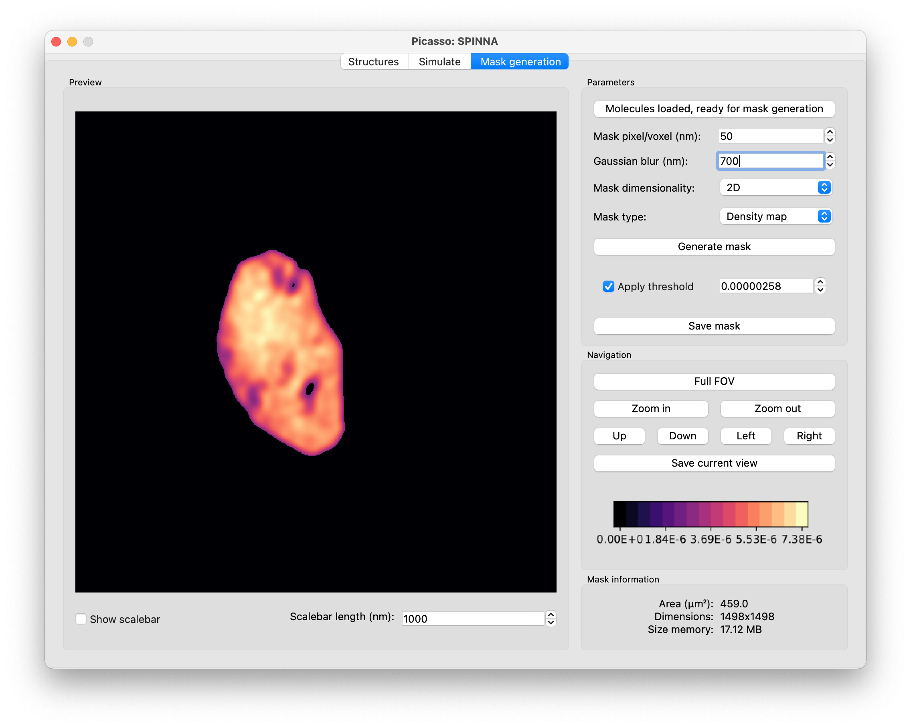

SPINNA
======

SPINNA is a module for analyzing the oligomerization of proteins using super-resolution microscopy data. For more information, please refer to the publication `L. A. Masullo, R. Kowalewski, et al. Nature Comm, 2025 <https://doi.org/10.1038/s41467-025-59500-z>`_.

Overview of the GUI
-------------------

The GUI consists of three tabs that can be navigated at the top of the screen: 
1. *Structures*: to define the structures used in simulations.
2. *Simulate*: to simulate any combination of structures with user-defined parameters as well as to fit the proportions of structures to experimental data.
3. *Mask generation*: to generate masks for simulations with heterogeneous densities of molecular targets.

Structures tab
--------------

This tab allows the user to define the model structures for SPINNA. The outline of the tab is shown above. Follow these steps to create new structures:
1. Click *Add a new structure* in the *Structures summary box* (top right corner).
2. Enter the name of the structure in the new dialog and confirm by clicking *OK*.
3. The structure is now loaded and its name is displayed in the *Preview* box (left panel).
4. To add molecular targets, navigate to the box *Molecular targets* (bottom right corner).
5. Click *Add a molecular target*. This creates a new row in the *Molecular targets* box. Please specify the following: name of the molecular target (e.g., EGFR), x, y and z coordinates (in nm). Please note that the structure will be rotated around the origin (i.e., x = y = z = 0 nm) during simulations. 
6. It is possible to delete each molecular target by clicking its corresponding delete button (*x* in the *Molecular targets* box).
7. The user can navigate between structures by clicking on their names in the *Structures summary* box. 
8. The *Preview* box allows the user to see the currently loaded structure, rotate it in 3D, show/hide legend and scale bar (whose length is adjustable) as well as save the current view as a .png file. 
9. Once at least two molecular targets are defined for the given structure, it is possible to add a new molecular target by clicking with the right mouse button on the structure view.

The image above illustrates the example structures generated for simulations of EGFR described in the main text. Once the structures are ready to use, save them by clicking *Save all structures* in the *Structures summary* box. 

**Note**: the user must ensure that no typos are introduced in the names of the molecular targets, since SPINNA will interpret these as separate molecular target species.

Simulate tab
------------

This tab is used for fitting the SPINNA model (see **Structures tab** above) to experimental data, displaying nearest neighbor distances (NND) and saving simulated molecules that can later be loaded into Picasso: Render. The image above shows the outline of the tab before loading data.
 
Load data and parameters
~~~~~~~~~~~~~~~~~~~~~~~~

1. Click the *Load structures* button in the top left corner of the window. Upon loading, new widgets will appear in the GUI.  
2. For each detected molecular target species, load the experimental data which must be saved in .hdf5 format that is compatible with localizations files in other Picasso modules, see `here <https://picassosr.readthedocs.io/en/latest/files.html#hdf5-files>`_.
3. Furthermore, input label uncertainty and labeling efficiency and observed density in the *Load data* box. Alternatively, load the mask to simulate heterogeneous distribution by clicking on *Masks* in the bottom left corner of the box. For more information about the mask, see **Mask generation tab**.
4. Moreover, in the *Load data* box, the user can change the dimensionality of the simulation, change the mode of rotations (random rotations around z axis (2D), random rotations around 3 axes or no rotations). If 3D simulation is chosen without a mask, the user needs to input the range of z coordinates of molecular targets simulated by clicking *Z range*.

Fitting
~~~~~~~

Within the *Fitting* box:
1. To generate the search space, i.e., the set of stoichiometries tested in SPINNA, click the button *Generate parameter search space* and define the number of simulation repeats and granularity. For more information, see Supplementary Figure 2 in the `SPINNA publication <https://doi.org/10.1038/s41467-025-59500-z>`_.
2. To save the fitting scores for each tested stoichiometry, tick *Save fitting scores*. The user will be asked to input the name of the resulting .csv file.
3. To obtain the result’s uncertainty, check the *Bootstrap* box, which will resample from the best fitting model 20 times and rerun SPINNA on the resampled datasets. Note that this will increase the computation time.
4. To test different SPINNA models, click *Compare models*. The dialog will open, asking the user to input the range of tested label uncertainties (the user can choose to fit label uncertainty or not) and the candidate SPINNA models. For example, the user may want to explore the models with different spacings between the structures or different shape. We recommend the choose lower granularity when comparing models since the fitting may take a long time. 
5. To run SPINNA, click *Find best fitting combination*. The progress dialog will be displayed.
6. After the fitting is finished, specify the name for saving a fit summary file (.txt). This file includes all the information about the fitting, the parameters and the results. The user may also choose not to save the file by clicking *Cancel* in the dialog. Additionally, the fitted stoichiometry is displayed in the *Single simulation* box and the NND histograms are shown in the *Plotting* box, see image below.

Single simulation
~~~~~~~~~~~~~~~~~

SPINNA allows the user to run a single simulation to visually inspect NNDs for a specific set of proportions of structures as well as to save the positions of the simulated molecular targets in an .hdf5 format. Once the model structures and simulation parameters in the *Load data* box are defined:

1. Specify area/volume (in the case of homogeneous distribution of structures, i.e., no masking) - it should equal the area/volume of the experimental data.
2. To save the positions of molecules from a simulation, tick *Save positions of simulated molecules*. The user will be asked to enter the name of the resulting file.
3. Click *Run a single simulation*. This will generate and display NND histogram(s) of the simulated molecular targets (solid lines) and (if loaded) of the experimental data (histogram bars). 
4. If fitting was completed before, the user can retrieve the best fitting combination of proportions of structures by clicking *Best fitting combination* in the bottom of the *Input proportions of structures* box.

Plotting
~~~~~~~~

*Plotting* box, located in the top right corner of the GUI, displays the NND histograms for simulated (solid lines) and experimental data (histogram bars).

- The NND plots can be saved by clicking *Save plots* and the plotted values (bins and frequencies) by *Save values*. 
- *# simulations* controls how many simulation results are accumulated to draw NND histograms. The higher the value, the smoother the histograms will be obtained.
- *Plot settings* opens a new dialog that allows the user to show/hide plot legend, adjust the histogram bin size and min. and max. plotted distances, among others, see below.

If the loaded structures include several molecular target species, several NND histograms are plotted, one for each pair of molecular target species which can be explored by clicking left and right arrows in the *Plotting* box.

Mask generation tab
-------------------

This tab allows the user to create a density/binary mask capable of recovering the heterogeneous density distribution present in the experimental data. 
 
1. Click *Load molecules* to open the .hdf5 file with molecules/localizations that will be used to generate the mask. 
2. Adjust bin size and Gaussian blur to be applied to the mask.
3. The mask can be generated in 3D and/or converted to a binary mask.
4. Click *Generate mask*. This may take a while, especially for a 3D mask. The mask will be displayed automatically. The legend in the *Navigation* box displays the probability of finding a molecular target per pixel/voxel. 
5. The density mask can be thresholded at any user-defined probability value. By default, the Otsu threshold is used (Otsu. *Automatica*, 1975). 
6. To explore the mask, use the buttons in the *Navigation* box. Alternatively, arrow keys can be used too.
7. Once the mask is ready, click *Save mask*. This saves a numpy array in the .npy format.

Command window - batch analysis
-------------------------------

SPINNA can be run directly from the command window to allow fast and efficient batch analysis – either to analyze many datasets or to analyze the same datasets with many user settings, or both. The entire list thereof is summarized in a .csv file. For more information on Picasso direct command window usage, see `here <https://picassosr.readthedocs.io/en/latest/cmd.html>`_. To run SPINNA batch analysis, run ``python -m picasso spinna -p NAME_OF_CSV_FILE``. The following arguments are available:
- ``-a`` or ``--asynch`` switches off the multiprocessing mode. If not specified, multiprocessing is used.
- ``-v`` or ``--verbose`` switches on the verbose mode, i.e., a progress bar for each row is displayed. If not specified, the verbose mode is off. 
- ``-b`` or ``--bootstrap`` switches on the bootstrap mode, i.e., the best fitting model is resampled 20 times and SPINNA is rerun on the resampled datasets. If not specified, the bootstrap mode is off.

Each row in the .csv file will specify parameters for which SPINNA is run. In the file, define the following column names (i.e., the values typed into the first row) as follows:
- *structures_filename* : Path to the file with structures saved (.yaml), see **Structures tab** above.
- *exp_data_TARGET* : Path to the file with experimental data (.hdf5) for each molecular target species. Each target in the structures must have a corresponding column, for example, *exp_data_EGFR".
- *le_TARGET* : Labeling efficiency (%) for each molecular target species. 
- *label_unc_TARGET* : Label uncertainty (nm) for each molecular target species. 
- *granularity* : Granularity used in parameters search space generation. The higher the value the more combinations of structure counts will be tested.
- *save_filename* : Name of the .txt file where the results will be saved.
- *NND_bin* : Bin size (nm) for plotting the NND histogram(s).
- *NND_maxdist* : Maximum distance (nm) for plotting the NND histogram(s).
- *sim_repeats* : Number of simulation repeats.

Depending on whether a homo- or heterogeneous distribution is used, the following columns must be present:

For a homogeneous distribution:
- *area* or *volume* : Area (2D simulation) or volume (3D simulation) of the simulated ROI (um^2 or um^3).
- *z_range* : Applicable only when *volume* is provided. Defines the range of z coordinates (nm) of simulated molecular targets.

For a heterogeneous distribution:
- *mask_filename_TARGET* : Name of the .npy file with the mask saved for each molecular target species.

Optional columns are:
- *rotation_mode* : Random rotations mode used in analysis. Values must be one of {*3D*, *2D*, *None*}. Default: *3D*.
- *nn_plotted* : Number of nearest neighbors plotted, default: 4.

SPINNA in Python
----------------

SPINNA functions can also be run in a Python script directly. Examples are presented in ``picasso/samples/SampleNotebook4.ipynb``.

