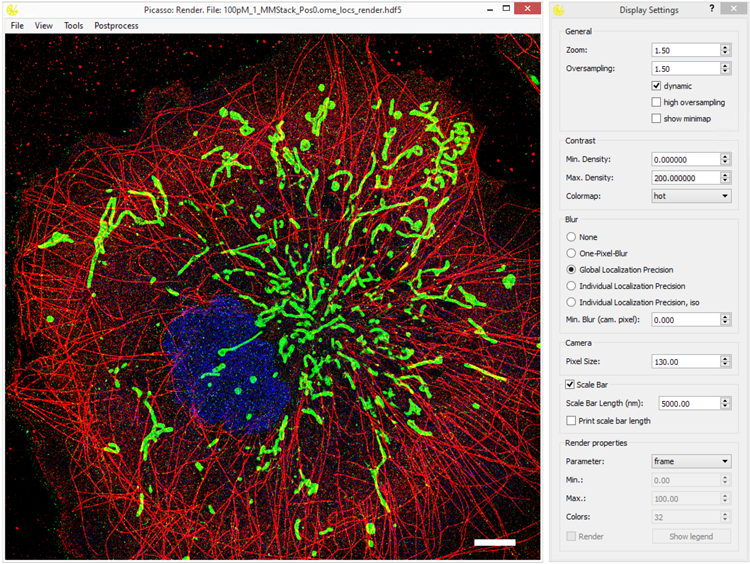

Picasso
=======
.. image:: https://readthedocs.org/projects/picassosr/badge/?version=latest
   :target: https://picassosr.readthedocs.io/en/latest/?badge=latest
   :alt: Documentation Status

.. image:: https://github.com/jungmannlab/picasso/workflows/CI/badge.svg
   :target: https://github.com/jungmannlab/picasso/workflows/CI/badge.svg
   :alt: CI

.. image:: http://img.shields.io/badge/DOI-10.1038/nprot.2017.024-52c92e.svg
   :target: https://doi.org/10.1038/nprot.2017.024
   :alt: CI

.. image:: https://static.pepy.tech/personalized-badge/picassosr?period=total&units=international_system&left_color=black&right_color=brightgreen&left_text=Downloads
 :target: https://pepy.tech/project/picassosr

A collection of tools for painting super-resolution images. The Picasso software is complemented by our `Nature Protocols publication <https://www.nature.com/nprot/journal/v12/n6/abs/nprot.2017.024.html>`__.
A comprehensive documentation can be found here: `Read the Docs <https://picassosr.readthedocs.io/en/latest/?badge=latest>`__.

Picasso 0.8.0
-------------
- **New module SPINNA for investigating oligomerization of proteins**, `DOI: 10.1038/s41467-025-59500-z <https://doi.org/10.1038/s41467-025-59500-z>`_.
- NeNA bug fix: old values were too large by a factor of sqrt(2).

Previous versions
-----------------
To see all changes introduced in previous versions, click `here <https://github.com/jungmannlab/picasso/blob/master/changelog.rst>`_.

Installation
------------

Check out the `Picasso release page <https://github.com/jungmannlab/picasso/releases/>`__ to download and run the latest compiled one-click installer for Windows. Here you will also find the Nature Protocols legacy version. 

For the platform-independent usage of Picasso (e.g., with Linux and Mac Os X), please follow the advanced installation instructions below.

Other installation modes (Python 3.10)
~~~~~~~~~~~~~~~~~~~~~~~~~~~~~~~~~~~~~~

As an alternative to the stand-alone program for end-users, Picasso can be installed as a Python package. This is the preferred option to use Picasso’s internal routines in custom Python programs. Those can be imported by running, for example, ``from picasso import io`` (see the "Example usage" tab below) to use input/output functions from Picasso. For windows, it is still possible to use Picasso as an end-user by creating the respective shortcuts. This allows Picasso to be used on the same system by both programmers and end-users.

Via PyPI
^^^^^^^^

1. Open the console/terminal and create a new conda environment: ``conda create --name picasso python=3.10``
2. Activate the environment: ``conda activate picasso``.
3. Install Picasso package using: ``pip install picassosr``.
4. You can now run any Picasso function directly from the console/terminal by running: ``picasso render``, ``picasso localize``, etc, or import Picasso functions in your own Python scripts.

For Developers
^^^^^^^^^^^^^^

If you wish to use your local version of Picasso with your own modifications:

1. Open the console/terminal and create a new conda environment: ``conda create --name picasso python=3.10``
2. Activate the environment: ``conda activate picasso``.
3. Change to the directory of choice using ``cd``.
4. Clone this GitHub repository by running ``git clone https://github.com/jungmannlab/picasso``. Alternatively, `download <https://github.com/jungmannlab/picasso/archive/master.zip>`__ the zip file and unzip it.
5. Open the Picasso directory: ``cd picasso``.
6. You can modify Picasso code in this directory.
7. To create a *local* Picasso package to use it in other Python scripts, run ``pip install -e .``. When you change the code in the ``picasso`` directory, the changes will be reflected in the package.
8. You can now run any Picasso function directly from the console/terminal by running: ``picasso render``, ``picasso localize``, etc, or import Picasso functions in your own Python scripts.

Optional packages
^^^^^^^^^^^^^^^^^

Regardless of whether Picasso was installed via PyPI or by cloning the GitHub repository, some packages may be additionally installed to allow extra functionality:

- ``pip install pyinstaller`` if you plan to additionally compile your own installer with `Pyinstaller <https://pyinstaller.org/en/stable/>`__.
- *(Windows only)* ``pip install PyImarisWriter==0.7.0`` to enable .ims files in Localize and Render. Note that ``PyImarisWriter`` has been tested only on Windows.
- To enable ``GPU fitting``, follow instructions on `Gpufit <https://github.com/gpufit/Gpufit>`__ to install the Gpufit python library in your conda environment. In practice, this means downloading the zipfile and installing the Python wheel. Picasso Localize will automatically import the library if present and enables a checkbox for GPU fitting when selecting the LQ-Method.

Updating
^^^^^^^^

If Picasso was installed from PyPI, run the following command:

``pip install --upgrade picassosr``

Creating shortcuts on Windows (*optional*)
~~~~~~~~~~~~~~~~~~~~~~~~~~~~~~~~~~~~~~~~~~

Run the PowerShell script “createShortcuts.ps1” in the gui directory. This should be doable by right-clicking on the script and choosing “Run with PowerShell”. Alternatively, run the command
``powershell ./createShortcuts.ps1`` in the command line. Use the generated shortcuts in the top level directory to start GUI components. Users can drag these shortcuts to their Desktop, Start Menu or Task Bar.

Example Usage
-------------

Besides using the GUI, you can use picasso like any other Python module. Consider the following example:::

  from picasso import io, postprocess

  path = 'testdata_locs.hdf5'
  locs, info = io.load_locs(path)
  # Link localizations and calcualte dark times
  linked_locs = postprocess.link(picked_locs, info, r_max=0.05, max_dark_time=1)
  linked_locs_dark = postprocess.compute_dark_times(linked_locs)

  print('Average bright time {:.2f} frames'.format(np.mean(linked_locs_dark.n)))
  print('Average dark time {:.2f} frames'.format(np.mean(linked_locs_dark.dark)))

This codeblock loads data from testdata_locs and uses the postprocess functions programmatically.

Jupyter Notebooks
-----------------

Check picasso/samples/ for Jupyter Notebooks that show how to interact with the Picasso codebase.

Contributing
------------

If you have a feature request or a bug report, please post it as an issue on the GitHub issue tracker. If you want to contribute, put a PR for it. You can find more guidelines for contributing `here <https://github.com/jungmannlab/picasso/blob/master/CONTRIBUTING.rst>`__. We will gladly guide you through the codebase and credit you accordingly. Additionally, you can check out the ``Projects``-page on GitHub.  You can also contact us via picasso@jungmannlab.org.

Contributions & Copyright
-------------------------

| Contributors: Joerg Schnitzbauer, Maximilian Strauss, Rafal Kowalewski, Adrian Przybylski, Andrey Aristov, Hiroshi Sasaki, Alexander Auer, Johanna Rahm
| Copyright (c) 2015-2025 Jungmann Lab, Max Planck Institute of Biochemistry
| Copyright (c) 2020-2021 Maximilian Strauss

Citing Picasso
--------------

If you use Picasso in your research, please cite our Nature Protocols publication describing the software.

| J. Schnitzbauer*, M.T. Strauss*, T. Schlichthaerle, F. Schueder, R. Jungmann
| Super-Resolution Microscopy with DNA-PAINT
| Nature Protocols (2017). 12: 1198-1228 DOI: `10.1038/nprot.2017.024 <https://doi.org/10.1038/nprot.2017.024>`__
|
| If you use some of the functionalities provided by Picasso, please also cite the respective publications:

- NeNA. DOI: `10.1007/s00418-014-1192-3 <https://doi.org/10.1007/s00418-014-1192-3>`__
- Theoretical localization precision (Gauss LQ and MLE). DOI: `10.1038/nmeth.1447 <https://doi.org/10.1038/nmeth.1447>`__
- MLE fitting. DOI: `10.1038/nmeth.1449 <https://doi.org/10.1038/nmeth.1449>`__
- RCC undrifting: DOI: `10.1364/OE.22.015982 <https://doi.org/10.1364/OE.22.015982>`__ 
- AIM undrifting. DOI: `10.1126/sciadv.adm776 <https://www.science.org/doi/10.1126/sciadv.adm7765>`__
- SMLM clusterer. DOIs: `10.1038/s41467-021-22606-1 <https://doi.org/10.1038/s41467-021-22606-1>`__ and `10.1038/s41586-023-05925-9 <https://doi.org/10.1038/s41586-023-05925-9>`__
- DBSCAN: Ester, et al. Inkdd, 1996. (Vol. 96, No. 34, pp. 226-231).
- HDBSCAN. DOI: `10.1007/978-3-642-37456-2_14 <https://doi.org/10.1007/978-3-642-37456-2_14>`__
- RESI. DOI: `10.1038/s41586-023-05925-9 <https://doi.org/10.1038/s41586-023-05925-9>`__
- SPINNA. DOI: `10.1038/s41467-025-59500-z <https://doi.org/10.1038/s41467-025-59500-z>`__

Credits
-------

-  Design icon based on “Hexagon by Creative Stalls" from the Noun Project
-  Simulate icon based on “Microchip by Futishia" from the Noun Project
-  Localize icon based on “Mountains" by MONTANA RUCOBO from the Noun Project
-  Filter icon based on “Funnel" by José Campos from the Noun Project
-  Render icon based on “Paint Palette" by Vectors Market from the Noun Project
-  Average icon based on “Layers" by Creative Stall from the Noun Project
-  Server icon based on “Database" by Nimal Raj from the Noun Project
-  SPINNA icon based on "Spinner" by Viktor Ostrovsky from the Noun Project
